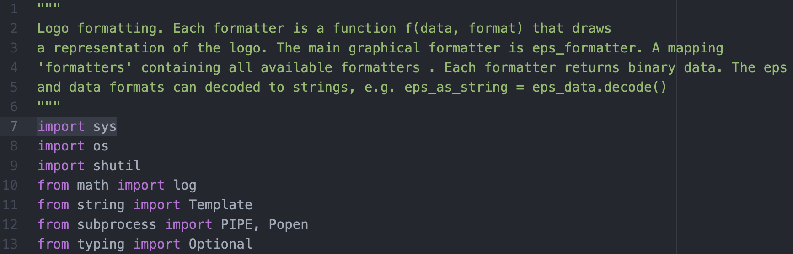
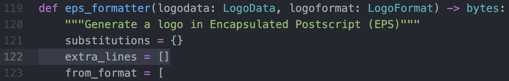
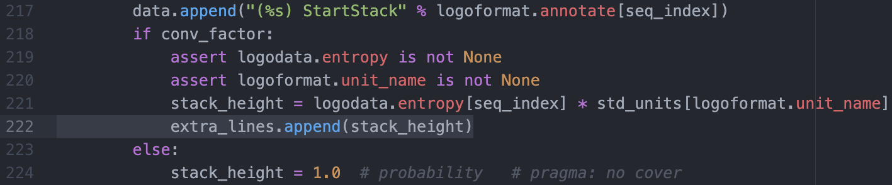
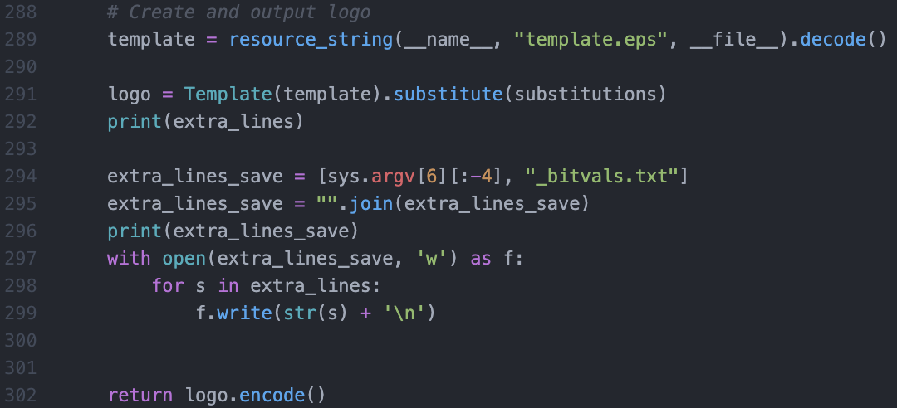

\pagebreak
# Foreword
  Organization of this vignette assumes that each section contains all files in a folder specific to that section and that scripts are initiated within the original section folder. ie. Figure1, Figure2 are individual folders. Therefore, calls to data made in a previous section will usually involve accessing that folder. Additionally, because each figure has many dependencies, each new dependency is listed before each section in which it is used. Subsequent sections which use previously listed dependencies do not list them. 

# Figure1. Tn5 sequence bias is more complex than nuclease sequence bias.

```{r Figure1, echo = FALSE, message=FALSE, fig.align='center', fig.pos = "H", fig.cap=" Tn5 sequence bias is more complex than nuclease sequence bias. A) The seqLogo sequence bias motifs are corrected for background nucleotide content and they illustrate that Tn5 bias is wider and more complex than other commonly used chromatin accessibility enzymes. Nucleotide frequencies listed in the inset to the right correspond to the highest information content position; for instance, G is found at position -4 45\\% of the instances that Tn5 inserts into DNA. Nuclease cleavage sites are indicated by dashed red line. Total information content (IC) from positions -10 to 10 is listed in the inset to the upper left. B) We plotted the log$_2$(observed/expected 5-mer frequency) for all positions surrounding DNA cleavage sites or Tn5 recognition sites as box and whisker plots. C) We plotted read depth normalized composite signal from various molecular genomics assays for the top 400,000 sites that conform most stringently to the respective enzyme’s bias motif. ", out.width = "100%"}
knitr::include_graphics("figs/fig1_OL_JBW.pdf")
```

The scripts for this figure cover all the steps necessary to reproduce figure 1.

Make a new folder for Figure 1 data and results:
```{bash eval = FALSE}
mkdir Figure1
cd Figure1
```

## Downloading genomic FASTA files

This step will download all of the necessary genomic reference files for figure 1. The script can be found at:
https://raw.githubusercontent.com/guertinlab/Tn5bias/master/Manuscript_Vignette/Vignette_Scripts/Figure1_ReferenceGenome_download.sh

```{bash eval=FALSE}
#You will need to download the human and mouse genomes:
wget http://hgdownload.cse.ucsc.edu/goldenPath/hg38/bigZips/hg38.fa.gz
wget https://hgdownload.cse.ucsc.edu/goldenpath/hg38/chromosomes/chrM.fa.gz
wget http://hgdownload.cse.ucsc.edu/goldenPath/mm39/bigZips/mm39.fa.gz
#unzip
gunzip hg38.fa.gz
gunzip chrM.fa.gz
gunzip mm39.fa.gz
```

## Python script: bedToOneEntryBed.py

The file is at https://raw.githubusercontent.com/guertinlab/Tn5bias/master/Manuscript_Vignette/bedToOneEntryBed.py and it converts a bed to a bed with one entry per instance, so that a FASTA entry is present for each ATAC insertion event.

```{bash eval=FALSE}
#! /usr/bin/env
import re
import string
import sys
import getopt
import os
import itertools
import glob


def function(fqFileName):
    infile=open(fqFileName, 'r')
    outfile=open(str.split(fqFileName,'.bed')[0]+'.oneentry.bed', 'w')
    while 1:
        line=infile.readline()
        if not line: break
        for i in range(int(line.split()[4])):
            outfile.write('%s'%(line))
    infile.close()
    outfile.close()

   
    
def main(argv):
    try:
        opts, args = getopt.getopt(argv, "i:h", ["infile=","help"])
    except getopt.GetoptError as err:
        print(str(err))
        sys.exit(2)
    infile = False
    for opt, arg in opts:
        if opt in ('-i', '--infile'):
            infile = arg
        elif opt in ('-h', '--help'):
            print('\n./bedToOneEntryBed.py -i test_PE1_plus_not_scaled.bed')
            sys.exit()
    if infile:
        print(infile)
        function(infile)

if __name__ == "__main__":
    main(sys.argv[1:])
```


## Retrieving then processing FASTQ data files

This step will download all of the data used in figure 1. These data sets will then be aligned to their respective genomes, plus and minus
data will be separated, seqOutBias will be run on both separated and unseparated data, bed entries will be converted into an entry
for each read, minus strand sequences are reverse complemented, and finally concatenated with the plus strand. This will be done for DNase and Tn5 using human
(hg38 reference genome) data while Cyanase, Benzonase and MNase use mouse (mm39 reference genome) data. This script can be found at:
https://raw.githubusercontent.com/guertinlab/Tn5bias/master/Manuscript_Vignette/Vignette_Scripts/Figure1_ReadAlignment.sh

__Software installations:__

sra-tools: https://github.com/ncbi/sra-tools

fastp: https://github.com/OpenGene/fastp/blob/master/README.md

bowtie2: http://bowtie-bio.sourceforge.net/bowtie2/index.shtml

samtools: http://www.htslib.org

seqOutBias: https://github.com/guertinlab/seqOutBias


``` {bash eval=FALSE}
#Download Benzonase, Cyanase, MNase mm39 (mouse) data
fasterq-dump SRR535737
fasterq-dump SRR535738
fasterq-dump SRR535739
fasterq-dump SRR535740
fasterq-dump SRR535741
fasterq-dump SRR535742
fasterq-dump SRR535743
fasterq-dump SRR535744
fasterq-dump SRR5723785

#Rename Benzonase, Cyanase, MNase data from SRR number
mv SRR535737.fastq mm39_liver_Benzonase0.25U.fastq
mv SRR535738.fastq mm39_liver_Benzonase1U_1.fastq
mv SRR535739.fastq mm39_liver_Benzonase1U_2.fastq
mv SRR535740.fastq mm39_liver_Benzonase4U.fastq
mv SRR535741.fastq mm39_liver_Cyanase0.25U.fastq
mv SRR535742.fastq mm39_liver_Cyanase1U_1.fastq
mv SRR535743.fastq mm39_liver_Cyanase1U_2.fastq
mv SRR535744.fastq mm39_liver_Cyanase4U.fastq
mv SRR5723785_1.fastq mm39_liver_MNase_1.fastq
mv SRR5723785_2.fastq mm39_liver_MNase_2.fastq

#Concatenate each enzyme
cat *Benz* > mm39_liver_Benzonase.fastq
cat *Cyan* > mm39_liver_Cyanase.fastq
cat *MNase* > mm39_liver_MNase.fastq

#Zip each file
gzip *ase.fastq

#build index genome for mm39
bowtie2-build mm39.fa mm39

#Align each dataset to mm39 genome
for fq in mm39_liver_*.fastq.gz
do
    name=$(echo $fq | awk -F".fastq.gz" '{print $1}')
    echo $name
    bowtie2 -p 6 --maxins 500 -x mm39 -U ${name}.fastq.gz  \
       | samtools view -bS - | samtools sort - -o $name.bam
done

#First, split each dataset into plus and minus aligned reads.
#Then, run seqOutBias on plus/minus and unseparated strands to get
##the bedfile which has chromosome coordinates for each read.
#From the bedfile, make each read a unique entry using bedToOneEntryBed.py
#Using awk commands, shift each position back 10bp then forward 21 in order to
##make a 'window' around the cut site.
#In order to get each sequence, we then convert from fasta to bed format for each data set
for i in mm39*ase.bam
do
    name=$(echo $i | awk -F".bam" '{print $1}')
    echo $name
    samtools view -bh -F 20 ${name}.bam > ${name}_plus.bam
    samtools view -bh -f 0x10 ${name}.bam > ${name}_minus.bam
    seqOutBias mm39.fa ${name}.bam --no-scale --shift-counts \
                                --strand-specific --bed=${name}.bed \
                                 --bw=${name}.bigWig --read-size=76
    seqOutBias mm39.fa ${name}_plus.bam --no-scale --shift-counts \
                                --strand-specific --bed=${name}_plus.bed \
                                 --bw=${name}_plus.bigWig --read-size=76
    seqOutBias mm39.fa ${name}_minus.bam --no-scale --shift-counts \
                                --strand-specific --bed=${name}_minus.bed \
                                 --bw=${name}_minus.bigWig --read-size=76
#Make each read its own entry in a bed file
#e.g. 2 of the same read becomes 2 entries of the same read
    python bedToOneEntryBed.py -i ${name}_not_scaled.bed
    python bedToOneEntryBed.py -i ${name}_plus_not_scaled.bed
    python bedToOneEntryBed.py -i ${name}_minus_not_scaled.bed
#These bed files can be used to get the sequence flanking ALL Tn5 insertion sites,
#so we can see the precise nature of the sequence bias for each PE/strand combination
#we shift the window coordinatess for each bed file to accomodate the 31bp for the figure
    awk '{$2 = $2 - 15; print}' ${name}_not_scaled.oneentry.bed | \
       awk '{OFS="\t";} {$3 = $2 + 31; print}' | grep -v - | \
       fastaFromBed -fi mm39.fa -s -bed stdin -fo ${name}.fasta
    awk '{$2 = $2 - 15; print}' ${name}_plus_not_scaled.oneentry.bed | \
       awk '{OFS="\t";} {$3 = $2 + 31; print}' | grep -v - | \
       fastaFromBed -fi mm39.fa -s -bed stdin -fo ${name}_plus.fasta
    awk '{$2 = $2 - 16; print}' ${name}_minus_not_scaled.oneentry.bed | \
       awk '{OFS="\t";} {$3 = $2 + 31; print}' |  grep -v - | \
       fastaFromBed -fi mm39.fa -s -bed stdin -fo ${name}_minus.fasta
#First convert all sequences in the minus fasta into uppercase letters,
#then reverse complement all minus strand sequences.
    awk 'BEGIN{FS=" "}{if(!/>/){print toupper($0)}else{print $1}}' ${name}_minus.fasta | \
       fastx_reverse_complement -o ${name}_minus_RC.fasta
#Concatenate the plus and minus strand fasta files together
    cat ${name}_minus_RC.fasta ${name}_plus.fasta > ${name}_sepcat.fasta
done

#Download Tn5 dataset
fasterq-dump SRR5123141

#Zip Tn5 data
gzip *fastq

#Rename Tn5 data
mv SRR5123141_1.fastq.gz C1_gDNA_rep1_PE1.fastq.gz
mv SRR5123141_2.fastq.gz C1_gDNA_rep1_PE2.fastq.gz


#build index genome
bowtie2-build hg38.fa hg38
bowtie2-build chrM.fa chrM

#First align Tn5 data to mitochondrial chromosome, then sort by chr/start
#Convert bam file to fastq file, then align to hg38 genome
for fq in *PE1.fastq.gz
do
	name=$(echo $fq | awk -F"_PE1.fastq.gz" '{print $1}')
	echo $name
	bowtie2 -p 6 -x chrM -1 ${name}_PE1.fastq.gz -2 ${name}_PE2.fastq.gz \
		| samtools view -b - | samtools sort - -o $name.sorted.chrM.bam
	samtools index $name.sorted.chrM.bam
	samtools view -b $name.sorted.chrM.bam '*' | samtools sort -n - \
		| bamToFastq -i - -fq ${name}_PE1.chrM.fastq -fq2 ${name}_PE2.chrM.fastq
	gzip *.chrM.fastq
	rm $name.sorted.chrM.bam
	bowtie2 -p 6 --maxins 500 -x hg38 -1 ${name}_PE1.chrM.fastq.gz -2 ${name}_PE2.chrM.fastq.gz \
		| samtools view -bS - | samtools sort -n - | samtools fixmate -m - - \
		| samtools sort - | samtools markdup -r - ${name}.bam

done

#First, split data into plus and minus aligned reads
#Run seqOutBias with no scale and shift of 4,-4 to get each read centered
#on cut site. Then process same as other enzymes above.
for i in C1*.bam
do
    name=$(echo $i | awk -F".bam" '{print $1}')
    echo $name


		samtools view -bh -F 20 ${name}.bam > ${name}_plus.bam
    samtools view -bh -f 0x10 ${name}.bam > ${name}_minus.bam
    seqOutBias hg38.fa ${name}.bam --no-scale --custom-shift=4,-4 \
                                --strand-specific --bed=${name}.bed \
                                 --bw=${name}.bigWig --read-size=76
    seqOutBias hg38.fa ${name}_plus.bam --no-scale --custom-shift=4,-4 \
                                --strand-specific --bed=${name}_plus.bed \
                                 --bw=${name}_plus.bigWig --read-size=76
    seqOutBias hg38.fa ${name}_minus.bam --no-scale --custom-shift=4,-4 \
                                --strand-specific --bed=${name}_minus.bed \
                                 --bw=${name}_minus.bigWig --read-size=76
    python bedToOneEntryBed.py -i ${name}_not_scaled.bed
		python bedToOneEntryBed.py -i ${name}_plus_not_scaled.bed
    python bedToOneEntryBed.py -i ${name}_minus_not_scaled.bed
#we shift the window coordinatess for each bed file to accomodate the 31bp for the figure
    awk '{$2 = $2 - 15; print}' ${name}_not_scaled.oneentry.bed | \
       awk '{OFS="\t";} {$3 = $2 + 31; print}' | grep -v - | \
       fastaFromBed -fi hg38.fa -s -bed stdin -fo ${name}.fasta
		awk '{$2 = $2 - 15; print}' ${name}_plus_not_scaled.oneentry.bed | \
       awk '{OFS="\t";} {$3 = $2 + 31; print}' | grep -v - | \
       fastaFromBed -fi hg38.fa -s -bed stdin -fo ${name}_plus.fasta
    awk '{$2 = $2 - 15; print}' ${name}_minus_not_scaled.oneentry.bed | \
       awk '{OFS="\t";} {$3 = $2 + 31; print}' |  grep -v - | \
       fastaFromBed -fi hg38.fa -s -bed stdin -fo ${name}_minus.fasta

		awk 'BEGIN{FS=" "}{if(!/>/){print toupper($0)}else{print $1}}' ${name}_minus.fasta | \
	     fastx_reverse_complement -o ${name}_minus_RC.fasta
#Concatenate the plus and minus strand fasta files together
	  cat ${name}_minus_RC.fasta ${name}_plus.fasta > ${name}_sepcat.fasta

done

#Download naked DNase data
fasterq-dump SRR769954

#Rename DNase data from SRR number
mv SRR769954.fastq DNase_Naked.fastq

#Zip
gzip DNase_Naked.fastq

#Align each dataset to hg38 genome
for fq in DNase_*.fastq.gz
do
    name=$(echo $fq | awk -F".fastq.gz" '{print $1}')
    echo $name
    bowtie2 -p 6 --maxins 500 -x hg38 -U ${name}.fastq.gz  \
       | samtools view -bS - | samtools sort - -o $name.bam
done

#First, split each dataset into plus and minus aligned reads.
#Then, run seqOutBias on plus/minus and unseparated strands to get
##the bedfile which has chromosome coordinates for each read.
#From the bedfile, make each read a unique entry using bedToOneEntryBed.py
#Using awk commands, shift each position back 10bp then forward 21 in order to
##make a 'window' around the cut site.
#In order to get each sequence, we then convert from fasta to bed format for each data set
for i in DNase_*.bam
do
    name=$(echo $i | awk -F".bam" '{print $1}')
    echo $name
    samtools view -bh -F 20 ${name}.bam > ${name}_plus.bam
    samtools view -bh -f 0x10 ${name}.bam > ${name}_minus.bam
    seqOutBias hg38.fa ${name}.bam --no-scale --shift-counts \
                                --strand-specific --bed=${name}_unscaled.bed \
                                 --bw=${name}_unscaled.bigWig --read-size=76
    seqOutBias hg38.fa ${name}_plus.bam --no-scale --shift-counts \
                                --strand-specific --bed=${name}_plus_unscaled.bed \
                                 --bw=${name}_plus_unscaled.bigWig --read-size=76
    seqOutBias hg38.fa ${name}_minus.bam --no-scale --shift-counts \
                                --strand-specific --bed=${name}_minus_unscaled.bed \
                                 --bw=${name}_minus_unscaled.bigWig --read-size=76
#Make each read its own entry in a bed file
#e.g. 2 of the same read becomes 2 entries of the same read
    python bedToOneEntryBed.py -i ${name}_unscaled_not_scaled.bed
    python bedToOneEntryBed.py -i ${name}_plus_unscaled_not_scaled.bed
    python bedToOneEntryBed.py -i ${name}_minus_unscaled_not_scaled.bed
#these bed files can be used to get the sequence flanking ALL DNase insertion sites,
#so we can see the precise nature of the sequence bias for each PE/strand combination
#we shift the window coordinatess for each bed file to accomodate the 31bp for the figure
    awk '{$2 = $2 - 15; print}' ${name}_unscaled_not_scaled.oneentry.bed | \
       awk '{OFS="\t";} {$3 = $2 + 31; print}' | grep -v - | \
       fastaFromBed -fi hg38.fa -s -bed stdin -fo ${name}.fasta
    awk '{$2 = $2 - 15; print}' ${name}_plus_unscaled_not_scaled.oneentry.bed | \
       awk '{OFS="\t";} {$3 = $2 + 31; print}' | grep -v - | \
       fastaFromBed -fi hg38.fa -s -bed stdin -fo ${name}_plus.fasta
    awk '{$2 = $2 - 16; print}' ${name}_minus_unscaled_not_scaled.oneentry.bed | \
       awk '{OFS="\t";} {$3 = $2 + 31; print}' |  grep -v - | \
       fastaFromBed -fi hg38.fa -s -bed stdin -fo ${name}_minus.fasta
#First convert all sequences in the minus fasta into uppercase letters,
#then reverse complement all minus strand sequences.
    awk 'BEGIN{FS=" "}{if(!/>/){print toupper($0)}else{print $1}}' ${name}_minus.fasta | \
       fastx_reverse_complement -o ${name}_minus_RC.fasta
#Concatenate the plus and minus strand fasta files together
    cat ${name}_minus_RC.fasta ${name}_plus.fasta > ${name}_sepcat.fasta
done
```
\pagebreak

## Counting nucleotides for sequence logos of each enzyme

Each enzyme's data set (FASTA file) is used to count the occurrence of each nucleotide at each position within 15bp around the cutsite. This script can be found at:
https://raw.githubusercontent.com/guertinlab/Tn5bias/master/Manuscript_Vignette/Vignette_Scripts/Figure1_Nucleotide_Count.R

``` {R eval=FALSE}
source('https://raw.githubusercontent.com/guertinlab/Tn5bias/master/Manuscript_Vignette/Vignette_Scripts/Tn5_Bias_Functions.R')
###################################################################################
#Benzonase sepcat FASTA files:
uppercasenames <- list('mm39_liver_Benzonase_sepcat.fasta')

#Make sure all FASTA entries are uppercase
uplist <- lapply(uppercasenames, uppercase)  

#Each list object of uplist is the corresponding file:
Benzonase_sepcat = as.data.frame(uplist[1])

rm(uplist, uppercasenames)
#
#Count each nucleotide at each position:
##Benzonase_sepcat
Benzonase_sepcat.transfac = vector("list", length = ceiling(nrow(Benzonase_sepcat)/100000))
Benzonase_sepcat.split = seqlast(from=1,to=(nrow(Benzonase_sepcat)+1),by=100000)

for (i in 1:length(Benzonase_sepcat.transfac)) {
  Benzonase_sepcat.transfac[[i]] =
    transfac.func.2(Benzonase_sepcat[Benzonase_sepcat.split[i]:(Benzonase_sepcat.split[i+1]-1),1],31)
}
#Combine all splits of data
transfac.Benzonase_sepcat <- matrix(0,nrow = 31, ncol = 4)
for (i in 1:length(Benzonase_sepcat.transfac)) {
  transfac.Benzonase_sepcat = transfac.Benzonase_sepcat + Benzonase_sepcat.transfac[[i]]
}
#Convert matrix back into DF
transfac.Benzonase_sepcat = cbind(1:nrow(transfac.Benzonase_sepcat), transfac.Benzonase_sepcat)
colnames(transfac.Benzonase_sepcat) = c('P0', 'A', 'C', 'G', 'T')
#Write transfac file for input into weblogo
writeLines(c("ID Benzonase_sepcat_bias",
             "BF Benzonase_sepcat_bias"), 'Benzonase_sepcat_bias.transfac')
write.table(transfac.Benzonase_sepcat, file = "Benzonase_sepcat_bias.transfac",
            append = TRUE, quote=FALSE, row.names =FALSE, col.names = TRUE, sep = '\t')
rm(Benzonase_sepcat, Benzonase_sepcat.transfac)
###################################################################################
###################################################################################
#Cyanase sepcat FASTA file:
uppercasenames <- list('mm39_liver_Cyanase_sepcat.fasta')

#Make sure all FASTA entries are uppercase
uplist <- lapply(uppercasenames, uppercase)  

#Each list object of uplist is the corresponding file:
Cyanase_sepcat = as.data.frame(uplist[1])

rm(uplist, uppercasenames)
##Cyanase_sepcat
Cyanase_sepcat.transfac = vector("list", length = ceiling(nrow(Cyanase_sepcat)/100000))
Cyanase_sepcat.split = seqlast(from=1,to=(nrow(Cyanase_sepcat)+1),by=100000)

for (i in 1:length(Cyanase_sepcat.transfac)) {
  Cyanase_sepcat.transfac[[i]] =
    transfac.func.2(Cyanase_sepcat[Cyanase_sepcat.split[i]:(Cyanase_sepcat.split[i+1]-1),1], 31)
}
#Combine all splits of data
transfac.Cyanase_sepcat <- matrix(0,nrow = 31, ncol = 4)
for (i in 1:length(Cyanase_sepcat.transfac)) {
  transfac.Cyanase_sepcat = transfac.Cyanase_sepcat + Cyanase_sepcat.transfac[[i]]
}
#Convert matrix back into DF
transfac.Cyanase_sepcat = cbind(1:nrow(transfac.Cyanase_sepcat), transfac.Cyanase_sepcat)
colnames(transfac.Cyanase_sepcat) = c('P0', 'A', 'C', 'G', 'T')
#Write transfac file for input into weblogo
writeLines(c("ID Cyanase_sepcat_bias",
             "BF Cyanase_sepcat_bias"), 'Cyanase_sepcat_bias.transfac')
write.table(transfac.Cyanase_sepcat, file = "Cyanase_sepcat_bias.transfac",
            append = TRUE, quote=FALSE, row.names =FALSE, col.names = TRUE, sep = '\t')
rm(Cyanase_sepcat.transfac, Cyanase_sepcat)
###################################################################################
###################################################################################
#MNase sepcat FASTA file:
uppercasenames <- list('mm39_liver_MNase_sepcat.fasta')

#Make sure all FASTA entries are uppercase
uplist <- lapply(uppercasenames, uppercase)  

#Each list object of uplist is the corresponding file:
MNase_sepcat = as.data.frame(uplist[1])

rm(uplist, uppercasenames)
##MNase_sepcat
MNase_sepcat.transfac = vector("list", length = ceiling(nrow(MNase_sepcat)/100000))
MNase_sepcat.split = seqlast(from=1,to=(nrow(MNase_sepcat)+1),by=100000)

for (i in 1:length(MNase_sepcat.transfac)) {
  MNase_sepcat.transfac[[i]] =
    transfac.func.2(MNase_sepcat[MNase_sepcat.split[i]:(MNase_sepcat.split[i+1]-1),1], 31)
}
#Combine all splits of data
transfac.MNase_sepcat <- matrix(0,nrow = 31, ncol = 4)
for (i in 1:length(MNase_sepcat.transfac)) {
  transfac.MNase_sepcat = transfac.MNase_sepcat + MNase_sepcat.transfac[[i]]
}
#Convert matrix back into DF
transfac.MNase_sepcat = cbind(1:nrow(transfac.MNase_sepcat), transfac.MNase_sepcat)
colnames(transfac.MNase_sepcat) = c('P0', 'A', 'C', 'G', 'T')
#Write transfac file for input into weblogo
writeLines(c("ID MNase_sepcat_bias",
             "BF MNase_sepcat_bias"), 'MNase_sepcat_bias.transfac')
write.table(transfac.MNase_sepcat, file = "MNase_sepcat_bias.transfac",
            append = TRUE, quote=FALSE, row.names =FALSE, col.names = TRUE, sep = '\t')
rm(MNase_sepcat.transfac, MNase_sepcat)
###################################################################################
###################################################################################
#DNase sepcat FASTA file:
uppercasenames <- list('DNase_Naked_sepcat.fasta')

#Make sure all FASTA entries are uppercase
uplist <- lapply(uppercasenames, uppercase)  

DNase_sepcat = as.data.frame(uplist[1])

rm(uplist, uppercasenames)
##DNase_sepcat
DNase_sepcat.transfac = vector("list", length = ceiling(nrow(DNase_sepcat)/100000))
DNase_sepcat.split = seqlast(from=1,to=(nrow(DNase_sepcat)+1),by=100000)

for (i in 1:length(DNase_sepcat.transfac)) {
  DNase_sepcat.transfac[[i]] =
    transfac.func.2(DNase_sepcat[DNase_sepcat.split[i]:(DNase_sepcat.split[i+1]-1),1], 31)
}
#Combine all splits of data
transfac.DNase_sepcat <- matrix(0,nrow = 31, ncol = 4)
for (i in 1:length(DNase_sepcat.transfac)) {
  transfac.DNase_sepcat = transfac.DNase_sepcat + DNase_sepcat.transfac[[i]]
}
#Convert matrix back into DF
transfac.DNase_sepcat = cbind(1:nrow(transfac.DNase_sepcat), transfac.DNase_sepcat)
colnames(transfac.DNase_sepcat) = c('P0', 'A', 'C', 'G', 'T')
#Write transfac file for input into weblogo
writeLines(c("ID DNase_sepcat_bias",
             "BF DNase_sepcat_bias"), 'DNase_sepcat_bias.transfac')
write.table(transfac.DNase_sepcat, file = "DNase_sepcat_bias.transfac",
            append = TRUE, quote=FALSE, row.names =FALSE, col.names = TRUE, sep = '\t')
rm(DNase_sepcat.transfac,DNase_sepcat)
###################################################################################
###################################################################################
#Tn5 sepcat FASTA file:
uppercasenames <- list('C1_gDNA_rep1_sepcat.fasta')
#Make sure all FASTA entries are uppercase
uplist <- lapply(uppercasenames, uppercase)  
Tn5_sepcat = as.data.frame(uplist[1])

rm(uplist, uppercasenames)
##Tn5_sepcat
Tn5_sepcat.transfac = vector("list", length = ceiling(nrow(Tn5_sepcat)/100000))
Tn5_sepcat.split = seqlast(from=1,to=(nrow(Tn5_sepcat)+1),by=100000)

for (i in 1:length(Tn5_sepcat.transfac)) {
  Tn5_sepcat.transfac[[i]] =
    transfac.func.2(Tn5_sepcat[Tn5_sepcat.split[i]:(Tn5_sepcat.split[i+1]-1),1], 31)
}
#Combine all splits of data
transfac.Tn5_sepcat <- matrix(0,nrow = 31, ncol = 4)
for (i in 1:length(Tn5_sepcat.transfac)) {
  transfac.Tn5_sepcat = transfac.Tn5_sepcat + Tn5_sepcat.transfac[[i]]
}
#Convert matrix back into DF
transfac.Tn5_sepcat = cbind(1:nrow(transfac.Tn5_sepcat), transfac.Tn5_sepcat)
colnames(transfac.Tn5_sepcat) = c('P0', 'A', 'C', 'G', 'T')
#Write transfac file for input into weblogo
writeLines(c("ID Tn5_sepcat_bias",
             "BF Tn5_sepcat_bias"), 'Tn5_sepcat_bias.transfac')
write.table(transfac.Tn5_sepcat, file = "Tn5_sepcat_bias.transfac",
            append = TRUE, quote=FALSE, row.names =FALSE, col.names = TRUE, sep = '\t')
###################################################################################
```

## Modifying the Weblogo python CLI to output information content file
In order to quantify information content calculated using Weblogo (as seen in figure 1 insets), modifying the Weblogo CLI source code is necessary. This modification was done on the Weblogo 3.7 distribution. The source code can be found here (accessed on Sep 16, 2022): https://github.com/WebLogo/weblogo\newline 
Open the file 'logo_formatter.py' in the Weblogo folder.\newline 
Enter the following code at the specified lines in parentheses (screenshots included for reference, as line numbers will change with modifications):\newline 


(line 7)
``` {python eval = FALSE}
import sys 
```

```{r weblogo_line7, echo = FALSE, message=FALSE, fig.align='center', fig.pos = "H", fig.cap="", out.width = "100%"}

```

(line 122)
``` {python eval = FALSE}
extra_lines = [] 
```

```{r weblogo_line122, echo = FALSE, message=FALSE, fig.align='center', fig.pos = "H", fig.cap="", out.width = "100%"}

```

(line 223)
``` {python eval = FALSE}
extra_lines.append(stack_height) 
```

```{r weblogo_line222, echo = FALSE, message=FALSE, fig.align='center', fig.pos = "H", fig.cap="", out.width = "100%"}

```

(line 292)
``` {python eval = FALSE}
print(extra_lines)

extra_lines_save = [sys.argv[6][:-4], "_bitvals.txt"]
extra_lines_save = "".join(extra_lines_save)
print(extra_lines_save)
with open(extra_lines_save, 'w') as f:
        for s in extra_lines:
            f.write(str(s) + '\n')
```

```{r weblogo_line292, echo = FALSE, message=FALSE, fig.align='center', fig.pos = "H", fig.cap="", out.width = "100%"}

```

## Determining background nucleotide frequency in mm39 and hg38 reference genomes

__Software installations:__

pyfaidx: https://github.com/mdshw5/pyfaidx

To determine background nucleotide frequency in the hg38 and mm39 reference genomes, a simple grep command may be used. To ensure that chromosome names aren't counted, a grep command using the chrom.sizes files for either genome may be used to correct these counts. This script may be found at:
https://raw.githubusercontent.com/guertinlab/Tn5bias/master/Manuscript_Vignette/Vignette_Scripts/Figure1_refBackground_Nuc_Freq.sh

```{bash eval = FALSE}
#Make chrom.sizes file using faidx
faidx hg38.fa -i chromsizes > hg38.fa.chrom.sizes

#Find number of C in hg38:
grep -o "c\|C" ../data/hg38.fa | wc -l
#623727797
grep -o "c\|C" ../data/hg38.fa.chrom.sizes | wc -l
#455
#623727797-455 = 623727342

#Find number of G in hg38:
grep -o "g\|G" ../data/hg38.fa | wc -l
#626335226
grep -o "g\|G" ../data/hg38.fa.chrom.sizes | wc -l
#89
#626335226-89 = 626335137

#Find number of A in hg38:
grep -o "a\|A" ../data/hg38.fa | wc -l
#898285722
grep -o "a\|A" ../data/hg38.fa.chrom.sizes | wc -l
#303
#898285722-303 = 898285419

#Find number of T in hg38:
grep -o "t\|T" ../data/hg38.fa | wc -l
#900968146
grep -o "t\|T" ../data/hg38.fa.chrom.sizes | wc -l
#261
#900968146-261 = 900967885

#hg38
#623727342+626335137+898285419+900967885=3049315783
#C = 623727342/3049315783 = 0.2045467
#G = 626335137/3049315783 = 0.2054019
#A = 898285419/3049315783 = 0.2945859
#T = 900967885/3049315783 = 0.2954656
#0.2045467 + 0.2054019 + 0.2945859 + 0.2954656 = 1


#Find number of C in mm39:
grep -o "c\|C" ../data/mm39.fa | wc -l
#553008726
grep -o "c\|C" ../data/mm39.fa.chrom.sizes | wc -l
#61
#553008726-61 = 553008665

#Find number of G in mm39:
grep -o "g\|G" ../data/mm39.fa | wc -l
#553055984
grep -o "g\|G" ../data/mm39.fa.chrom.sizes | wc -l
#27
#553055984-27 = 553055957

#Find number of A in mm39:
grep -o "a\|A" ../data/mm39.fa | wc -l
#773810667
grep -o "a\|A" ../data/mm39.fa.chrom.sizes | wc -l
#18
#773810667-18 = 773810649

#Find number of T in mm39:
grep -o "t\|T" ../data/mm39.fa | wc -l
#774746512
grep -o "t\|T" ../data/mm39.fa.chrom.sizes | wc -l
#0
#774746512-0 = 774746512

#mm39
#553008665 + 553055957 + 773810649 + 774746512 = 2654621783
#C = 553008665/2654621783 = 0.2083192
#G = 553055957/2654621783 = 0.208337
#A = 773810649/2654621783 = 0.2914956
#T = 774746512/2654621783 = 0.2918482
#0.2083192 + 0.208337 + 0.2914956 + 0.2918482 = 1
```

## Plotting enzymatic sequence bias sequence logos for genomic background frequency and equiprobable background frequency (figure S1) using weblogo

This will plot sequence logos for each enzyme's enzymatic sequence bias as seen in figure 1 and S1. These plots will also output information content files labeled with "_bitvals.txt" if the modifications to weblogo as previously outlined are implemented. Nucleases have their positions shifted by -0.5 to model cleavage between bases. This script can be found at:
https://raw.githubusercontent.com/guertinlab/Tn5bias/master/Manuscript_Vignette/Vignette_Scripts/Figure1_weblogo_Enzyme_Bias.sh

``` {bash eval = FALSE}
weblogo -f DNase_sepcat_bias.transfac -D transfac -o DNase_sepcat_bias.eps \
        --color-scheme classic -F eps -S 0.35 -Y YES -s large \
        --composition "{'A':29.5, 'C':20.5, 'G':20.5, 'T':29.5}" --logo-font Arial-BoldMT \
        --annotate '-15,-14,-13,-12,-11,-10,-9,-8,-7,-6,-5,-4,-3,-2,-1,0,1,2,3,4,5,6,7,8,9,10,11,12,13,14,15' \
        --number-fontsize 14 --rotate-numbers YES --fineprint '' --ylabel '' --errorbars NO

weblogo -f Tn5_sepcat_bias.transfac -D transfac -o Tn5_sepcat_bias.eps \
        --color-scheme classic -F eps -S 0.35 -Y YES -s large \
        --composition "{'A':29.5, 'C':20.5, 'G':20.5, 'T':29.5}" --logo-font Arial-BoldMT \
        --annotate '-15,-14,-13,-12,-11,-10,-9,-8,-7,-6,-5,-4,-3,-2,-1,0,1,2,3,4,5,6,7,8,9,10,11,12,13,14,15' \
        --number-fontsize 14 --rotate-numbers YES --fineprint '' --ylabel '' --errorbars NO

weblogo -f Benzonase_sepcat_bias.transfac -D transfac -o Benzonase_sepcat_bias.eps \
        --color-scheme classic -F eps -S 0.35 -Y YES -s large \
        --composition "{'A':29.2, 'C':20.8, 'G':20.8, 'T':29.2}" --logo-font Arial-BoldMT \
        --annotate '-15,-14,-13,-12,-11,-10,-9,-8,-7,-6,-5,-4,-3,-2,-1,0,1,2,3,4,5,6,7,8,9,10,11,12,13,14,15' \
        --number-fontsize 14 --rotate-numbers YES --fineprint '' --ylabel '' --errorbars NO

weblogo -f Cyanase_sepcat_bias.transfac -D transfac -o Cyanase_sepcat_bias.eps \
        --color-scheme classic -F eps -S 0.35 -Y YES -s large \
        --composition "{'A':29.2, 'C':20.8, 'G':20.8, 'T':29.2}" --logo-font Arial-BoldMT \
        --annotate '-15,-14,-13,-12,-11,-10,-9,-8,-7,-6,-5,-4,-3,-2,-1,0,1,2,3,4,5,6,7,8,9,10,11,12,13,14,15' \
        --number-fontsize 14 --rotate-numbers YES --fineprint '' --ylabel '' --errorbars NO

weblogo -f MNase_sepcat_bias.transfac -D transfac -o MNase_sepcat_bias.eps \
        --color-scheme classic -F eps -S 0.35 -Y YES -s large \
        --composition "{'A':29.2, 'C':20.8, 'G':20.8, 'T':29.2}" --logo-font Arial-BoldMT \
        --annotate '-15,-14,-13,-12,-11,-10,-9,-8,-7,-6,-5,-4,-3,-2,-1,0,1,2,3,4,5,6,7,8,9,10,11,12,13,14,15' \
        --number-fontsize 14 --rotate-numbers YES --fineprint '' --ylabel '' --errorbars NO
################################################################################################################
weblogo -f Tn5_sepcat_bias.transfac -D transfac -o Tn5_sepcat_bias_greatestval.eps \
        --color-scheme classic -F eps -S 0.31 -Y YES -s large \
        --composition "{'A':29.5, 'C':20.5, 'G':20.5, 'T':29.5}" --logo-font Arial-BoldMT \
        --annotate '-15,-14,-13,-12,-11,-10,-9,-8,-7,-6,-5,-4,-3,-2,-1,0,1,2,3,4,5,6,7,8,9,10,11,12,13,14,15' \
        --number-fontsize 14 --rotate-numbers YES --fineprint '' --ylabel '' --errorbars NO

weblogo -f Benzonase_sepcat_bias.transfac -D transfac \
        -o Benzonase_sepcat_bias_greatestval.eps \
        --color-scheme classic -F eps -S 0.16 -Y YES -s large \
        --composition "{'A':29.2, 'C':20.8, 'G':20.8, 'T':29.2}" --logo-font Arial-BoldMT \
        --annotate '-15,-14,-13,-12,-11,-10,-9,-8,-7,-6,-5,-4,-3,-2,-1,0,1,2,3,4,5,6,7,8,9,10,11,12,13,14,15' \
        --number-fontsize 14 --rotate-numbers YES --fineprint '' --ylabel '' --errorbars NO

weblogo -f Cyanase_sepcat_bias.transfac -D transfac \
        -o Cyanase_sepcat_bias_greatestval.eps --color-scheme classic \
        -F eps -S 0.13 -Y YES -s large \
        --composition "{'A':29.2, 'C':20.8, 'G':20.8, 'T':29.2}" --logo-font Arial-BoldMT \
        --annotate '-15,-14,-13,-12,-11,-10,-9,-8,-7,-6,-5,-4,-3,-2,-1,0,1,2,3,4,5,6,7,8,9,10,11,12,13,14,15' \
        --number-fontsize 14 --rotate-numbers YES --fineprint '' --ylabel '' --errorbars NO

weblogo -f MNase_sepcat_bias.transfac -D transfac \
        -o MNase_sepcat_bias_greatestval.eps --color-scheme classic \
        -F eps -S 0.31 -Y YES -s large  \
        --composition "{'A':29.2, 'C':20.8, 'G':20.8, 'T':29.2}" --logo-font Arial-BoldMT \
        --annotate '-15,-14,-13,-12,-11,-10,-9,-8,-7,-6,-5,-4,-3,-2,-1,0,1,2,3,4,5,6,7,8,9,10,11,12,13,14,15' \
        --number-fontsize 14 --rotate-numbers YES --fineprint '' --ylabel '' --errorbars NO

################################################################################################################
weblogo -f DNase_sepcat_bias.transfac -D transfac \
        -o DNase_sepcat_bias_EQUIPROBABLE_BACKGROUND.eps --color-scheme classic \
        -F eps -S 0.31 -Y YES -s large --composition equiprobable --logo-font Arial-BoldMT \
        --annotate '-15,-14,-13,-12,-11,-10,-9,-8,-7,-6,-5,-4,-3,-2,-1,0,1,2,3,4,5,6,7,8,9,10,11,12,13,14,15' \
        --number-fontsize 14 --rotate-numbers YES --fineprint '' --ylabel '' --errorbars NO

weblogo -f Tn5_sepcat_bias.transfac -D transfac \
        -o Tn5_sepcat_bias_EQUIPROBABLE_BACKGROUND.eps --color-scheme classic \
        -F eps -S 0.18 -Y YES -s large --composition equiprobable --logo-font Arial-BoldMT \
        --annotate '-15,-14,-13,-12,-11,-10,-9,-8,-7,-6,-5,-4,-3,-2,-1,0,1,2,3,4,5,6,7,8,9,10,11,12,13,14,15' \
        --number-fontsize 14 --rotate-numbers YES --fineprint '' --ylabel '' --errorbars NO

weblogo -f Benzonase_sepcat_bias.transfac -D transfac \
        -o Benzonase_sepcat_bias_EQUIPROBABLE_BACKGROUND.eps --color-scheme classic \
        -F eps -S 0.1 -Y YES -s large --composition equiprobable --logo-font Arial-BoldMT \
        --annotate '-15,-14,-13,-12,-11,-10,-9,-8,-7,-6,-5,-4,-3,-2,-1,0,1,2,3,4,5,6,7,8,9,10,11,12,13,14,15' \
        --number-fontsize 14 --rotate-numbers YES --fineprint '' --ylabel '' --errorbars NO

weblogo -f Cyanase_sepcat_bias.transfac -D transfac \
        -o Cyanase_sepcat_bias_EQUIPROBABLE_BACKGROUND.eps --color-scheme classic \
        -F eps -S 0.1 -Y YES -s large --composition equiprobable --logo-font Arial-BoldMT \
        --annotate '-15,-14,-13,-12,-11,-10,-9,-8,-7,-6,-5,-4,-3,-2,-1,0,1,2,3,4,5,6,7,8,9,10,11,12,13,14,15' \
        --number-fontsize 14 --rotate-numbers YES --fineprint '' --ylabel '' --errorbars NO

weblogo -f MNase_sepcat_bias.transfac -D transfac \
        -o MNase_sepcat_bias_EQUIPROBABLE_BACKGROUND.eps --color-scheme classic \
        -F eps -S 0.42 -Y YES -s large --composition equiprobable --logo-font Arial-BoldMT \
        --annotate '-15,-14,-13,-12,-11,-10,-9,-8,-7,-6,-5,-4,-3,-2,-1,0,1,2,3,4,5,6,7,8,9,10,11,12,13,14,15' \
        --number-fontsize 14 --rotate-numbers YES --fineprint '' --ylabel '' --errorbars NO

```


## Weblogo background correction calculations

Using the output positional information content from weblogo as confirmation, the formula used for Weblogo background correction were determined.\newline
First, classic uncorrected Shannon entropy of the nucleotide frequencies is determined:
$$H(l) = -\sum_{b=a}^t = f(b,l)log_2{f(b,l)}$$
Where H(l) is the entropy at any given position and f(b,l) is the frequency of a base (b) at this position (l). Subtracting this value from 2 is the classic calculation for information content.

Next, background entropy (deviation from equiprobable) is calculated:
$$H(background) = -\sum_{b=a}^t = f(b,l)log_2(\frac{0.25}{f(background,b)})$$
Where H(background) is the correction for background nucleotide frequency. And f(background,b) is the background frequency (background) for a base (b).

Thus, for any position, the background corrected information content is:
$$Information\text{ }Content = 2 - (H(l)+H(background))$$
As a coherence check, we plotted manually calculated information content for background corrected Tn5 sequence bias motif against Weblogo output:
```{r weblogo_manual_calculation, echo = FALSE, message=FALSE, fig.align='center', fig.pos = "H", fig.cap="", out.width = "100%"}
knitr::include_graphics("figs/weblogo_manual_calculation.pdf")
```

## Converting transfac files into MEME file format for FIMO
__Software installations:__

transfac2meme: https://meme-suite.org/meme/doc/download.html

This script converts transfac format files into MEME format, it can be found at:
https://raw.githubusercontent.com/guertinlab/Tn5bias/master/Manuscript_Vignette/Vignette_Scripts/Figure1_transfac2meme.sh

```{bash eval=FALSE}
#Add 'XX' to end of each transfac document
endline='XX'
for i in *.transfac
do
    echo $endline >> $i
done

#Convert transfacs to memes
for i in *.transfac
do
    name=$(echo $i | awk -F".transfac" '{print $1}')
    echo $name
    transfac2meme $i > $name.meme
done
```

## Using the FIMO algorithm to find instances of highest conformation to enzyme bias

### Using the FIMO algorithm to identify sites of strongest enzymatic sequence bias

This allows us to find the composite signal at sites for each enzyme corresponding to highest bias. Then we subset these coordinates for the top 400k scoring motifs.
This script can be found at:
https://raw.githubusercontent.com/guertinlab/Tn5bias/master/Manuscript_Vignette/Vignette_Scripts/Figure1_EnzymeBias_FIMO.sh

``` {bash eval = FALSE}

fimo --thresh 0.00005 --text Tn5_sepcat_bias.meme \
                             hg38.fa > Tn5_sepcat_bias_transfac_00005_fimo.txt

fimo --thresh 0.0001 --text DNase_sepcat_bias.meme \
                            hg38.fa > DNase_sepcat_bias_transfac_0001_fimo.txt

fimo --thresh 0.00009 --text Cyanase_sepcat_bias.meme \
                             mm39.fa > Cyanase_sepcat_bias_transfac_00009_fimo.txt

fimo --thresh 0.00005 --text Benzonase_sepcat_bias.meme \
                             mm39.fa > Benzonase_sepcat_bias_transfac_00005_fimo.txt

fimo --thresh 0.0001 --text MNase_sepcat_bias.meme \
                            mm39.fa > MNase_sepcat_bias_transfac_0001_fimo.txt

```


### Subset the top 400,000 sites for each enzyme and strand

We now subset these coordinates for the top 400,000 plus and minus positions and also remove any motifs on the mitochondrial or alternate chromosomes. You can find this script at:
https://raw.githubusercontent.com/guertinlab/Tn5bias/master/Manuscript_Vignette/Vignette_Scripts/Figure1_FIMO_subset.R

__Software installations:__

data.table R package: https://github.com/Rdatatable/data.table

```{R eval=FALSE}
library(data.table)
#Find all of the fimo files
FIMO_files = list.files('./')
FIMO_files = FIMO_files[grep('_fimo', FIMO_files)]
#Subset out the top 400k plus strand FIMO locations
for (z in 1:length(FIMO_files)) {
  FIMO = fread(paste(FIMO_files[z], sep = ''),
               sep = 'auto', skip = 0, header = TRUE, fill = FALSE)
  FIMO = FIMO[FIMO$strand=='+']
  FIMO = FIMO[-c(grep('_', FIMO$sequence_name))]
  if (length(grep('chrM', FIMO$sequence_name)) > 0) {
  FIMO = FIMO[-c(grep('chrM', FIMO$sequence_name))]
  }
  print(unique(FIMO$sequence_name))
  print(nrow(FIMO))
  FIMO = FIMO[order(-score)][1:400000]
  write.table(FIMO, file = paste(substr(FIMO_files[z], 1, nchar(FIMO_files[z])-9),
                                 '_plus_400k_fimo.txt', sep = ''),
              quote=FALSE, sep = '\t', row.names=FALSE, na = "")
}
#Subset out the top 400k minus strand FIMO locations
for (z in 1:length(FIMO_files)) {
  FIMO = fread(paste(FIMO_files[z], sep = ''),
               sep = 'auto', skip = 0, header = TRUE, fill = FALSE)
  FIMO = FIMO[FIMO$strand=='-']
  FIMO = FIMO[-c(grep('_', FIMO$sequence_name))]
  if (length(grep('chrM', FIMO$sequence_name)) > 0) {
    FIMO = FIMO[-c(grep('chrM', FIMO$sequence_name))]
  }
  print(unique(FIMO$sequence_name))
  print(nrow(FIMO))
  FIMO = FIMO[order(-score)][1:400000]
  write.table(FIMO, file = paste(substr(FIMO_files[z], 1, nchar(FIMO_files[z])-9),
                                 '_minus_400k_fimo.txt', sep = ''),
              quote=FALSE, sep = '\t', row.names=FALSE, na = "")
}
```

## Plotting composite profiles of each enzyme's bias

Here, we use the FIMO results to plot the regions with highest conformation to each enzyme's bias after correcting for read depth.
This script can be downloaded from:
https://raw.githubusercontent.com/guertinlab/Tn5bias/master/Manuscript_Vignette/Vignette_Scripts/Figure1_Plot_EnzymeBias.R

``` {R eval=FALSE}
source('https://raw.githubusercontent.com/guertinlab/Tn5bias/master/Manuscript_Vignette/Vignette_Scripts/Tn5_Bias_Functions.R')
###################################################################################
library(bigWig)
library(zoo)
library(lattice)
###########################Benzonase unsep/minus/plus
Motifs <- c('Benzonase_sepcat_bias_transfac_00005_plus_400k_fimo.txt',
            'Benzonase_sepcat_bias_transfac_00005_minus_400k_fimo.txt')
Motiflist <- vector('list', length(Motifs))

for (i in 1:length(Motifs)) {
  Motiflist[[i]] = FIMO.to.BED(Motifs[i])
}
Motiflist[[1]] = rbind(Motiflist[[1]], Motiflist[[2]])

names(Motiflist) <- 'Benzonase'

BWs <- c('mm39_liver_Benzonase_plus.bigWig', 'mm39_liver_Benzonase_minus.bigWig')

merged_benz <- BED.query.bigWig(Motiflist[[1]], BWs[1], BWs[2], 
                                upstream = 50, downstream = 50, factor = 'Benzonase',
                                group = 'Unscaled', ATAC = FALSE)

unscaled_composite_agg <- rbind(merged_benz)

###########################Cyanase unsep/minus/plus
Motifs <- c('Cyanase_sepcat_bias_transfac_0001_plus_400k_fimo.txt',
            'Cyanase_sepcat_bias_transfac_0001_minus_400k_fimo.txt')
Motiflist <- vector('list', length(Motifs))

for (i in 1:length(Motifs)) {
  Motiflist[[i]] = FIMO.to.BED(Motifs[i])
}
Motiflist[[1]] = rbind(Motiflist[[1]], Motiflist[[2]])

names(Motiflist) <- 'Cyanase'

BWs <- c('mm39_liver_Cyanase_plus.bigWig', 'mm39_liver_Cyanase_minus.bigWig')

merged_cyan <- BED.query.bigWig(Motiflist[[1]], BWs[1], BWs[2], 
                                upstream = 50, downstream = 50, factor = 'Cyanase',
                                group = 'Unscaled', ATAC = FALSE)


unscaled_composite_agg <- rbind(unscaled_composite_agg, merged_cyan)

###########################DNase unsep/minus/plus
Motifs <- c('DNase_sepcat_bias_transfac_0001_plus_400k_fimo.txt',
            'DNase_sepcat_bias_transfac_0001_minus_400k_fimo.txt')
Motiflist <- vector('list', length(Motifs))

for (i in 1:length(Motifs)) {
  Motiflist[[i]] = FIMO.to.BED(Motifs[i])
}
Motiflist[[1]] = rbind(Motiflist[[1]], Motiflist[[2]])
names(Motiflist) <- 'DNase'

BWs <- c('DNase_Naked_plus_unscaled.bigWig', 'DNase_Naked_minus_unscaled.bigWig')

merged_DNase <- BED.query.bigWig(Motiflist[[1]], BWs[1], BWs[2], 
                                 upstream = 50, downstream = 50, factor = 'DNase',
                                 group = 'Unscaled', ATAC = FALSE)


unscaled_composite_agg <- rbind(unscaled_composite_agg, merged_DNase)

###########################MNase unsep/minus/plus
Motifs <- c('MNase_sepcat_bias_transfac_0001_plus_400k_fimo.txt',
            'MNase_sepcat_bias_transfac_0001_minus_400k_fimo.txt')
Motiflist <- vector('list', length(Motifs))

for (i in 1:length(Motifs)) {
  Motiflist[[i]] = FIMO.to.BED(Motifs[i])
}
Motiflist[[1]] = rbind(Motiflist[[1]], Motiflist[[2]])
names(Motiflist) <- 'MNase'

BWs <- c('mm39_liver_MNase_plus.bigWig', 'mm39_liver_MNase_minus.bigWig')

merged_MNase <- BED.query.bigWig(Motiflist[[1]], BWs[1], BWs[2], 
                                 upstream = 50, downstream = 50, factor = 'MNase',
                                 group = 'Unscaled', ATAC = FALSE)


unscaled_composite_agg <- rbind(unscaled_composite_agg, merged_MNase)

###########################Tn5 unsep/minus/plus
Motifs <- c('Tn5_sepcat_bias_transfac_00005_plus_400k_fimo.txt',
            'Tn5_sepcat_bias_transfac_00005_minus_400k_fimo.txt')
Motiflist <- vector('list', length(Motifs))

for (i in 1:length(Motifs)) {
  Motiflist[[i]] = FIMO.to.BED(Motifs[i])
}
Motiflist[[1]] = rbind(Motiflist[[1]], Motiflist[[2]])
names(Motiflist) <- 'Tn5'

BWs <- c('C1_gDNA_rep1_plus.bigWig', 'C1_gDNA_rep1_minus.bigWig')

merged_Tn5 <- BED.query.bigWig(Motiflist[[1]], BWs[1], BWs[2], 
                               upstream = 50, downstream = 50, factor = 'Tn5',
                               group = 'Unscaled', ATAC = TRUE)

unscaled_composite_agg <- rbind(unscaled_composite_agg, merged_Tn5)

#Determine each enzyme's read depth:
benzonase_read_depth = fread('mm39_liver_Benzonase_not_scaled.bed')
benzonase_read_depth = sum(benzonase_read_depth$V5)
cyanase_read_depth = fread('mm39_liver_Cyanase_not_scaled.bed')
cyanase_read_depth = sum(cyanase_read_depth$V5)
MNase_read_depth = fread('mm39_liver_MNase_not_scaled.bed')
MNase_read_depth = sum(MNase_read_depth$V5)
DNase_read_depth = fread('DNase_Naked_unscaled_not_scaled.bed')
DNase_read_depth = sum(DNase_read_depth$V5)
Tn5_read_depth = fread('C1_gDNA_rep1_not_scaled.bed')
Tn5_read_depth = sum(Tn5_read_depth$V5)


#Scale all values by their read depth
unscaled_composite_agg$est[which(unscaled_composite_agg$factor == 'Benzonase')] = 
  unscaled_composite_agg$est[which(unscaled_composite_agg$factor == 'Benzonase')]/benzonase_read_depth

unscaled_composite_agg$est[which(unscaled_composite_agg$factor == 'Cyanase')] = 
  unscaled_composite_agg$est[which(unscaled_composite_agg$factor == 'Cyanase')]/cyanase_read_depth

unscaled_composite_agg$est[which(unscaled_composite_agg$factor == 'MNase')] = 
  unscaled_composite_agg$est[which(unscaled_composite_agg$factor == 'MNase')]/MNase_read_depth

unscaled_composite_agg$est[which(unscaled_composite_agg$factor == 'DNase')] = 
  unscaled_composite_agg$est[which(unscaled_composite_agg$factor == 'DNase')]/DNase_read_depth

unscaled_composite_agg$est[which(unscaled_composite_agg$factor == 'Tn5')] = 
  unscaled_composite_agg$est[which(unscaled_composite_agg$factor == 'Tn5')]/Tn5_read_depth

#Normalize all plots to greatest value
unscaled_composite_agg$est = unscaled_composite_agg$est/max(unscaled_composite_agg$est)

save(unscaled_composite_agg, file = 'Figure1C_Unscaled_enzyme_composites.Rdata')
load('Figure1C_Unscaled_enzyme_composites.Rdata')
###Plot these all together
enzymebiasplot = plot.composites(unscaled_composite_agg, x_axis_range=-15:15,
                          legend = FALSE, 
                          ylabel = 'Cut Frequency',
                          xlabel = 'Distance from Motif Center',
                          figwidth = 4, figheight = 12,
                          motifline = FALSE,
                          Motiflen = mlen,
                          striplabel = TRUE,
                          pdf_name = 'unscaled_enzymebias_composites',
                          indexlist = list(c(5,3,2,1,4)),
                          layoutgrid = c(1,5),
                          y_axis_range = 0:1, y_axis = TRUE
)
```

```{r unscaled_striplabel_ss_composites, echo = FALSE, message=FALSE, fig.align='center', fig.pos = "H", fig.cap=' Unscaled enzyme bias composites, corrected for read depth ', out.width = "100%"}
knitr::include_graphics("figs/unscaled_enzymebias_composites.pdf")
```

## Generating iterative seqtables with seqOutBias

Using a for loop, and parallel computing, we run many instances of seqOutBias in order to generate seqtable files, so we may calculate scale factors for each 5-mer position within a 15bp range of the cutsite.
To download this file, please visit:
https://raw.githubusercontent.com/guertinlab/Tn5bias/master/Manuscript_Vignette/Vignette_Scripts/Figure1_seqOutBias_Masks.R

``` {R eval=FALSE}
library(parallel)
library(bigWig)
source("https://raw.githubusercontent.com/guertinlab/seqOutBias/master/docs/R/seqOutBias_hcsearch.R")

system('mkdir EnzymeBias_masks')
setwd('EnzymeBias_masks')
neighbors <- function(vecmask) {
  # generate list of neighboring masks that differ
  # by the addition of a single unmasked position
  result <- vector(mode="list", length=length(vecmask))
  n <- 0
  for (k in 1:length(vecmask)) {
    if (vecmask[k] == -1) { # X
      n <- n + 1
      vi = vecmask
      vi[k] = 1 # N
      vi[k+1] = 1 # 2nd N
      vi[k+2] = 1 # 3rd N
      vi[k+3] = 1 # 4th N
      vi[k+4] = 1 # 5th N
      result[[n]] <- vec.to.mask(vi)
    }
  }
  if (n == 0) return(NULL)
  #Remove last line so you don't get an extra N space (mappable bases = mer-1)
  zz <- (n-4)
  result[1:zz]
}

###Make Tn5 masks-we need a wider range because we will need to shift these by 4 (this will take hours)
start_mask = "XXXXXXXXXXXXXXXXXXXXXXXXXXXXXXXXXXXXXXXXXXXXXX"
nextlst = neighbors(mask.to.vec(start_mask))
seqOutBias.args = "../hg38.fa ../C1_gDNA_rep1.bam --read-size=76 --strand-specific --custom-shift=4,-4"
sqcmd = "seqOutBias"
prefix = "Tn5_"

masks = mclapply(nextlst, function(cutmask) {
  bw.paths = run.cutmask(cutmask, seqOutBias.args, sqcmd=sqcmd, prefix=prefix, cleanup = FALSE)
}, mc.cores = 3)

###Make DNase masks (this will take hours)
start_mask = "XXXXXXXXXXXXXXXXXXXXXXXXXXXXXXXXXXXX"
nextlst = neighbors(mask.to.vec(start_mask))
seqOutBias.args = "../hg38.fa ../DNase_Naked.bam --read-size=76 --strand-specific"
sqcmd = "seqOutBias"
prefix = "DNase_"

masks = mclapply(nextlst, function(cutmask) {
  bw.paths = run.cutmask(cutmask, seqOutBias.args, sqcmd=sqcmd, prefix=prefix, cleanup = FALSE)
}, mc.cores = 3)

###Make Benzonase masks (this will take hours)
start_mask = "XXXXXXXXXXXXXXXXXXXXXXXXXXXXXXXXXXXX"
nextlst = neighbors(mask.to.vec(start_mask))
seqOutBias.args = "../mm39.fa ../mm39_liver_Benzonase.bam --read-size=76 --strand-specific"
sqcmd = "seqOutBias"
prefix = "Benzonase_"

masks = mclapply(nextlst, function(cutmask) {
  bw.paths = run.cutmask(cutmask, seqOutBias.args, sqcmd=sqcmd, prefix=prefix, cleanup = FALSE)
}, mc.cores = 3)

###Make Cyanase masks (this will take hours)
start_mask = "XXXXXXXXXXXXXXXXXXXXXXXXXXXXXXXXXXXX"
nextlst = neighbors(mask.to.vec(start_mask))
seqOutBias.args = "../mm39.fa ../mm39_liver_Cyanase.bam --read-size=76 --strand-specific"
sqcmd = "seqOutBias"
prefix = "Cyanase_"

masks = mclapply(nextlst, function(cutmask) {
  bw.paths = run.cutmask(cutmask, seqOutBias.args, sqcmd=sqcmd, prefix=prefix, cleanup = FALSE)
}, mc.cores = 3)

###Make MNase masks (this will take hours)
start_mask = "XXXXXXXXXXXXXXXXXXXXXXXXXXXXXXXXXXXX"
nextlst = neighbors(mask.to.vec(start_mask))
seqOutBias.args = "../mm39.fa ../mm39_liver_MNase.bam --read-size=76 --strand-specific"
sqcmd = "seqOutBias"
prefix = "MNase_"

masks = mclapply(nextlst, function(cutmask) {
  bw.paths = run.cutmask(cutmask, seqOutBias.args, sqcmd=sqcmd, prefix=prefix, cleanup = FALSE)
}, mc.cores = 3)
```

## Output k-mer counts tables for each 5-mer position {#5merkcount}

We now generate all k-mer counts for each 5-mer position using the .tbl files, data files and 'seqOutBias table' command, find this script here:
https://raw.githubusercontent.com/guertinlab/Tn5bias/master/Manuscript_Vignette/Vignette_Scripts/Figure1_seqOutBias_kmercounts.sh


```{bash eval=FALSE}
setwd('EnzymeBias_masks')
#Determine all Tn5 scale factors
for i in Tn5*.tbl
do
    name=$(echo $i | awk -F".tbl" '{print $1}')
    echo $name
    seqOutBias table $i ../C1_gDNA_rep1.bam > ${name}_scale_factors.txt
done

#Determine all DNase scale factors
for i in DNase*.tbl
do
    name=$(echo $i | awk -F".tbl" '{print $1}')
    echo $name
    seqOutBias table $i ../DNase_Naked.bam > ${name}_scale_factors.txt
done

#Determine all Benzonase scale factors
for i in Benzonase*.tbl
do
    name=$(echo $i | awk -F".tbl" '{print $1}')
    echo $name
    seqOutBias table $i ../mm39_liver_Benzonase.bam > ${name}_scale_factors.txt
done

#Determine all Cyanase scale factors
for i in Cyanase*.tbl
do
    name=$(echo $i | awk -F".tbl" '{print $1}')
    echo $name
    seqOutBias table $i ../mm39_liver_Cyanase.bam > ${name}_scale_factors.txt
done

#Determine all MNase scale factors
for i in MNase*.tbl
do
    name=$(echo $i | awk -F".tbl" '{print $1}')
    echo $name
    seqOutBias table $i ../mm39_liver_MNase.bam > ${name}_scale_factors.txt
done
```

## Plotting scale factors for Enzyme masks

### Calculating scale factors from k-mer counts

Using the scalefactor.func function, scale factors are calculated from k-mer counts for each enzyme. You can access this script at:
https://raw.githubusercontent.com/guertinlab/Tn5bias/master/Manuscript_Vignette/Vignette_Scripts/Figure1_ScaleFactor_Calc.R

``` {R eval=FALSE}
library(lattice)
library(data.table)
source('https://raw.githubusercontent.com/guertinlab/Tn5bias/master/Manuscript_Vignette/Vignette_Scripts/Tn5_Bias_Functions.R')
#Load in scale factor files
Benzonase_factor_files = list.files('EnzymeBias_masks')
#Subset only the Benzonase files
Benzonase_factor_files = Benzonase_factor_files[grep('Benzonase', Benzonase_factor_files)]
Benzonase_scale_factors = vector(mode = 'list', length = length(Benzonase_factor_files))
#Determine scale factors for each k-mer position 
for (i in 1:length(Benzonase_factor_files)) {
  Benzonase_scale_factors[[i]] = scalefactor.func(paste('EnzymeBias_masks/',
                                                        Benzonase_factor_files[i], sep = ''))
}
names(Benzonase_scale_factors) = gsub( '_scale_factors.txt', '',Benzonase_factor_files)
names(Benzonase_scale_factors) = gsub( 'Benzonase_', '',names(Benzonase_scale_factors))
#Turn these scale factors into a data.table with an identifier column 
Benzonase_scale_factors_df = rbindlist(Benzonase_scale_factors, idcol = TRUE)
colnames(Benzonase_scale_factors_df)[1] = 'ID'
factor_key = data.frame(levels(factor(Benzonase_scale_factors_df$ID)))
factor_key[,2] = 1:nrow(factor_key)
colnames(factor_key) = c('mask', 'index')
Benzonase_scale_factors_df[, xaxis := factor_key[match(Benzonase_scale_factors_df$ID, factor_key$mask),2]-16.5]
######################################################################################################
#Add benzonase to the list of enzyme scale factors for plotting
Figure1B_list = vector(mode = 'list', length = 1L)
Figure1B_list[[1]] = Benzonase_scale_factors_df[,c(10,14)]
#Combine Benzonase scale factors for plotting
colnames(Figure1B_list[[1]])[1] = 'minusscalefact'
Figure1B_list[[1]] = rbind(Figure1B_list[[1]], Benzonase_scale_factors_df[,c(13,14)])
names(Figure1B_list)[1] = 'Benzonase_scale_factors_df'
######################################################################################################
#Load in scale factor files
Cyanase_factor_files = list.files('EnzymeBias_masks')
#Subset only the Cyanase files
Cyanase_factor_files = Cyanase_factor_files[grep('Cyanase', Cyanase_factor_files)]
Cyanase_scale_factors = vector(mode = 'list', length = length(Cyanase_factor_files))
#Determine scale factors for each k-mer position 
for (i in 1:length(Cyanase_factor_files)) {
  Cyanase_scale_factors[[i]] = scalefactor.func(paste('EnzymeBias_masks/',
                                                      Cyanase_factor_files[i], sep = ''))
}
names(Cyanase_scale_factors) = gsub( '_scale_factors.txt', '',Cyanase_factor_files)
names(Cyanase_scale_factors) = gsub( 'Cyanase_', '',names(Cyanase_scale_factors))
#Turn these scale factors into a data.table with an identifier column 
Cyanase_scale_factors_df = rbindlist(Cyanase_scale_factors, idcol = TRUE)
colnames(Cyanase_scale_factors_df)[1] = 'ID'
factor_key = data.frame(levels(factor(Cyanase_scale_factors_df$ID)))
factor_key[,2] = 1:nrow(factor_key)
colnames(factor_key) = c('mask', 'index')
Cyanase_scale_factors_df[, xaxis := factor_key[match(Cyanase_scale_factors_df$ID, factor_key$mask),2]-16.5]
######################################################################################################
#Add Cyanase to the list of enzyme scale factors for plotting
Figure1B_list[[2]] = Cyanase_scale_factors_df[,c(10,14)]
#Combine Cyanase plus and minus scale factors for plotting:
colnames(Figure1B_list[[2]])[1] = 'minusscalefact'
Figure1B_list[[2]] = rbind(Figure1B_list[[2]], Cyanase_scale_factors_df[,c(13,14)])
names(Figure1B_list)[2] = 'Cyanase_scale_factors_df'
######################################################################################################
######################################################################################################
#Load in scale factor files
MNase_factor_files = list.files('EnzymeBias_masks')
#Subset only the MNase files
MNase_factor_files = MNase_factor_files[grep('MNase', MNase_factor_files)]
MNase_factor_files = MNase_factor_files[grep('scale_factors', MNase_factor_files)]
MNase_scale_factors = vector(mode = 'list', length = length(MNase_factor_files))
#Determine scale factors for each k-mer position 
for (i in 1:length(MNase_factor_files)) {
  MNase_scale_factors[[i]] = scalefactor.func(paste('EnzymeBias_masks/',
                                                    MNase_factor_files[i], sep = ''))
}
names(MNase_scale_factors) = gsub( '_scale_factors.txt', '',MNase_factor_files)
names(MNase_scale_factors) = gsub( 'MNase_', '',names(MNase_scale_factors))
#Turn these scale factors into a data.table with an identifier column 
MNase_scale_factors_df = rbindlist(MNase_scale_factors, idcol = TRUE)
colnames(MNase_scale_factors_df)[1] = 'ID'
factor_key = data.frame(levels(factor(MNase_scale_factors_df$ID)))
factor_key[,2] = 1:nrow(factor_key)
colnames(factor_key) = c('mask', 'index')
MNase_scale_factors_df[, xaxis := factor_key[match(MNase_scale_factors_df$ID, factor_key$mask),2]-16.5]
######################################################################################################
#Add MNase to the list of enzyme scale factors for plotting
Figure1B_list[[3]] = MNase_scale_factors_df[,c(10,14)]
#Combine minus and plus scale factors for plotting
colnames(Figure1B_list[[3]])[1] = 'minusscalefact'
Figure1B_list[[3]] = rbind(Figure1B_list[[3]], MNase_scale_factors_df[,c(13,14)])
names(Figure1B_list)[3] = 'MNase_scale_factors_df'
######################################################################################################
######################################################################################################
#Load in scale factor files
DNase_factor_files = list.files('EnzymeBias_masks')
#Subset only the DNase files
DNase_factor_files = DNase_factor_files[grep('DNase', DNase_factor_files)]
DNase_scale_factors = vector(mode = 'list', length = length(DNase_factor_files))
#Determine scale factors for each k-mer position 
for (i in 1:length(DNase_factor_files)) {
  DNase_scale_factors[[i]] = scalefactor.func(paste('EnzymeBias_masks/',
                                                    DNase_factor_files[i], sep = ''))
}
names(DNase_scale_factors) = gsub( '_scale_factors.txt', '',DNase_factor_files)
names(DNase_scale_factors) = gsub( 'DNase_', '',names(DNase_scale_factors))
#Turn these scale factors into a data.table with an identifier column 
DNase_scale_factors_df = rbindlist(DNase_scale_factors, idcol = TRUE)
colnames(DNase_scale_factors_df)[1] = 'ID'
factor_key = data.frame(levels(factor(DNase_scale_factors_df$ID)))
factor_key[,2] = 1:nrow(factor_key)
colnames(factor_key) = c('mask', 'index')
DNase_scale_factors_df[, xaxis := factor_key[match(DNase_scale_factors_df$ID, factor_key$mask),2]-16.5]
######################################################################################################
#Add DNase to the list of enzyme scale factors for plotting
Figure1B_list[[4]] = DNase_scale_factors_df[,c(10,14)]
#Combine minus and plus scale factors for plotting
colnames(Figure1B_list[[4]])[1] = 'minusscalefact'
Figure1B_list[[4]] = rbind(Figure1B_list[[4]], DNase_scale_factors_df[,c(13,14)])
names(Figure1B_list)[4] = 'DNase_scale_factors_df'
######################################################################################################
######################################################################################################
#Load in scale factor files
Tn5_factor_files = list.files('EnzymeBias_masks')
#Subset only the Tn5 files with masks we desire
Tn5_factor_files = Tn5_factor_files[grep('Tn5', Tn5_factor_files)]
Tn5_factor_files = Tn5_factor_files[(grep('XXXXXXXXXXNNNNNXXXXXXXXCXXXXXXXXXXXXXXXXXXXXXXX', Tn5_factor_files)):
                                      (grep('XXXXXXXXXXNNNNNXXXXXXXXCXXXXXXXXXXXXXXXXXXXXXXX', Tn5_factor_files)+30)]
Tn5_scale_factors = vector(mode = 'list', length = length(Tn5_factor_files))
#Determine scale factors for each k-mer position 
for (i in 1:length(Tn5_factor_files)) {
  Tn5_scale_factors[[i]] = scalefactor.func(paste('EnzymeBias_masks/',
                                                  Tn5_factor_files[i], sep = ''))
}
names(Tn5_scale_factors) = gsub( '_scale_factors.txt', '',Tn5_factor_files)
names(Tn5_scale_factors) = gsub( 'Tn5_', '',names(Tn5_scale_factors))
#Turn these scale factors into a data.table with an identifier column 
Tn5_scale_factors_df = rbindlist(Tn5_scale_factors, idcol = TRUE)
colnames(Tn5_scale_factors_df)[1] = 'ID'
factor_key = data.frame(levels(factor(Tn5_scale_factors_df$ID)))
factor_key[,2] = 1:nrow(factor_key)
colnames(factor_key) = c('mask', 'index')
Tn5_scale_factors_df[, xaxis := factor_key[match(Tn5_scale_factors_df$ID, factor_key$mask),2]-16]
######################################################################################################
#Add Tn5 to the list of enzyme scale factors for plotting
Figure1B_list[[5]] = Tn5_scale_factors_df[,c(10,14)]
#Combine minus and plus scale factors for plotting
colnames(Figure1B_list[[5]])[1] = 'minusscalefact'
Figure1B_list[[5]] = rbind(Figure1B_list[[5]], Tn5_scale_factors_df[,c(13,14)])
names(Figure1B_list)[5] = 'Tn5_scale_factors_df'
######################################################################################################
save(Figure1B_list, file = 'Figure1B_scalefactor_list.Rdata')
```

### Plotting scale factors for each enzyme as box and whisker plots

Scale factors for each enzyme are plotted in box-and-whisker plots. This is available in raw format here:
https://raw.githubusercontent.com/guertinlab/Tn5bias/master/Manuscript_Vignette/Vignette_Scripts/Figure1_ScaleFactor_BW_Plot.R

```{R eval = FALSE}
library(lattice)
#Load in  scale factor files
load('Figure1B_scalefactor_list.Rdata')

for (i in 1:length(Figure1B_list)) {
  Figure1B_list[[i]][,2] = as.factor(Figure1B_list[[i]][,2])
}
############################################################################################################

bw_theme <- trellis.par.get()
bw_theme$box.dot$pch <- "|"
bw_theme$box.rectangle$fill <- "light blue"
bw_theme$box.umbrella$lty <- 1
bw_theme$box.umbrella$lwd <- 3
bw_theme$box.umbrella$col <- "black"
bw_theme$box.rectangle$col <- "black"
bw_theme$box.rectangle$lwd <- 3

for (i in 1:length(Figure1B_list)) {
  pdf(paste(names(Figure1B_list)[i], '_maskpositions.pdf', sep = ''), width=26, height=7)
  print(bwplot(log2(1/minusscalefact)~xaxis, Figure1B_list[[i]],
               scales=list(x=list(rot=90), y=list(rot=0), relation="free", cex=3.5, font=1),
               ylab="",
               main="",
               do.out=FALSE,
               par.settings = bw_theme,
               panel=function(...){
                 panel.bwplot(...)
               }))
  dev.off()
}
```

```{r Tn5_Allscalingvalues_maskposition_balanced, echo = FALSE, message=FALSE, fig.align='center', fig.pos = "H", fig.cap=' Tn5 Transposase Scaling Factor Distributions Output ', out.width = "100%"}
knitr::include_graphics("Tn5_scale_factors_df_maskpositions.pdf")
```

```{r DNase_Allscalingvalues_maskposition_balanced, echo = FALSE, message=FALSE, fig.align='center', fig.pos = "H", fig.cap=' DNase Scaling Factor Distributions Output ', out.width = "100%"}
knitr::include_graphics("DNase_scale_factors_df_maskpositions.pdf")
```

# Figure2. Use of scaling factors to correct Tn5 sequence bias is hindered by complex enzyme-DNA interactions.

```{r Figure2, echo = FALSE, message=FALSE, fig.align='center', fig.pos = "H", fig.cap='Figure 2. Use of direct k-mer scaling to correct Tn5 sequence bias is hindered by complex enzyme-DNA interactions. A) Barchart of observed divided by expected (from k-mer prevalence in the bias position probability matrix) k-mer frequency for specified 3-mers at a position -4 to -6bp upstream from the centrally recognized base. These values are corrected for background Tn5 3-mer frequency. B) Portions of the composite profile for the 3mer ‘CAG’ can be corrected by rationally designed masks, based on their position relative to the cutsite. Application of these corrections exacerbates the bias of nearby peaks within the composite. ', out.width = "80%"}
knitr::include_graphics("figs/fig2_OL_JBW.pdf")
```


Because we are beginning a new figure, create this directory and set it as PWD:

```{bash eval = FALSE}
cd ../
mkdir Figure2
cd Figure2
```

## Tn5 upstream observed 3-mers divided by sequence logo frequency expected 3-mers
This experiment illustrates that Tn5 sequence bias violates the assumption of positional independence in PSWM models. This is done by counting the number of each k-mer at positions -4 to -6 in the sequence data and dividing by the expected number of k-mers based on the PSWM frequencies. Before this, we determine background 3-mer observed divided by expected frequency and correct the observed values by multiplying them by the inverse of the background frequencies.

### Background k-mer frequency in Tn5 data

First, we retrieve fasta sequence files for all of the sequences 50bp and 100bp upstream of our reads. To run this yourself, visit:
https://raw.githubusercontent.com/guertinlab/Tn5bias/master/Manuscript_Vignette/Vignette_Scripts/Figure2_Tn5_Background_kmercount.sh

```{bash eval=FALSE}
#Make a fasta file of sequences 50bp upstream of all plus strand cutsites
awk '{$2 = $2 - 50; print}' ../Figure1/C1_gDNA_rep1_plus.oneentry.bed | \
   awk '{OFS="\t";} {$3 = $2 + 3; print}' | grep -v - | \
   fastaFromBed -fi ../Figure1/hg38.fa -s -bed stdin -fo C1_gDNA_rep1_50bp_plus.fasta

#Make a fasta file of sequences 50bp upstream of all minus strand cutsites
awk '{$2 = $2 - 50; print}' ../Figure1/C1_gDNA_rep1_minus.oneentry.bed | \
   awk '{OFS="\t";} {$3 = $2 + 3; print}' |  grep -v - | \
   fastaFromBed -fi ../Figure1/hg38.fa -s -bed stdin -fo C1_gDNA_rep1_50bp_minus.fasta

#Reverse complement all minus strand sequences
awk 'BEGIN{FS=" "}{if(!/>/){print toupper($0)}else{print $1}}' C1_gDNA_rep1_50bp_minus.fasta | \
  fastx_reverse_complement -o C1_gDNA_rep1_50bp_minus_RC.fasta

#Concatenate the plus and minus strand fasta files together
cat C1_gDNA_rep1_50bp_minus_RC.fasta C1_gDNA_rep1_50bp_plus.fasta > C1_gDNA_rep1_50bp_sepcat.fasta


################################################################################################################
#Make a fasta file of sequences 100bp upstream of all plus strand cutsites
awk '{$2 = $2 - 100; print}' ../Figure1/C1_gDNA_rep1_plus.oneentry.bed | \
   awk '{OFS="\t";} {$3 = $2 + 3; print}' | grep -v - | \
   fastaFromBed -fi ../Figure1/hg38.fa -s -bed stdin -fo C1_gDNA_rep1_100bp_plus.fasta

#Make a fasta file of sequences 100bp upstream of all minus strand cutsites
awk '{$2 = $2 - 100; print}' ../Figure1/C1_gDNA_rep1_minus.oneentry.bed | \
   awk '{OFS="\t";} {$3 = $2 + 3; print}' |  grep -v - | \
   fastaFromBed -fi ../Figure1/hg38.fa -s -bed stdin -fo C1_gDNA_rep1_100bp_minus.fasta

#Reverse complement all minus strand sequences
awk 'BEGIN{FS=" "}{if(!/>/){print toupper($0)}else{print $1}}' C1_gDNA_rep1_100bp_minus.fasta | \
  fastx_reverse_complement -o C1_gDNA_rep1_100bp_minus_RC.fasta

#Concatenate the plus and minus strand fasta files together
cat C1_gDNA_rep1_100bp_minus_RC.fasta C1_gDNA_rep1_100bp_plus.fasta > C1_gDNA_rep1_100bp_sepcat.fasta
```

Next, we determine if background 50bp and 100bp k-mer frequencies are similar. First, we must determine nucleotide frequency for both in order to calculate the expected frequency, then we count k-mers in the desired positions and divide one by the other. We finally plot these values as a bar chart. To recapitulate these results, run the script at:
https://raw.githubusercontent.com/guertinlab/Tn5bias/master/Manuscript_Vignette/Vignette_Scripts/Figure2_Tn5_Background_kmerplot.R

```{R eval=FALSE}
source('https://raw.githubusercontent.com/guertinlab/seqOutBias/master/docs/R/seqOutBias_functions.R')
source('https://raw.githubusercontent.com/guertinlab/Tn5bias/master/Manuscript_Vignette/Vignette_Scripts/Tn5_Bias_Functions.R')
library(data.table)
library(ggplot2)
options(scipen = 100)
#Convert all sequences to uppercase
uppercasenames <- list('C1_gDNA_rep1_100bp_sepcat.fasta', 'C1_gDNA_rep1_50bp_sepcat.fasta')
uplist <- lapply(uppercasenames, uppercase)  
Tn5_100bp_sepcat = as.data.frame(uplist[1])
Tn5_50bp_sepcat = as.data.frame(uplist[2])
#Determine pswm of each:
Tn5_100bp_sepcat.pswm = transfac.func.2(Tn5_100bp_sepcat[,1], 3)
Tn5_100bp_sepcat.pswm = t(apply(Tn5_100bp_sepcat.pswm, 1, function(x) x / sum(x)))

Tn5_50bp_sepcat.pswm = transfac.func.2(Tn5_50bp_sepcat[,1], 3)
Tn5_50bp_sepcat.pswm = t(apply(Tn5_50bp_sepcat.pswm, 1, function(x) x / sum(x)))
#Make df of positions 50-47bp upstream (-50:-47 from cutsite)
Tn5_pos100_98 = data.table(substr(uplist[[1]][,1], 1, 3))
Tn5_pos100_98 = Tn5_pos100_98$V1
Tn5_pos50_48 = data.table(substr(uplist[[2]][,1], 1, 3))
Tn5_pos50_48 = Tn5_pos50_48$V1
#Make all possible 3mers:
mertable = expand.grid(rep(list(c('A','C','G','T')), 3))
mertable = data.frame(apply(mertable, 1 , paste, collapse = ""))
#Count number of each 3mer in each position:
for (i in 1:length(mertable[,1])) {
  mertable[i,2] = length(grep(mertable[i,1], Tn5_pos100_98))
  mertable[i,3] = length(grep(mertable[i,1], Tn5_pos50_48))
}
#Calculate percent frequency of each k-mer for each position
mertable[,4] = mertable[,2]/sum(mertable[,2])
mertable[,5] = mertable[,3]/sum(mertable[,3])
#Change column names
colnames(mertable) = c('kmer', 'count100bp', 'count50bp', 'percent100bp', 'percent50bp')
#Calculate expected k-mer frequency for 100bp, based on the PSWM created above
pswm_100bp_Tn5 = Tn5_100bp_sepcat.pswm
colnames(pswm_100bp_Tn5) = c('A', 'C', 'G', 'T')
###Calculate expected upstream values based on nucleotide prevalence:
expected_100bp_nuc_prevalence = expand.grid(rep(list(c('A','C','G','T')), 3))
for (i in 1:nrow(expected_100bp_nuc_prevalence)) {
  expected_100bp_nuc_prevalence[i,4] = 
    pswm_100bp_Tn5[1 ,which(colnames(pswm_100bp_Tn5) == expected_100bp_nuc_prevalence[i,1])]
  expected_100bp_nuc_prevalence[i,5] = 
    pswm_100bp_Tn5[2 ,which(colnames(pswm_100bp_Tn5) == expected_100bp_nuc_prevalence[i,2])]
  expected_100bp_nuc_prevalence[i,6] = 
    pswm_100bp_Tn5[3 ,which(colnames(pswm_100bp_Tn5) == expected_100bp_nuc_prevalence[i,3])]
}
expected_100bp_nuc_prevalence[,7] = 
  expected_100bp_nuc_prevalence[,4] * expected_100bp_nuc_prevalence[,5] * expected_100bp_nuc_prevalence[,6]
#calculate 100bp observed / expected:
mertable$OE100bp = mertable$percent100bp / expected_100bp_nuc_prevalence$V7
#Repeat for 50bp upstream
#Calculate expected k-mer frequency for 50bp, based on the PSWM created above
pswm_50bp_Tn5 = Tn5_50bp_sepcat.pswm
colnames(pswm_50bp_Tn5) = c('A', 'C', 'G', 'T')
###Calculate expected upstream values based on nucleotide prevalence:
expected_50bp_nuc_prevalence = expand.grid(rep(list(c('A','C','G','T')), 3))
for (i in 1:nrow(expected_50bp_nuc_prevalence)) {
  expected_50bp_nuc_prevalence[i,4] = 
    pswm_50bp_Tn5[1 ,which(colnames(pswm_50bp_Tn5) == expected_50bp_nuc_prevalence[i,1])]
  expected_50bp_nuc_prevalence[i,5] = 
    pswm_50bp_Tn5[2 ,which(colnames(pswm_50bp_Tn5) == expected_50bp_nuc_prevalence[i,2])]
  expected_50bp_nuc_prevalence[i,6] = 
    pswm_50bp_Tn5[3 ,which(colnames(pswm_50bp_Tn5) == expected_50bp_nuc_prevalence[i,3])]
}
expected_50bp_nuc_prevalence[,7] = 
  expected_50bp_nuc_prevalence[,4] * expected_50bp_nuc_prevalence[,5] * expected_50bp_nuc_prevalence[,6]
#calculate 50bp observed / expected:
mertable$OE50bp = mertable$percent50bp / expected_50bp_nuc_prevalence$V7
#Calculate 1/50bp * 100bp Observed/Expected values 
mertable$Inv50OE100bp = mertable$OE100bp*(1/mertable$OE50bp)
#Plot this comparison
pdf(file = 'Tn5_100bpCorrectedby50bp_kmers.pdf', width=12, height=9)
ggplot(data=mertable, aes(x=kmer, y=Inv50OE100bp)) +
  geom_bar(stat="identity", fill = 'Black') +
  ylab("Ratio observed / expected") + xlab("") + theme_classic() + 
  theme(axis.text.x = element_text(angle = 90, vjust = 0.5, size = 16, colour = 'black'),
        axis.text.y = element_text(size = 16, color = 'black'),
        axis.title.y = element_text(size = 24)) +
  geom_hline(yintercept=1, linetype="dashed", 
             color = "red", size=1)
dev.off()
#Save the mertable df to use as a correction for observed/expected k-mer frequencies
Tn5_kmer_count_correction = mertable
save(Tn5_kmer_count_correction, file='Tn5_100bp_observedexpected_kmercounts.Rdata')
```

```{r Tn5_100bpCorrectedby50bp_kmers, echo = FALSE, message=FALSE, fig.align='center', fig.pos = "H", fig.cap='50bp and 100bp upstream k-mer observed divided by expected frequencies are very similar', out.width = "100%"}
knitr::include_graphics("figs/Tn5_100bpCorrectedby50bp_kmers.pdf")
```


### Upstream k-mer Observed divided by expected frequency
__Software installations:__

stringr: https://stringr.tidyverse.org/

We can now calculate the upstream divided by expected k-mer frequency at positions -6:-4, and correct these values by the 50bp upstream k-mer observed/expected values. To run this code, download it from:
https://raw.githubusercontent.com/guertinlab/Tn5bias/master/Manuscript_Vignette/Vignette_Scripts/Figure2_Tn5_ObsExp_kmerFreq.R


``` {R eval=FALSE}
source('https://raw.githubusercontent.com/guertinlab/Tn5bias/master/Manuscript_Vignette/Vignette_Scripts/Tn5_Bias_Functions.R')
library(data.table)
library(lattice)
library(stringr)
options(scipen=10000)
#
#
uppercasenames <- list('../Figure1/C1_gDNA_rep1_plus.fasta',
                       '../Figure1/C1_gDNA_rep1_minus_RC.fasta')
uplist <- lapply(uppercasenames, uppercase)  
plus_Tn5 = as.data.frame(uplist[1])

minus_Tn5 = as.data.frame(uplist[2])
rm(uplist, uppercasenames)
#
#######################################################################################################
#Make df of positions 10-12 (-6:-4 from cutsite)
plus_Tn5_pos10_12 = data.table(str_split_fixed(plus_Tn5[,1], '', 13))
plus_Tn5_pos10_12 = plus_Tn5_pos10_12[,10:12]
plus_Tn5_pos10_12[, kmer := paste0(V10, V11, V12)]
plus_Tn5_pos10_12 = plus_Tn5_pos10_12$kmer
rm(plus_Tn5)

#Make df of positions 10-12 (-6:-4 from cutsite)
minus_Tn5_pos10_12 = data.table(str_split_fixed(minus_Tn5[,1], '', 13))
minus_Tn5_pos10_12 = minus_Tn5_pos10_12[,10:12]
minus_Tn5_pos10_12[, kmer := paste0(V10, V11, V12)]
minus_Tn5_pos10_12 = minus_Tn5_pos10_12$kmer
rm(minus_Tn5)

#Make all possible 3mers:
mertable = expand.grid(rep(list(c('A','C','G','T')), 3))
mertable = data.frame(apply(mertable, 1 , paste, collapse = ""))

#Count number of each 3mer in each position:
for (i in 1:length(mertable[,1])) {
  mertable[i,2] = length(grep(mertable[i,1], plus_Tn5_pos10_12))
  mertable[i,3] = length(grep(mertable[i,1], minus_Tn5_pos10_12))
}

colnames(mertable) = c('kmer', 'upPlus', 'upMinus')

save(mertable, file = 'mertable_kmer_counts.Rdata')
load('mertable_kmer_counts.Rdata')

mertable[,4] = mertable[,2] + mertable[,3]
colnames(mertable)[4] = c('upTotal')
mertable[,4] = mertable[,4]/sum(mertable[,4])
##Load in tn5 bias transfac
transfac.tn5 = read.table('../Figure1/Tn5_sepcat_bias.transfac', skip = 3, fill = TRUE)
transfac.tn5 = transfac.tn5[-c(32), -c(1)]
colnames(transfac.tn5) = c('A', 'C', 'G', 'T')
transfac.tn5 = t(apply(transfac.tn5, 1, function(x) x / sum(x)))
###Calculate expected upstream values based on nucleotide prevalence:
expected_upstream_nuc_prevalence = expand.grid(rep(list(c('A','C','G','T')), 3))

for (i in 1:nrow(expected_upstream_nuc_prevalence)) {
  expected_upstream_nuc_prevalence[i,4] = 
    transfac.tn5[10 ,which(colnames(transfac.tn5) == expected_upstream_nuc_prevalence[i,1])]
  expected_upstream_nuc_prevalence[i,5] = 
    transfac.tn5[11 ,which(colnames(transfac.tn5) == expected_upstream_nuc_prevalence[i,2])]
  expected_upstream_nuc_prevalence[i,6] = 
    transfac.tn5[12 ,which(colnames(transfac.tn5) == expected_upstream_nuc_prevalence[i,3])]
}

#Multiply these together to get each 3-mers expected prevalence
expected_upstream_nuc_prevalence[,7] = expected_upstream_nuc_prevalence[,4] *
  expected_upstream_nuc_prevalence[,5] * 
  expected_upstream_nuc_prevalence[,6]

#calculate upstream observed / expected:
mertable$upOE = mertable$upTotal / expected_upstream_nuc_prevalence$V7
#Correct the observed divided by expected k-mer counts by the 50bp upstream counts
load('Tn5_100bp_observedexpected_kmercounts.Rdata')
mertable$CorrupOE = mertable$upOE*(1/Tn5_kmer_count_correction$OE50bp)
mertable$CorrupOE = log2(mertable$CorrupOE)
mertable$kmer = factor(mertable$kmer, levels = mertable$kmer)

#Plot corrected upstream observed/expected k-mer counts
pdf(file = 'Figure2A_Tn5_upstream_OE_kmers.pdf', width=20, height=5)
barchart(CorrupOE~kmer, mertable,
         ylab = list(expression("log"[2]~frac(Observed, Expected)~" 3-mers" ), cex = 3),
         scales=list(x=list(cex=2.2, rot = 90, fontfamily = "mono"), y=list(cex=2.5)),
         ylim = c(-1,1),
         col = 'black',
         par.settings = list(axis.line = list(col = 0)),
         panel=function(...) {
           panel.barchart(...)
           panel.abline(h=0, col = 'red', lwd = 4, lty = 2)
         })
dev.off()
```

```{r Figure2A_Tn5_upstream_OE_kmers, echo = FALSE, message=FALSE, fig.align='center', fig.pos = "H", fig.cap=' Figure 2A. Tn5 upstream observed divided by expected 3-mers, corrected for background k-mer frequencies ', out.width = "100%"}
knitr::include_graphics("figs/Figure2A_Tn5_upstream_OE_kmers.pdf")
```

## Generating 400,000 random CAG locations in the genome and plotting signal at these intervals

### dump_to_kmer_bed.py

This script uses seqOutBias dump output to output locations for a given k-mer, indicated by its position in an index (plus 19 and minus 31 is CAG). You may find the raw script here:
https://raw.githubusercontent.com/guertinlab/Tn5bias/master/Manuscript_Vignette/Vignette_Scripts/dump_to_kmer_bed.py

```{python eval=FALSE}
#! /sw/bin/python
import re
import string
import sys
import getopt
import os
import itertools
import glob

def function(dumpFileName, kmerp, kmerm):
    infile=open(dumpFileName, 'r')
    outfileplus=open(str.split(dumpFileName,'.dump')[0]+ 'plus.' + kmerp + '.bed', 'w')
    outfileminus=open(str.split(dumpFileName,'.dump')[0]+ 'minus.' + kmerm + '.bed', 'w')
    sze = int(infile.readline().split()[2])
    plusoff = infile.readline().split()[2]
    minusoff = int(infile.readline().split()[2])
    readlen = int(infile.readline().split()[2])
    while 1:
        line=infile.readline()
        if not line: break
        splitline = line.split()
        if line.startswith('>'):
            chr = splitline[0].split('>')[1]
        else:
            if splitline[1] == kmerp:
                start = int(splitline[0]) - int(plusoff)
                outfileplus.write('%s\t%s\t%s\t%s\t%s\t%s\n'%(chr, str(start), str(start + sze), splitline[1], str(kmerp), '+'))
#still workin gon this. do I need to RC on my own?
            if splitline[2] == kmerm:
                start = int(splitline[0]) + readlen
                outfileminus.write('%s\t%s\t%s\t%s\t%s\t%s\n'%(chr, str(start), str(start + sze), splitline[2], str(kmerm), '-'))
    infile.close()
    outfileplus.close()
    outfileminus.close()
    
def main(argv):
    try:
        opts, args = getopt.getopt(argv, "i:p:m:h", ["dump=", "kmerplus=","kmerminus=","help"])
    except getopt.GetoptError as err:
        print(str(err))
        sys.exit(2)
    infile = False
    for opt, arg in opts:
        if opt in ('-i', '--dump'):
            infile = arg
        elif opt in ('-p', '--kmerplus'):
            inf2 = arg
        elif opt in ('-m', '--kmerminus'):
            inf3 = arg
        elif opt in ('-h', '--help'):
            print('\n python dump_to_kmer_bed.py -i hg38.3.3.3.dump.test.txt -kp 64 -km 1')
            sys.exit()
    if infile and inf2 and inf3:
        print(infile)
        function(infile, inf2, inf3)
if __name__ == "__main__":
    main(sys.argv[1:])
```

### Generate 400,000 random CAG locations in the genome and 3, 3-mer masks to correct bias

First use seqOutBias seqtable command to generate a .tbl file of all 3-mers in hg38. Next, use seqOutBias dump command to make list of all 3-mer locations in the hg38 genome. Then use the dump_to_kmer_bed.py script to output the locations of all CAGs in the genome, in bed format. We take random 400,000 instances of CAG for plotting. To find this script, visit:
https://raw.githubusercontent.com/guertinlab/Tn5bias/master/Manuscript_Vignette/Vignette_Scripts/Figure2_seqOutBias_dump.sh

``` {bash eval=FALSE}
#This will make a .tbl file of all 3-mers in the genome
seqOutBias seqtable ../Figure1/hg38.fa --kmer-size=3 --plus-offset=3 --minus-offset=3 --read-size=76 --out=hg38.3.3.3.tbl
#This will dump all indexed 3-mer locations to a text file. This file will be LARGE
seqOutBias dump hg38.3.3.3.tbl > hg38.3.3.3.dump.txt
#This will take the plus and minus index for CAG and output a bed file for each
python dump_to_kmer_bed.py -i hg38.3.3.3.dump.txt -p 19 -m 31
#Combine the plus and minus bed files
cat hg38.3.3.3plus.19.bed hg38.3.3.3minus.31.bed > CAG_locations.bed
#Subset 400,000 random locations from combined bed files
shuf -n 400000 CAG_locations.bed > CAG_locations_rand400k.bed

#Run seqOutBias with masks designed to correct each peak (mask is shifted 4 base pairs):
seqOutBias ../Figure1/hg38.fa ../Figure1/C1_gDNA_rep1_plus.bam \
                                    --custom-shift=4,-4 --strand-specific --kmer-mask=NNCN \
                                    --bed=C1_gDNA_rep1_plus_NNNXXXC.bed \
                                    --bw=C1_gDNA_rep1_plus_NNNXXXC.bigWig --read-size=76
seqOutBias ../Figure1/hg38.fa ../Figure1/C1_gDNA_rep1_minus.bam \
                                    --custom-shift=4,-4 --strand-specific --kmer-mask=NNCN \
                                    --bed=C1_gDNA_rep1_minus_NNNXXXC.bed \
                                    --bw=C1_gDNA_rep1_minus_NNNXXXC.bigWig --read-size=76

seqOutBias ../Figure1/hg38.fa ../Figure1/C1_gDNA_rep1_plus.bam \
                                    --custom-shift=4,-4 --strand-specific --kmer-mask=CXXXNNN \
                                    --bed=C1_gDNA_rep1_plus_NCNN.bed \
                                    --bw=C1_gDNA_rep1_plus_NCNN.bigWig --read-size=76
seqOutBias ../Figure1/hg38.fa ../Figure1/C1_gDNA_rep1_minus.bam \
                                    --custom-shift=4,-4 --strand-specific --kmer-mask=CXXXNNN \
                                    --bed=C1_gDNA_rep1_minus_NCNN.bed \
                                    --bw=C1_gDNA_rep1_minus_NCNN.bigWig --read-size=76

seqOutBias ../Figure1/hg38.fa ../Figure1/C1_gDNA_rep1_plus.bam \
                                    --custom-shift=4,-4 --strand-specific --kmer-mask=CXXXXXXXXNNN \
                                    --bed=C1_gDNA_rep1_plus_CXXXXNNN.bed \
                                    --bw=C1_gDNA_rep1_plus_CXXXXNNN.bigWig --read-size=76
seqOutBias ../Figure1/hg38.fa ../Figure1/C1_gDNA_rep1_minus.bam \
                                    --custom-shift=4,-4 --strand-specific --kmer-mask=CXXXXXXXXNNN \
                                    --bed=C1_gDNA_rep1_minus_CXXXXNNN.bed \
                                    --bw=C1_gDNA_rep1_minus_CXXXXNNN.bigWig --read-size=76
```

### Plot CAG peak direction composites

Plot the composite profile of 400,000 CAG sites in the genome, then see how masks correct each peak. This script can be accessed at:
https://raw.githubusercontent.com/guertinlab/Tn5bias/master/Manuscript_Vignette/Vignette_Scripts/Figure2_Tn5_CAG_composite_correction.R

``` {R eval=FALSE}
library(bigWig)
library(lattice)
library(data.table)
source('https://raw.githubusercontent.com/guertinlab/Tn5bias/master/Manuscript_Vignette/Vignette_Scripts/Tn5_Bias_Functions.R')
####CAG peak direction
#Load in random 400,000 CAG instances 
CAG_BED <- fread(input = 'CAG_locations_rand400k.bed')
colnames(CAG_BED) <- c('chr', 'start', 'end', 'gene', 'location', 'strand')

#Plot the unscaled signal at the CAG instances 
CAG_unscaled_composite <- BED.query.bigWig(CAG_BED,
                                    bwPlus = '../Figure1/C1_gDNA_rep1_plus.bigWig',
                                    bwMinus = '../Figure1/C1_gDNA_rep1_minus.bigWig',
                                    upstream = 15, downstream = 15, group = 'Unscaled', factor = '')

#Plot the NCNN scaled signal at the CAG instances 
CAG_NCNN_composite <- BED.query.bigWig(CAG_BED,
                                    bwPlus =  'C1_gDNA_rep1_plus_NCNN.bigWig',
                                    bwMinus =  'C1_gDNA_rep1_minus_NCNN.bigWig',
                                    upstream = 15, downstream = 15, group = 'NCNN', factor = '')
CAG_NCNN_composite <- rbind(CAG_NCNN_composite, CAG_unscaled_composite)
CAG_NCNN_composite$factor <- c('NCNN')


#Plot the CXXXXNNN scaled signal at the CAG instances 
CAG_CXXXXNNN_composite <- BED.query.bigWig(CAG_BED,
                                    bwPlus =  'C1_gDNA_rep1_plus_CXXXXNNN.bigWig',
                                    bwMinus =  'C1_gDNA_rep1_minus_CXXXXNNN.bigWig',
                                    upstream = 15, downstream = 15, group = 'CXXXXNNN', factor = '')
CAG_CXXXXNNN_composite <- rbind(CAG_CXXXXNNN_composite, CAG_unscaled_composite)
CAG_CXXXXNNN_composite$factor <- c('CXXXXNNN')

#Plot the NNNXXXC scaled signal at the CAG instances 
CAG_NNNXXXC_composite <- BED.query.bigWig(CAG_BED,
                                    bwPlus =  'C1_gDNA_rep1_plus_NNNXXXC.bigWig',
                                    bwMinus =  'C1_gDNA_rep1_minus_NNNXXXC.bigWig',
                                    upstream = 15, downstream = 15, group = 'NNNXXXC', factor = '')
CAG_NNNXXXC_composite <- rbind(CAG_NNNXXXC_composite, CAG_unscaled_composite)
CAG_NNNXXXC_composite$factor <- c('NNNXXXC')
CAG_fig_composite <- rbind(CAG_NCNN_composite,
                           CAG_CXXXXNNN_composite, CAG_NNNXXXC_composite)
save(CAG_fig_composite, file = 'Figure2B_CAG_correction.Rdata')
#Plot random CAG composites with mask corrections
plot.composites(CAG_fig_composite, legend = FALSE, 
                pdf_name = 'Figure2B_CAG_direction_maskcompare',
                ylabel = 'Insertion Frequency',
                xlabel = 'Distance from CAG Center',
                indexlist = list(c(3,2,1)),
                layoutgrid = c(3,1),
                figwidth = 8, figheight=5,
                motifline = FALSE, y_axis = TRUE,
                y_axis_range = seq(0,0.0185, 0.003), x_axis_range = -15:15, nYticks = 2,
                col.lines = c('#096000', '#5409C9', '#FF0000','#A1A3AB'),
                linethick = 3)
```

```{r Figure2B, echo = FALSE, message=FALSE, fig.align='center', fig.pos = "H", fig.cap='Figure2B CAG direction', out.width = "100%"}
knitr::include_graphics("figs/Figure2B_CAG_direction_maskcompare.pdf")
```
\pagebreak


# Figure4. Size constrained, followed by hierarchical clustering of transcription factor motifs based on information content and GC%

```{r Figure3, echo = FALSE, message=FALSE, fig.align='center', fig.pos = "H", fig.cap=" Figure 4. Clustering of transcription factor motifs creates diverse test and training sets. A) We clustered transcription factor motifs into test and training sets based on motif information content and GC content. We indicate clusters with transparent ovals. Training and test sets are indicated as red or blue text that indicates the motif name. B) The seqLogos of training and test transcription factor motifs illustrate their diversity. ", out.width = "80%"}
knitr::include_graphics("figs/fig3_OL_JBW.pdf")
```

The scripts for this figure cover all the steps necessary to reproduce figure 4.

Make a directory for Figure 4:
```{bash eval = FALSE}
cd ../
mkdir Figure4
cd Figure4
```

## Download transcription factor motifs from JASPAR

__Software installations:__

svn: http://subversion.apache.org/

Because the motifs listed in the JASPAR database change with new experimental data, we archived the results which were used to cluster our data. These motifs can be downloaded using the following script:
https://raw.githubusercontent.com/guertinlab/Tn5bias/master/Manuscript_Vignette/Vignette_Scripts/Figure4_TF_Motif_download.sh

``` {bash eval=FALSE}
svn export https://github.com/guertinlab/Tn5bias/trunk/Manuscript_Vignette/Motifs/
cd Motifs
mv *.meme ../
cd ../
rm -r Motifs
```

## Implement size-constrained, hierchical clustering to make groups of TFs based on IC and GC content then plot TFs along with cluster/group designation

__Software installations:__

ggplot2: https://ggplot2.tidyverse.org/
seqLogo: https://github.com/ivanek/seqLogo
scclust: https://github.com/fsavje/scclust-R
RColorBrewer: https://cran.r-project.org/web/packages/RColorBrewer/index.html
ggrepel: https://github.com/slowkow/ggrepel
ggnewscale: https://eliocamp.github.io/ggnewscale/
ggseqLogo: https://omarwagih.github.io/ggseqlogo/

This splits the transcription factors downloaded from JASPAR into test and training sets. We first determine IC and GC for each motif, then cluster them by these values using size-constrained, followed by hierarchical clustering. This clustering was done including the transcription factor DUX4. We later excluded DUX4 due to overlap with repetitive regions and odd baseline k-mer frequencies. We manually made test/training determinations for each cluster in order to preserve an even distribution in both groups. Finally, the circles colored according to cluster number were added in a post-processing step. This script can be found at:
https://raw.githubusercontent.com/guertinlab/Tn5bias/master/Manuscript_Vignette/Vignette_Scripts/Figure4_TF_Motif_clustering.R


```{R eval=FALSE}
library(data.table)
library(ggplot2)
library(seqLogo)
library(scclust)
library(RColorBrewer)
library(ggrepel)
library(ggnewscale)
source('https://raw.githubusercontent.com/guertinlab/Tn5bias/master/Manuscript_Vignette/Vignette_Scripts/Tn5_Bias_Functions.R')
################################################################################
train = c( 'ASCL1', 'ATF3', 'CLOCK', 'CTCF',
           'DLX2', 'EBF1', 'EGR1', 'ELF1',
           'FOS', 'FOXA1', 'FOXK2', 'GATA2',
           'GLIS1', 'IRF1', 'JUN', 'LEF1',
           'MEIS2', 'MLX', 'MYC', 'PPARG', 
           'RUNX1', 'SPIB', 'SRY', 'STAT1', 'TGIF1')
test = c('AR', 'CEBPB', 'E2F1', 'ESR1',
         'FERD3L', 'HOXC12', 'HSF1', 'MAX',
         'MEF2A', 'MGA', 'NFATC3', 'NR2F2',
         'POU3F1', 'REST', 'Six3', 'SP1',
         'USF1', 'TEAD1')
#Determine GC and IC of each transcription factor
Memes <- list.files('./')
Memes = Memes[grep('.meme', Memes)]
GCvec = NULL
ICvec = NULL
for(i in 1:length(Memes)) {
  memefile <- paste0("./",Memes[i])
  minmeme <- read.csv(memefile, skip = 11, header = FALSE, sep = '')
  minmeme <- minmeme[1:nrow(minmeme)-1,]
  minmeme[,2] <- as.numeric(minmeme[,2])
  minmeme[,1] <- as.numeric(minmeme[,1])
  GCcon <- sum(minmeme[,c(2,3)])/sum(minmeme)
  GCvec[i] <- GCcon
  minmeme = t(minmeme)
  rownames(minmeme) = c('A', 'C', 'G', 'T')
  pwmMeme = makePWM(minmeme)
  ICcon = sum(ic(pwmMeme))
  ICvec[i] = ICcon
}
#Combine IC and GC vectors and add TF name column
GCbyIC = as.data.frame(cbind(GCvec, ICvec))
GCbyIC[,3] = substr(Memes, 1, nchar(Memes)- 5)
#Add column names
colnames(GCbyIC) = c('GC', 'IC', 'TF')
#z-standardize GC values
GCmean = mean(GCbyIC$GC)
GCstddv = sd(GCbyIC$GC)
GCbyICstd = as.data.frame((GCbyIC$GC-GCmean)/GCstddv)
#z-standardize IC values
ICmean = mean(GCbyIC$IC)
ICstddv = sd(GCbyIC$IC)
GCbyICstd[,2] = (GCbyIC$IC-ICmean)/ICstddv
GCbyICstd[,3] = GCbyIC$TF
#Add column names
colnames(GCbyICstd) = c('zstdGC', 'zstdIC', 'TF')
#Compute euclidean distances between points
GCbyIC_dist = distances(GCbyICstd,
                        id_variable = "TF",
                        dist_variables = c("zstdGC", "zstdIC"))
#Implement size-constrained clustering
set.seed(42)
GCbyIC_scclust = sc_clustering(GCbyIC_dist, 2)
#Refine clustering using hierarchical clustering
GCbyIC_clust = hierarchical_clustering(GCbyIC_dist, 2, batch_assign = TRUE,
                                       existing_clustering = GCbyIC_scclust)
#Add clusters to dataframe
GCbyICstd[,4] = GCbyIC_clust
colnames(GCbyICstd)[4] = 'Cluster'
GCbyICstd[,4] = as.character(GCbyICstd[,4])
#Remove DUX4
GCbyICstd = GCbyICstd[-c(8),]
#Assign test and training labels to each TF
GCbyICstd$group = ''
for (i in 1:nrow(GCbyICstd)) {
  if (GCbyICstd[i,3] %in% train) {
    GCbyICstd[i,5] = 'Train'
  } else {
    GCbyICstd[i,5] = 'Test'
  } 
}
#Assign colors to test and training sets and make a color pallette for clusters
GCbyICstd[,6] = 'red'
GCbyICstd[which(GCbyICstd[,5] == 'Train'),6] = 'blue'
colnames(GCbyICstd)[6] = 'TestTrain'
colnames(GCbyICstd)[5] = 'Set'
GCbyICstd$Cluster = factor(GCbyICstd$Cluster, levels = 0:17)
mycolors = colorRampPalette(brewer.pal(8, "Set1"))(22)

#Plot clustered transcription factor motifs
GCbyICstd_clust_plot = ggplot(data = GCbyICstd, 
                               mapping = aes(x = zstdIC, 
                                             y = zstdGC, 
                                             color = Cluster, label = TF)) + geom_point(size = 4) +
  theme_classic() +
  xlab('Information Content (z-score standardized)') +
  ylab('Motif GC% (z-score standardized)') +
  theme(axis.title.x = element_text(family = 'sans', face = 'bold', size = 22)) + 
  theme(axis.title.y = element_text(family = 'sans', face = 'bold', size = 22)) +
  theme(axis.text=element_text(size=18, color = 'black')) +
  theme(legend.text=element_text(size=18, color = 'black'), legend.title=element_text(size=18)) +
  geom_point(shape = 1,size = 4,colour = "black") + 
  scale_color_manual(values = mycolors) + 
  new_scale_color() + geom_point(aes(x = zstdIC, y = zstdGC, color = Set), alpha = 0) +
  scale_color_manual(values = c('red', 'blue')) +
  geom_text_repel(aes(label = TF),
                  size = 6, max.overlaps = 11, color = GCbyICstd$TestTrain,
                  force = 10, force_pull = 0.75, seed = 43L, min.segment.length = 0) + 
  guides(colour = guide_legend(override.aes = list(alpha = 1))) + coord_fixed(ratio = 1.086468)

pdf("ICbyMotifGC_TestTrain_clust.pdf", width=12, height=12)
GCbyICstd_clust_plot
dev.off()

#Plot each motif's seqlogo:
for (i in 1:length(Memes)) {
  plot.seqlogo.meme(Memes[i],
        outfile = paste(substr(Memes[i],1,nchar(Memes[i])-5),'_seqLogo.pdf',sep = ''))
}
```

```{r Figure4A, echo = FALSE, message=FALSE, fig.align='center', fig.pos = "H", fig.cap=' Figure 4A Plot', out.width = "100%"}
knitr::include_graphics("figs/ICbyMotifGC_TestTrain_clust.pdf")
```


# Figure5. Application of a prediction rules ensemble to DNase data can slightly enhance k-mer scaling

```{r Figure5, echo = FALSE, message=FALSE, fig.align='center', fig.pos = "H", fig.cap=' Figure 5. Rule ensemble modeling effectively corrects DNase bias. A) Rule ensemble modeling provides information about the importance of variable in the model. The positions proximal to DNase cleavage are most important. B) Violin plots quantify the log2 ratio of unbiased signal to output for each transcription factor’s composite profile given the method of k-mer scaling. Regions measured in each plot are within 10 base pairs of each motif, as indicated by the graphic above the figure panel. C) We plotted composite profiles of transcription factors from rule ensemble output compared with direct k-mer scaling of the 5-mer that encompasses the five most influential positions in panel A. D) We visualized improvement of rule ensemble modeling over seqOutBias by using a violin plot of distance from calculated random cut frequency for rule ensemble output subtracted from seqOutBias. Positions which rule ensemble outperforms seqOutBias will be above 0 (dashed red line). 62\\% of positions in this plot were improved. ', out.width = "100%"}
knitr::include_graphics("figs/fig5_OL_JBW_vig.pdf")
```

Make a directory for Figure 5:
```{bash eval = FALSE}
cd ../
mkdir Figure5
cd Figure5
```


## Generate scaling factors for DNase 
These scaling factors based on mask positions within 30bp of the cutsite are generated for [Figure1](#5merkcount).

## Use the FIMO algorithm to find 400,000 plus and minus strand locations of the test and training motifs in the genome, with repetitive regions removed.

__Software installations:__

bedtools: https://bedtools.readthedocs.io/en/latest/

Direct the FIMO algorithm to find region sets for the test and training motifs. Then use bedtools to remove all regions which are in repetitive elements, as indicated by repeatmasker. The code to execute this can be found at:    
https://raw.githubusercontent.com/guertinlab/Tn5bias/master/Manuscript_Vignette/Vignette_Scripts/Figure5_TF_motif_FIMO.sh

``` {bash eval=FALSE}
####FIMO transcription factor motifs using hg38
for meme in ../Figure4/*.meme
do
    name=$(echo $meme | awk -F".meme" '{print $1}' | awk -F"../Figure4/" '{print $2}')
    echo $name
    fimo --thresh 0.001 --text ${meme} ../Figure1/hg38.fa > ${name}_FIMO.txt
done
#Remove DUX4
rm DUX4_FIMO.txt
##wget repeatmasker coordinates
wget  https://www.repeatmasker.org/genomes/hg38/RepeatMasker-rm405-db20140131/hg38.fa.out.gz
gunzip -c hg38.fa.out.gz > hg38_repeatmasker.fa
awk  '{ OFS="\t" } {print $5, $6, $7, $11}' hg38_repeatmasker.fa | tail +4 > hg38_repeatmasker.bed
rm hg38_repeatmasker.fa
###Remove repeatmasker regions from all FIMO files
for file in *_FIMO.txt
do
  TF=$(echo $file | awk -F"_FIMO.txt" '{print $1}')
  echo ${TF}
  awk  '{ OFS="\t" } {print $3, $4, $5, $2, $1, $6, $7, $8, $9}' $file | tail +2 > ${TF}_FIMO.bed
  bedtools intersect -wa -v \
  -a ${TF}_FIMO.bed \
  -b hg38_repeatmasker.bed \
   > ${TF}.removed.bed
  echo ${TF}.removed.bed
  awk  '{ OFS="\t" } {print $5, $4, $1, $2, $3, $6, $7, $8, "", $9}' ${TF}.removed.bed > ${TF}_nohead_FIMO.bed
  head -n 1 AR_fimo.txt | cat - ${TF}_nohead_FIMO.bed > ${TF}_rm_FIMO.txt
  rm ${TF}_FIMO.bed ${TF}.removed.bed ${TF}_nohead_FIMO.bed
done
```

Separate 400,000 plus/minus motifs from the FIMO file to use for rule ensemble modeling, and remove all motifs in mitochondrial or alternate chromosomes. To access the raw script, please visit:    
https://raw.githubusercontent.com/guertinlab/Tn5bias/master/Manuscript_Vignette/Vignette_Scripts/Figure5_TF_motif_FIMO_subset.R


``` {R eval = FALSE}
library(data.table)
FIMO_files = list.files('./')
FIMO_files = FIMO_files[grep('rm_FIMO.txt', FIMO_files)]
#Make 400k plus/minus strand reads
for (z in 1:length(FIMO_files)) {
  #Load in FIMO file    
  FIMO = fread(paste('./', FIMO_files[z], sep = ''),
               sep = 'auto', skip = 0, header = TRUE, fill = FALSE)
  #Remove alternative and mitochondrial chromosomes
  FIMO = FIMO[-c(grep('_', FIMO$sequence_name))]
  FIMO = FIMO[-c(grep('chrM', FIMO$sequence_name))]
  print(unique(FIMO$sequence_name))
  
  FIMO_minus = FIMO[FIMO$strand=='-']
  FIMO_minus = FIMO_minus[order(-score)][1:400000]
  write.table(FIMO_minus, file = paste(substr(FIMO_files[z], 1, nchar(FIMO_files[z])-9),
                                       '_minus_400k_fimo.txt', sep = ''), 
              quote=FALSE, sep = '\t', row.names=FALSE, na = "")
  
  FIMO_plus = FIMO[FIMO$strand=='+']
  FIMO_plus = FIMO_plus[order(-score)][1:400000]
  write.table(FIMO_plus, file = paste(substr(FIMO_files[z], 1, nchar(FIMO_files[z])-9),
                                      '_plus_400k_fimo.txt', sep = ''), 
              quote=FALSE, sep = '\t', row.names=FALSE, na = "")
}
```


## Plot unscaled DNase composite values for FIMO motifs (values which rule ensemble predicts)

The rule ensemble model predicts the unscaled values of each transcription factor motif's composite profile. This will calculate these values in addition to plotting them for inspection and saving them for later use as input. To run this script, use the raw version here:
https://raw.githubusercontent.com/guertinlab/Tn5bias/master/Manuscript_Vignette/Vignette_Scripts/Figure5_DNase_unscaled_TF_plots.R

``` {R eval=FALSE}
library(data.table)
source('https://raw.githubusercontent.com/guertinlab/Tn5bias/master/Manuscript_Vignette/Vignette_Scripts/Tn5_Bias_Functions.R')
########################### For only plus unscaled composites
#Load in plus coordinates for each TF Motif
Motifs <- list.files('./')
Motifs = Motifs[grep('plus_400k_fimo', Motifs)]
Motiflist <- vector('list', length(Motifs))
for (i in 1:length(Motifs)) {
  Motiflist[[i]] <- FIMO.to.BED(paste('./',Motifs[i], sep = ''))
}
names(Motiflist) = substr(Motifs, 1, nchar(Motifs)-14)
Motifs = names(Motiflist)
#Determine signal at each plus motif
BWs <- c('../Figure1/DNase_Naked_plus_unscaled.bigWig')
DNase_plus_unscaled_compositelist <- vector('list', length(Motifs))
for (i in 1:length(Motiflist)) {
  DNase_plus_unscaled_compositelist[[i]] = BED.query.bigWig(Motiflist[[i]], paste(BWs), paste(BWs), 
                                           upstream = 100, downstream = 100, factor = Motifs[i],
                                           group = 'Unscaled', ATAC = FALSE)
}
names(DNase_plus_unscaled_compositelist) <- Motifs

#plot uncorrected values
for (i in 1:length(DNase_plus_unscaled_compositelist)) {
  plot.composites(DNase_plus_unscaled_compositelist[[i]], legend = FALSE, 
                  pdf_name = paste('DNase_plus_unscaled_400k_', 
                  paste(names(DNase_plus_unscaled_compositelist[i])), '_composite', sep = ''),
                  ylabel = 'Cut Frequency',
                  xlabel = 'Distance from Motif Center',
                  motifline = FALSE, Motiflen = Motiflen[i],
                  y_axis_range = c(0, max(DNase_plus_unscaled_compositelist[[i]]$est)),
                  x_axis_range = -100:100, nXticks = 4,
                  figwidth = 4, figheight=4, nYticks = 2, nYaxisdigits = 2
  )}
#Save values
save(DNase_plus_unscaled_compositelist, file = 'DNase_plus_unscaled_compositelist.Rdata')

########################### For only minus unscaled composites
#Load in minus coordinates for each TF Motif
Motifs <- list.files('./')
Motifs = Motifs[grep('minus_400k_fimo', Motifs)]
Motiflist <- vector('list', length(Motifs))
for (i in 1:length(Motifs)) {
  Motiflist[[i]] <- FIMO.to.BED(paste('./',Motifs[i], sep = ''))
}
names(Motiflist) = substr(Motifs, 1, nchar(Motifs)-14)
Motifs = names(Motiflist)
#Determine signal at each minus motif
BWs <- c('../Figure1/DNase_Naked_minus_unscaled.bigWig')
DNase_minus_unscaled_compositelist <- vector('list', length(Motifs))
for (i in 1:length(Motiflist)) {
  DNase_minus_unscaled_compositelist[[i]] = BED.query.bigWig(Motiflist[[i]], paste(BWs), paste(BWs), 
                                            upstream = 100, downstream = 100, factor = Motifs[i],
                                            group = 'Unscaled', ATAC = FALSE)
}
names(DNase_minus_unscaled_compositelist) <- Motifs

#plot uncorrected values
for (i in 1:length(DNase_minus_unscaled_compositelist)) {
  plot.composites(DNase_minus_unscaled_compositelist[[i]], legend = FALSE, 
                  pdf_name = paste('DNase_minus_unscaled_400k_', 
                  paste(names(DNase_minus_unscaled_compositelist[i])), '_composite', sep = ''),
                  ylabel = 'Cut Frequency',
                  xlabel = 'Distance from Motif Center',
                  motifline = FALSE, Motiflen = Motiflen[i],
                  y_axis_range = c(0, max(DNase_plus_unscaled_compositelist[[i]]$est)),
                  x_axis_range = -100:100, nXticks = 4,
                  figwidth = 4, figheight=4, nYticks = 2, nYaxisdigits = 2
  )}
#Save values
save(DNase_minus_unscaled_compositelist, file = 'DNase_minus_unscaled_compositelist.Rdata')
```

## Determine 5-mer frequency for rule ensemble modeling and multiply this by inverse scale factors for each mask

Before a rule ensemble model can be generated, k-mer frequency of the predicted motif must be calculated. In this section we take all of the sequences from our motifs of interest and digest them into 5bp chunks. Next, we tally the number of each 5-mer found at each position in our composites. Once we have this data, we then multiply each k-mer frequency at a position by its inverse scale factor as input for each unscaled composite trace. The output is then summed for each position and finally shifted to align with unscaled DNase traces as input for rule ensemble training. This script can be found here:
https://raw.githubusercontent.com/guertinlab/Tn5bias/master/Manuscript_Vignette/Vignette_Scripts/Figure5_DNase_ScaleFactor_by_KmerFrequency.R

``` {R eval=FALSE}
library(data.table)
library(doParallel)
source('https://raw.githubusercontent.com/guertinlab/Tn5bias/master/Manuscript_Vignette/Vignette_Scripts/Tn5_Bias_Functions.R')
options(scipen = 100)
train = c( 'ASCL1', 'ATF3', 'CLOCK', 'CTCF',
           'DLX2', 'EBF1', 'EGR1', 'ELF1',
           'FOS', 'FOXA1', 'FOXK2', 'GATA2',
           'GLIS1', 'IRF1', 'JUN', 'LEF1',
           'MEIS2', 'MLX', 'MYC', 'PPARG', 
           'RUNX1', 'SPIB', 'SRY', 'STAT1', 'TGIF1')
#Import kmer counts and compute scale factors for each
factorfiles = list.files('../Figure1')
factorfiles = factorfiles[c(grep('DNase', factorfiles))]
factorfiles = factorfiles[c(grep('_scale_factors.txt', factorfiles))]
factorfiles = factorfiles[grep('NNNNNXXXXXCXXXXXXXXXX', factorfiles):
                            grep('XXXXXXXXXXCXXXXXNNNNN', factorfiles)]
scalefactors = vector(mode = "list", length = length(factorfiles))
names(scalefactors) = factorfiles
for (i in 1:length(factorfiles)) {
  scalefactors[[i]] <- scalefactor.func(paste('../Figure1/', factorfiles[i], sep = ''))
}


#Import TF FIMO coordinates to extract the sequences from the FASTA
FIMOfiles = list.files('./')
FIMOfiles = FIMOfiles[grep('plus_400k_fimo', FIMOfiles)]

FIMOfiles = FIMOfiles[which(substr(FIMOfiles,1,nchar(FIMOfiles)-22) %in% train)]
TFmotifs = vector(mode = "list", length = length(FIMOfiles))
names(TFmotifs) = substr(FIMOfiles, 1, (nchar(FIMOfiles)-14))

#Import FIMO files for genomic coordinates and expand a 'window'
#around these sites (using a central base)
for (i in 1:length(TFmotifs)) {
  TFmotifs[[i]] <- FIMO.to.BED(paste('./', FIMOfiles[i], sep = ''), window = 100)
}

#Ensure that no start positions are off the chromosome
for (i in 1:length(TFmotifs)) {
  print(TFmotifs[[i]][which.min(TFmotifs[[i]]$start),])
}

#Write these coordinates into a bed file for use with 'getfasta' from bedtools
for (i in 1:length(TFmotifs)) {
  write.table(TFmotifs[[i]], file = paste(names(TFmotifs[i]), '_hg38coords.bed', sep = ''),
              row.names=FALSE, sep="\t", quote = FALSE, col.names = FALSE)
}

#Run getfasta on genomic coordinates to get sequences for window
for (i in 1:length(TFmotifs)) {
  system(paste('bedtools getfasta -bedOut -s -fi ../Figure1/hg38.fa -bed ', 
               names(TFmotifs[i]), '_hg38coords.bed > ',
               names(TFmotifs[i]), '_hg38seq.bed', sep = ''))
}
#load in bed files with sequences
TFseq_plus <- vector(mode = "list", length = length(TFmotifs))
names(TFseq_plus) <- names(TFmotifs)
for (i in 1:length(TFmotifs)) {
  TFseq_plus[[i]] <- fread(paste(names(TFmotifs[i]), '_hg38seq.bed', sep = ''))
}
#Make sure you still have 400k rows
for (i in 1:length(TFseq_plus)) {
  print(nrow(TFseq_plus[[i]]))
}
#Make all sequences upper case
TFseq_plus = lapply(TFseq_plus, function(x) {toupper(x$V7)})
#Break sequences into 5bp chunks (for 5mer)
TFseq_plus = lapply(TFseq_plus, mer.positions, mermask = "NNNNN")
#Find frequency of each possible 5mer for each position
TFseq_plus = lapply(TFseq_plus, position.frequencies, mermask = 'NNNNN')
#Multiply 1/scale_factor by its corresponding kmer frequency for each TF motif. This will produce an
# .rds file for each TF/mask combo (scale factor * k-mer frequency - sfkf)
registerDoParallel(3)
TF_scalefactors_kmerfreq <- vector(mode = "list", length = length(TFseq_plus))
names(TF_scalefactors_kmerfreq) = names(TFseq_plus)

foreach (i = 1:length(TF_scalefactors_kmerfreq)) %dopar% {TF_scalefactors_kmerfreq[[i]] = 
                               scalefactor.by.kmerfrequency(scalefactors = scalefactors,
                               kmerfrequency = TFseq_plus[[i]], tfname = names(TFseq_plus[i]))}

#Next we load in each sfkf combo to the same list
TF_sfkf_5mer_plus <- vector(mode = "list", length = length(TFseq_plus))
names(TF_sfkf_5mer_plus) = names(TFseq_plus)

RDSlist = list.files('./')
RDSlist = RDSlist[grep('plus', RDSlist)]
RDSlist = RDSlist[grep('.rds', RDSlist)]

for (i in 1:length(RDSlist)) {
  TF_sfkf_5mer_plus[[which(names(TF_sfkf_5mer_plus) == 
          substr(RDSlist[i], 1, nchar(RDSlist[i]) - 48))]][[grep(substr(RDSlist[i],
          nchar(RDSlist[i]) - 40, nchar(RDSlist[i])- 4),
          factorfiles)]] = readRDS(paste( './', RDSlist[i], sep = ''))
          names(TF_sfkf_5mer_plus[[which(names(TF_sfkf_5mer_plus) == 
          substr(RDSlist[i], 1, nchar(RDSlist[i]) - 48))]])[grep(substr(RDSlist[i],
          nchar(RDSlist[i]) - 40, nchar(RDSlist[i])- 4),
          factorfiles)] =  substr(RDSlist[i], 1, nchar(RDSlist[i]) - 4)
          TF_sfkf_5mer_plus[[which(names(TF_sfkf_5mer_plus) == 
          substr(RDSlist[i], 1, nchar(RDSlist[i]) - 48))]][[grep(substr(RDSlist[i],
          nchar(RDSlist[i]) - 40, nchar(RDSlist[i])- 4),
          factorfiles)]] = scaledkmerfreq.sum.plus(TF_sfkf_5mer_plus[[which(names(TF_sfkf_5mer_plus)
          == substr(RDSlist[i], 1,
          nchar(RDSlist[i]) - 48))]][[grep(substr(RDSlist[i], nchar(RDSlist[i]) - 40,
                                                                                                                                                                                                        nchar(RDSlist[i])- 4), factorfiles)]])
}
Plus_pre_input = TF_sfkf_5mer_plus

###############################################################################
#Load in unscaled composites
load('DNase_plus_unscaled_compositelist.Rdata')
DNase_unscaled_composites = do.call(rbind, DNase_plus_unscaled_compositelist)
#Trim unscaled composites to the size of predicted area
DNase_unscaled_composites = DNase_unscaled_composites[-c(which(DNase_unscaled_composites$x < -90.5 |
                                                                 DNase_unscaled_composites$x > 90.5)),]
#Normalize unscaled composites to the same value for all composites
DNase_unscaled_composites$est = DNase_unscaled_composites$est/mean(DNase_unscaled_composites$correction)
#Subset out training motifs
DNase_unscaled_composites = DNase_unscaled_composites[which(substr(DNase_unscaled_composites$factor,1,
                            nchar(DNase_unscaled_composites$factor)-8) %in% train),]
#Shift pre predictor variables. Each masks' position shifts by the mask's offset
input_correction = data.frame(matrix(nrow = 16, ncol = 2))
input_correction[1:16,1] = 1:16
input_correction[1:16,2] = 182:197

Plus_pred_input = vector(mode = 'list', length = length(Plus_pre_input))
names(Plus_pred_input) <- names(Plus_pre_input)
for (i in 1:length(Plus_pre_input)) {
  for (p in 1:length(Plus_pre_input[[i]])) {
    Plus_pred_input[[i]][[p]] = Plus_pre_input[[i]][[p]][input_correction[p,1]:input_correction[p,2]]
  }
  Plus_pred_input[[i]] = data.frame(Plus_pred_input[[i]])
}

#Assign names
for (i in 1:length(Plus_pred_input)) {
  names(Plus_pred_input[[i]]) = names(Plus_pre_input[[i]])  
}
#Make all mask names the same:
for (i in 1:length(Plus_pred_input)) {
  names(Plus_pred_input[[i]]) = substr(names(Plus_pred_input[[i]]),
                    nchar(names(Plus_pred_input[[i]]))-36, nchar(names(Plus_pred_input[[i]])))
}
#Turn plus_pred_input into DF
Plus_pred_input = cbind(seq(-90.5,90.5,1), DNase_unscaled_composites$est,
                        do.call(rbind, Plus_pred_input))
colnames(Plus_pred_input)[1:2] = c('X', 'unscaled')
Plus_pred_input = Plus_pred_input[which(Plus_pred_input$X >= -39.5 & Plus_pred_input$X <= 39.5),]
#This is the plus input for the rule ensemble
save(Plus_pred_input, file = 'DNase_TF_plus_pre_input.Rdata')

###############################################################################
#Repeat for Minus strand motifs
#Import TF FIMO coordinates to extract the sequences from the FASTA
FIMOfiles = list.files('./')
FIMOfiles = FIMOfiles[grep('rm_minus_400k_fimo.txt', FIMOfiles)]
FIMOfiles = FIMOfiles[which(substr(FIMOfiles,1,nchar(FIMOfiles)-23) %in% train)]
TFmotifs = vector(mode = "list", length = length(FIMOfiles))
names(TFmotifs) = substr(FIMOfiles, 1, (nchar(FIMOfiles)-14))

#Import FIMO files for genomic coordinates and expand a 'window'
#around these sites (using a central base)
for (i in 1:length(TFmotifs)) {
  TFmotifs[[i]] <- FIMO.to.BED(paste('./', FIMOfiles[i], sep = ''), window = 100)
}

#Ensure that no start positions are off the chromosome
for (i in 1:length(TFmotifs)) {
  print(TFmotifs[[i]][which.min(TFmotifs[[i]]$start),])
}

#Write these coordinates into a bed file for use with 'getfasta' from bedtools
for (i in 1:length(TFmotifs)) {
  write.table(TFmotifs[[i]], file = paste(names(TFmotifs[i]), '_hg38coords.bed', sep = ''),
              row.names=FALSE, sep="\t", quote = FALSE, col.names = FALSE)
}

#Run getfasta on genomic coordinates to get sequences for window
for (i in 1:length(TFmotifs)) {
  system(paste('bedtools getfasta -bedOut -s -fi ../Figure1/hg38.fa -bed ', 
               names(TFmotifs[i]), '_hg38coords.bed > ',
               names(TFmotifs[i]), '_hg38seq.bed', sep = ''))
}
#load in bed files with sequences
TFseq_minus <- vector(mode = "list", length = length(TFmotifs))
names(TFseq_minus) <- names(TFmotifs)
for (i in 1:length(TFmotifs)) {
  TFseq_minus[[i]] <- fread(paste(names(TFmotifs[i]), '_hg38seq.bed', sep = ''))
}
#Make sure you still have 400k rows
for (i in 1:length(TFseq_minus)) {
  print(nrow(TFseq_minus[[i]]))
}
#Make all sequences upper case
TFseq_minus = lapply(TFseq_minus, function(x) {toupper(x$V7)})
#Break sequences into 5bp chunks (for 5mer)
TFseq_minus = lapply(TFseq_minus, mer.positions, mermask = "NNNNN")
#Find frequency of each possible 5mer for each position
TFseq_minus = lapply(TFseq_minus, position.frequencies, mermask = 'NNNNN')
#Multiply 1/scale_factor by its corresponding kmer frequency for each TF motif. This will produce an
# .rds file for each TF/mask combo (scale factor * k-mer frequency - sfkf)
registerDoParallel(3)
TF_scalefactors_kmerfreq <- vector(mode = "list", length = length(TFseq_minus))
names(TF_scalefactors_kmerfreq) = names(TFseq_minus)

foreach (i = 1:length(TF_scalefactors_kmerfreq)) %dopar% {TF_scalefactors_kmerfreq[[i]] = 
  scalefactor.by.kmerfrequency(scalefactors = scalefactors,
                               kmerfrequency = TFseq_minus[[i]], tfname = names(TFseq_minus[i]))}

#Next we load in each sfkf combo to the same list
TF_sfkf_5mer_minus <- vector(mode = "list", length = length(TFseq_minus))
names(TF_sfkf_5mer_minus) = names(TFseq_minus)


RDSlist = list.files('./')
RDSlist = RDSlist[grep('rm_minus_DNase_', RDSlist)]
RDSlist = RDSlist[grep('.rds', RDSlist)]
for (i in 1:length(RDSlist)) {
  TF_sfkf_5mer_minus[[which(names(TF_sfkf_5mer_minus) == 
          substr(RDSlist[i], 1, nchar(RDSlist[i]) - 48))]][[grep(substr(RDSlist[i],
          nchar(RDSlist[i]) - 40, nchar(RDSlist[i])- 4),
          factorfiles)]] = readRDS(paste( './', RDSlist[i], sep = ''))
          names(TF_sfkf_5mer_minus[[which(names(TF_sfkf_5mer_minus) == 
          substr(RDSlist[i], 1, nchar(RDSlist[i]) - 48))]])[grep(substr(RDSlist[i],
          nchar(RDSlist[i]) - 40, nchar(RDSlist[i])- 4),
          factorfiles)] =  substr(RDSlist[i], 1, nchar(RDSlist[i]) - 4)
          TF_sfkf_5mer_minus[[which(names(TF_sfkf_5mer_minus) == 
          substr(RDSlist[i], 1, nchar(RDSlist[i]) - 48))]][[grep(substr(RDSlist[i],
          nchar(RDSlist[i]) - 40, nchar(RDSlist[i])- 4),
          factorfiles)]] = scaledkmerfreq.sum.minus(TF_sfkf_5mer_minus[[which(names(TF_sfkf_5mer_minus)
          == substr(RDSlist[i], 1,
          nchar(RDSlist[i]) - 48))]][[grep(substr(RDSlist[i], nchar(RDSlist[i]) - 40,
          nchar(RDSlist[i])- 4), factorfiles)]])
}
minus_pre_input = TF_sfkf_5mer_minus

###############################################################################
#Load in unscaled composites
load('DNase_minus_unscaled_compositelist.Rdata')
DNase_unscaled_composites = do.call(rbind, DNase_minus_unscaled_compositelist)
#Trim unscaled composites to the size of predicted area
DNase_unscaled_composites = DNase_unscaled_composites[-c(which(DNase_unscaled_composites$x < -90.5 |
                                                                 DNase_unscaled_composites$x > 90.5)),]
#Normalize unscaled composites to the same value for all composites
DNase_unscaled_composites$est = DNase_unscaled_composites$est/mean(DNase_unscaled_composites$correction)
#Subset out training motifs
DNase_unscaled_composites = DNase_unscaled_composites[which(substr(DNase_unscaled_composites$factor,
                            1,nchar(DNase_unscaled_composites$factor)-9) %in% train),]
#Shift pre predictor variables. Each masks' position shifts by the mask's offset
input_correction = data.frame(matrix(nrow = 32, ncol = 2))
input_correction[1:32,1] = 1:16
input_correction[1:32,2] = 182:197

minus_pred_input = vector(mode = 'list', length = length(minus_pre_input))
names(minus_pred_input) <- names(minus_pre_input)
for (i in 1:length(minus_pre_input)) {
  for (p in 1:length(minus_pre_input[[i]])) {
    minus_pred_input[[i]][[p]] = minus_pre_input[[i]][[p]][input_correction[p,1]:input_correction[p,2]]
  }
  minus_pred_input[[i]] = data.frame(minus_pred_input[[i]])
}

#Assign names
for (i in 1:length(minus_pred_input)) {
  names(minus_pred_input[[i]]) = names(minus_pre_input[[i]])  
}
#Make all mask names the same:
for (i in 1:length(minus_pred_input)) {
  names(minus_pred_input[[i]]) = substr(names(minus_pred_input[[i]]),
            nchar(names(minus_pred_input[[i]]))-36, nchar(names(minus_pred_input[[i]])))
}
#Turn minus_pred_input into DF
minus_pred_input = cbind(seq(-90.5,90.5,1), DNase_unscaled_composites$est,
                         do.call(rbind, minus_pred_input))
colnames(minus_pred_input)[1:2] = c('X', 'unscaled')
minus_pred_input = minus_pred_input[which(minus_pred_input$X >= -39.5 & minus_pred_input$X <= 39.5),]
#This is the plus input for the rule ensemble
save(minus_pred_input, file = 'DNase_TF_minus_pre_input.Rdata')

```

## Train a rule ensemble model using the prepared DNase data from above.

Use the DNase input data prepared in the previous section to train a rule ensemble model to correct DNase bias. Once the model has been trained, use the importance values to plot a barchart. To run this script yourself, visit:
https://raw.githubusercontent.com/guertinlab/Tn5bias/master/Manuscript_Vignette/Vignette_Scripts/Figure5_DNase_RuleEnsemble_train.R

``` {R eval=FALSE}
library(data.table)
library(pre)
library(ggplot2)
source('https://raw.githubusercontent.com/guertinlab/Tn5bias/master/Manuscript_Vignette/Vignette_Scripts/Tn5_Bias_Functions.R')
options(scipen = 100)
#These are the training and test TF motif sets
train = c( 'ASCL1', 'ATF3', 'CLOCK', 'CTCF', 'DLX2', 'EBF1',
           'EGR1', 'ELF1', 'FOS', 'FOXA1', 'FOXK2', 'GATA2',
           'GLIS1', 'IRF1', 'JUN', 'LEF1', 'MEIS2', 'MLX',
           'MYC', 'PPARG','RUNX1', 'SPIB', 'SRY', 'STAT1', 'TGIF1')
test = c('AR', 'CEBPB', 'E2F1', 'ESR1', 'FERD3L', 'HOXC12',
         'HSF1', 'MAX', 'MEF2A', 'MGA', 'NFATC3', 'NR2F2',
         'POU3F1', 'REST', 'Six3', 'SP1', 'USF1', 'TEAD1')
load('DNase_TF_plus_pre_input.Rdata')
load('DNase_TF_minus_pre_input.Rdata')
#Subset test data
DNase_pre_data <- rbind(Plus_pred_input, minus_pred_input)
#Remove X, factor, group, correction columns
DNase_pre_data = data.frame(DNase_pre_data[,-c(1)])
################################################################################
#Train rule ensemble model using DNase input
set.seed(42)
DNase_pre_model <- pre(unscaled ~  ., data = DNase_pre_data, type = 'both', sampfrac = 0.5, 
                       verbose = TRUE, ntrees = 3500,
                       use.grad = TRUE, nfolds = 10, winsfrac = 0, maxdepth = 3L,
                       learnrate = 0.1, intercept = FALSE)
save(DNase_pre_model, file = 'DNase_PRE_model.Rdata')
################################################################################
#Write table for rule ensemble model coefficients/rules
print(DNase_pre_model, penalty.par.val = DNase_pre_model$glmnet.fit$lambda.min)
DNase_pre_model_coef <- coef(DNase_pre_model, penalty.par.val = DNase_pre_model$glmnet.fit$lambda.min)
DNase_pre_model_coef = DNase_pre_model_coef[which(DNase_pre_model_coef$coefficient != 0),]
write.table(DNase_pre_model_coef[,2:3], file = 'DNase_pre_coeff.txt', quote = FALSE, sep = ',',
            row.names = FALSE)
#Plot variable importances for PRE model:
imps = importance(DNase_pre_model, penalty.par.val = DNase_pre_model$glmnet.fit$lambda.min,
                  abbreviate = FALSE)
base_imps = imps$varimps
base_imps$varname = as.factor(base_imps$varname)
redundant_base_imps = redundantpos(base_imps, labelnum = 1, impnum = 2)
redundant_base_imps = redundant_base_imps[9:28,]
redundant_base_imps$position = seq(-9.5,9.5,1)
#Plot redundant_var_imps
pdf(file = 'Figure5A_Redundant_DNase_PRE_variable_importances.pdf', width = 9, height = 12)
impbarplot <-ggplot(data=redundant_base_imps, aes(x=position, y=possum)) 
impbarplot +
  labs(x= 'Position Relative to Cut Site', y= 'Importance') +
  geom_bar(stat="identity", fill="black") +
  theme_classic() +
  theme(axis.title.x = element_text(size=40, colour = "black"),
        axis.title.y = element_text(size=40, colour = "black"),
        axis.text.x = element_text(size=38, colour = "black"),
        axis.text.y = element_text(size=38, colour = "black"),
        axis.line = element_line(colour = 'black', size = 1),
        plot.title = element_text(hjust = 0.5)) +
  scale_x_continuous(breaks = c(-9.5, -4.5, 0.5, 4.5, 9.5), labels = c(-9.5, -4.5, 0.5, 4.5, 9.5)) + 
  scale_y_continuous(breaks = seq(0,0.6,0.1), labels = seq(0,0.6,0.1)) + 
  theme(axis.text.x=element_text(vjust=1), plot.margin = margin(1,1,1.5,1.2, "cm"),
        axis.ticks.length=unit(.75, "cm"), axis.ticks=element_line(size=2))  
dev.off()
```

```{r DNase_variable_imps, echo = FALSE, message=FALSE, fig.align='center', fig.pos = "H", fig.cap='DNase rule ensemble variable importances', out.width = "80%"}
knitr::include_graphics("figs/Figure5A_Redundant_DNase_PRE_variable_importances.pdf")
```

## Combine all relevant bigwig files into a single bedGraph for application of the rule ensemble model

Convert the bigWig files created in Figure1 into bedGraph format. Then use unionbedg to combine all of these into a single file. This script can be found at:
https://raw.githubusercontent.com/guertinlab/Tn5bias/master/Manuscript_Vignette/Vignette_Scripts/Figure5_bigWig_to_UnionBedGraph.sh

``` {bash eval=FALSE}
#convert bigWigs into bedGraphs
for bw in ../Figure1/DNase*.bigWig
do
	name=$(echo $bw | awk -F".bigWig" '{print $1}' | awk -F"../Figure1/" '{print $2}')
  echo $name
  bigWigToBedGraph '../Figure1/'$name'.bigWig' $name'.bedGraph'
done

#Make a text file with all bedgraph names and order
for bw in *.bedGraph
do
	name=$(echo $bw | awk -F".bedGraph" '{print $1}')
	echo $name
	echo $name >> DNase_allmasks_names.txt
done

#Combine all bedGraphs into a single file
bedtools unionbedg -i *.bedGraph > DNase_5mer_union.bedGraph
```

## Apply rule ensemble model to DNase data and generate a scaled bigWig as output

__Software installations:__

bedGraphToBigWig: http://hgdownload.soe.ucsc.edu/admin/exe/

First, import the rule ensemble model previously written to a text file. Reformat the model so it can be used as a function to scale the combined bigWig and save this as an R script. Scale the rule ensemble model output to unscaled read depth. Finally, output a bedGraph and reformat this to a bigWig. You can run these commands yourself here:
https://raw.githubusercontent.com/guertinlab/Tn5bias/master/Manuscript_Vignette/Vignette_Scripts/Figure5_DNase_model_implementation.R

``` {R eval=FALSE}
library(data.table)
options(scipen = 100)
source('https://raw.githubusercontent.com/guertinlab/Tn5bias/master/Manuscript_Vignette/Vignette_Scripts/Tn5_Bias_Functions.R')
################################################################################
#Import union bedGraph and set column names
x <- fread('DNase_5mer_union.bedGraph')
masknames = fread('DNase_allmasks_names.txt', header = FALSE)
masknames = masknames$V1
masknames = substr(masknames, 7, nchar(masknames))
masknames = c('chr', 'start', 'stop', masknames)
colnames(x) = masknames
#Get the unscaled read depth for later scaling
unscaled_read_depth = sum(x$Naked_unscaled)
#Import the formula from the rule ensemble 
prerules = import.rules('DNase_pre_coeff.txt')
prerules = gsub(' + ', ' + \n', prerules, fixed = TRUE)
#Format the formula into a function and write a file containing this function
write.table('', file = 'DNase_RuleEnsemble_model.R')
fileConn<-file("DNase_RuleEnsemble_model.R")
writeLines(c('RE_scale_DNase = function (input) { input[, RuleEnsemble :=', prerules, '] \nreturn(input)}'), fileConn)
close(fileConn)
source('DNase_RuleEnsemble_model.R')
#This function can also be called from GitHub:
source('https://raw.githubusercontent.com/guertinlab/Tn5bias/master/Manuscript_Vignette/Vignette_Scripts/DNase_RuleEnsemble_model.R')
#Apply the model to the DNase data
RE_scale_DNase(x)
#Get model read depth
pre_read_depth = sum(x$RuleEnsemble)
#Create a ratio to scale Rule ensemble read depth to unscaled read depth
RDS = unscaled_read_depth/pre_read_depth
x[, pre_RDS := RuleEnsemble*RDS ]
#Write the scaled DNase data in bedGraph format
write.table(x[,c(1:3,24)], file = 'DNase_Rule_Ensemble_Scaled.bedGraph', col.names = FALSE, 
            row.names=FALSE, sep = '\t', quote=FALSE)
#Convert the bedGraph to bigWig format
system('bedGraphToBigWig DNase_Rule_Ensemble_Scaled.bedGraph ../Figure1/hg38.fa.chrom.sizes DNase_Rule_Ensemble_Scaled.bigWig')
```

## Analyze the bias correction in rule ensemble-scaled DNase-seq data

Take the bigWig containing all DNase-seq scaled reads and use it to compare the output with seqOutBias output using the best performing mask 'NNNCNN'. Plot these comparisons. Calculate the value which each method improves bias correction. These scripts can be found here:
https://raw.githubusercontent.com/guertinlab/Tn5bias/master/Manuscript_Vignette/Vignette_Scripts/Figure5_DNase_BiasCorrection_Analysis.R

``` {R eval = FALSE}
options(scipen = 100)
library(data.table)
library(lattice)
library(ggplot2)
library(grid)
source('https://raw.githubusercontent.com/guertinlab/Tn5bias/master/Manuscript_Vignette/Vignette_Scripts/Tn5_Bias_Functions.R')
#Set test and training sets
train = c( 'ASCL1', 'ATF3', 'CLOCK', 'CTCF',
           'DLX2', 'EBF1', 'EGR1', 'ELF1',
           'FOS', 'FOXA1', 'FOXK2', 'GATA2',
           'GLIS1', 'IRF1', 'JUN', 'LEF1',
           'MEIS2', 'MLX', 'MYC', 'PPARG', 
           'RUNX1', 'SPIB', 'SRY', 'STAT1', 'TGIF1')
test = c('AR', 'CEBPB', 'E2F1', 'ESR1',
         'FERD3L', 'HOXC12', 'HSF1', 'MAX',
         'MEF2A', 'MGA', 'NFATC3', 'NR2F2',
         'POU3F1', 'REST', 'Six3', 'SP1',
         'USF1', 'TEAD1')

########################### Load in TF motif coordinates and each TF's length
Motifs = list.files('./')
Motifs = Motifs[grep('_fimo', Motifs)]

Motiflist <- vector('list', length(Motifs))
for (i in 1:length(Motifs)) {
  Motiflist[[i]] <- FIMO.to.BED(paste('./', Motifs[i], sep = ''))
}
names(Motiflist) = Motifs
#Combine minus and plus motifs
minus_Motifs = Motiflist[seq(1, 88, 2)]
plus_Motifs = Motiflist[-c(seq(1, 88, 2))]
Motiflist = vector('list', length(plus_Motifs))
for (i in 1:length(plus_Motifs)) {
  Motiflist[[i]] = rbind(plus_Motifs[[i]], minus_Motifs[[i]])
}
names(Motiflist) <- substr(names(plus_Motifs), 1, nchar(names(plus_Motifs))-22)
rm(plus_Motifs, minus_Motifs)
Motifs <- names(Motiflist)
#Get lengths for each motif
Motiflen_files = list.files('./')
Motiflen_files = Motiflen_files[grep('_fimo', Motiflen_files)]
Motiflen_files = Motiflen_files[grep('plus', Motiflen_files)]
Motiflen = NULL
Motif_len = NULL
for (i in 1:length(Motiflen_files)) {
  Motif_len = fread(Motiflen_files[i])
  Motiflen[i] = (Motif_len$stop[1] - Motif_len$start[1])+1
}
names(Motiflen) = Motifs
save(Motiflen, file = 'Motiflen.Rdata')
#Plot RE model corrected TFs
BWs <- c('DNase_Rule_Ensemble_Scaled.bigWig')

compositelist <- vector('list', length(Motifs))
for (i in 1:length(Motiflist)) {
  compositelist[[i]] <- BED.query.bigWig(Motiflist[[i]], paste(BWs), paste(BWs), 
                                         upstream = 100, downstream = 100, 
                                         factor = Motifs[i], group = 'Rule Ensemble', ATAC = FALSE)
}

names(compositelist) <- Motifs
DNase_RE_composite = compositelist
save(DNase_RE_composite, file = 'DNase_RE_composite.Rdata')

#Plot masked TFs for comparison (this seqOutBias command was run for figure 1C)
BWs <- c('../Figure1/DNase_XXXXXXXXXXXXXXXNNNCNNXXXXXXXXXXXXXXXX.bigWig')

compositelist <- vector('list', length(Motifs))
for (i in 1:length(Motiflist)) {
  compositelist[[i]] <- BED.query.bigWig(Motiflist[[i]], paste(BWs), paste(BWs), 
                                         upstream = 100, downstream = 100,
                                         factor = Motifs[i], group = 'seqOutBias', ATAC = FALSE)
}

names(compositelist) <- Motifs
DNase_NNNCNN_compositelist = compositelist

save(DNase_NNNCNN_compositelist, file = 'DNase_NNNCNN_compositelist.Rdata')

#Plot masked TFs for comparison (this seqOutBias command was run for figure 1C)
BWs <- c('../Figure1/DNase_Naked_unscaled.bigWig')

compositelist <- vector('list', length(Motifs))
for (i in 1:length(Motiflist)) {
  compositelist[[i]] <- BED.query.bigWig(Motiflist[[i]], paste(BWs), paste(BWs), 
                                         upstream = 100, downstream = 100,
                                         factor = Motifs[i], group = 'Unscaled', ATAC = FALSE)
}

names(compositelist) <- Motifs
DNase_unscaled_compositelist = compositelist

save(DNase_unscaled_compositelist, file = 'DNase_unscaled_compositelist.Rdata')

##Combine rule ensemble, seqOutBias and unscaled compositelists for plotting
combined_compositelist <- vector(mode = 'list', length = 1)
for (i in 1:length(DNase_unscaled_compositelist)) {
  combined_compositelist[[i]] <- rbind(DNase_RE_composite[[i]],
                                       DNase_unscaled_compositelist[[i]],
                                       DNase_NNNCNN_compositelist[[i]])
}
names(combined_compositelist) <- names(DNase_unscaled_compositelist)

#Separate out the TFs to be plotted (for 3C) and their motif lengths
figure5C_plot = do.call(rbind, combined_compositelist[c(4, 20, 41)])

mlen <- Motiflen[c(4, 20, 41)]
mlen <- as.data.frame(mlen)
rownames(mlen) <- levels(as.factor(figure5C_plot$factor))


plot.composites(figure5C_plot, legend = TRUE, 
                pdf_name = 'Figure5C_DNasePN_PRE_NNNCNN_comparison',
                figwidth = 8, figheight = 4,
                ylabel = '',
                xlabel = '',
                motifline = TRUE, Motiflen = mlen, layoutgrid = c(3,1),
                x_axis_range = -20:20, X_axis_ticks = seq(-20,20,10),
                Y_axis_ticks = seq(0,0.05,0.01), nYaxisdigits = 2,
                hline_val = 0.006831447, y_axis_range = seq(0,0.02,0.01),
                y_axis = FALSE, hline = TRUE, Y_ticks = FALSE, labsize = 0.85)

#Plot supplemental composites
supp_figure5C_plot = do.call(rbind, combined_compositelist[-c(4, 20, 41)])
supp_figure5C_plot = supp_figure5C_plot[which(supp_figure5C_plot$factor %in% test),]

mlen = Motiflen[-c(4, 20, 41)]
mlen = mlen[which(names(mlen) %in% test)]
mlen = as.data.frame(mlen)
rownames(mlen) = levels(as.factor(supp_figure5C_plot$factor))


plot.composites(supp_figure5C_plot, legend = TRUE, 
                pdf_name = 'Supplemental5B_DNasePN_PRE_NNNCNN_comparison',
                figwidth = 12, figheight = 10,
                ylabel = '',
                xlabel = '',
                motifline = TRUE, Motiflen = mlen, layoutgrid = c(5,3),
                x_axis_range = -20:20, X_axis_ticks = seq(-20,20,10),
                Y_ticks = FALSE,
                hline_val = 0.006831447, y_axis_range = seq(0,0.02,0.01),
                y_axis = FALSE, hline = TRUE, labsize = 0.85)


###Subset test motifs out
test_DNase_RE_compositelist = DNase_RE_composite[which(names(DNase_RE_composite) %in% test)]
test_unscaled_compositelist = 
  DNase_unscaled_compositelist[which(names(DNase_unscaled_compositelist) %in% test)]
test_DNase_NNNCNN_compositelist = 
  DNase_NNNCNN_compositelist[which(names(DNase_NNNCNN_compositelist) %in% test)]
Motiflen = Motiflen[which(names(Motiflen) %in% test)]
#Make data frame for single nucleotide measurements of each treatment
test_DNase_RE = do.call(rbind, test_DNase_RE_compositelist)
singlenuc_frame = NULL
singlenuc_store = NULL
for (i in 1:length(Motiflen)) {
  singlenuc_store = test_DNase_RE[which(test_DNase_RE$factor == names(Motiflen)[i] &
                                          test_DNase_RE$x < ((Motiflen[i]/2)+10) &
                                          test_DNase_RE$x > - ((Motiflen[i]/2)+10)),]
  singlenuc_frame = rbind(singlenuc_frame, singlenuc_store)
}
test_DNase_RE = singlenuc_frame

test_unscaled = do.call(rbind, test_unscaled_compositelist)
singlenuc_frame = NULL
singlenuc_store = NULL
for (i in 1:length(Motiflen)) {
  singlenuc_store = test_unscaled[which(test_unscaled$factor == names(Motiflen)[i] &
                                          test_unscaled$x < ((Motiflen[i]/2)+10) &
                                          test_unscaled$x > - ((Motiflen[i]/2)+10)),]
  singlenuc_frame = rbind(singlenuc_frame, singlenuc_store)
}
test_unscaled = singlenuc_frame

test_DNase_NNNCNN = do.call(rbind, test_DNase_NNNCNN_compositelist)
singlenuc_frame = NULL
singlenuc_store = NULL
for (i in 1:length(Motiflen)) {
  singlenuc_store = test_DNase_NNNCNN[which(test_DNase_NNNCNN$factor == names(Motiflen)[i] &
                                              test_DNase_NNNCNN$x < ((Motiflen[i]/2)+10) &
                                              test_DNase_NNNCNN$x > - ((Motiflen[i]/2)+10)),]
  singlenuc_frame = rbind(singlenuc_frame, singlenuc_store)
}
test_DNase_NNNCNN = singlenuc_frame

#to get log2 diff- first change to percent diff from baseline
#Calculate distance between target and output
DNase_RE_log = NULL
DNase_NNNCNN_log = NULL
unscaled_log = NULL
for (i in 1:length(test_unscaled$factor)) {
  DNase_RE_log[i] = log2(test_DNase_RE$est[i] / 0.006831447)
  unscaled_log[i] = log2(test_unscaled$est[i] / 0.006831447)
  DNase_NNNCNN_log[i] = log2(test_DNase_NNNCNN$est[i] / 0.006831447)
}

unscaled_log = data.frame(unscaled_log)
unscaled_log[,2] = test_unscaled$factor
unscaled_log[,3] = 'Unscaled'
colnames(unscaled_log) = c('Difference', 'Factor', 'Treatment')

DNase_RE_log = data.frame(DNase_RE_log)
DNase_RE_log[,2] = test_unscaled$factor
DNase_RE_log[,3] = 'Rule Ensemble'
colnames(DNase_RE_log) = c('Difference', 'Factor', 'Treatment')

DNase_NNNCNN_log = data.frame(DNase_NNNCNN_log)
DNase_NNNCNN_log[,2] = test_unscaled$factor
DNase_NNNCNN_log[,3] = 'seqOutBias'
colnames(DNase_NNNCNN_log) = c('Difference', 'Factor', 'Treatment')

log_fold = rbind(DNase_NNNCNN_log, DNase_RE_log, unscaled_log)
log_fold$Treatment = factor(log_fold$Treatment, levels = c('Unscaled',
                                                           'seqOutBias',
                                                           'Rule Ensemble'))

x = log_fold

x[,3] <- as.factor(x[,3])
x[,3] = factor(x[,3], levels = c('Unscaled', 'seqOutBias', 'Rule Ensemble'))

#Subset x to only include top 9
supp_x = x[-c(which(x$Factor == 'CEBPB' | x$Factor == 'E2F1' | x$Factor == 'HOXC12' |
                      x$Factor == 'HSF1' | x$Factor == 'MEF2A' | x$Factor == 'NFATC3' |
                      x$Factor == 'POU3F1' | x$Factor == 'Six3' | x$Factor == 'TEAD1')),]
x = x[c(which(x$Factor == 'CEBPB' | x$Factor == 'E2F1' | x$Factor == 'HOXC12' |
                x$Factor == 'HSF1' | x$Factor == 'MEF2A' | x$Factor == 'NFATC3' |
                x$Factor == 'POU3F1' | x$Factor == 'Six3' | x$Factor == 'TEAD1')),]

log2plot = bwplot(Difference ~ Treatment | Factor , data = x,
                  between=list(y=0.5, x = 0.5),
                  scales=list(x=list(draw=TRUE),rot = 45, alternating=c(1,1,1,1),cex=1.2,font=1),
                  #xlab = '',
                  ylim = c(-2.10, 2.10),
                  ylab =expression("log"[2]~frac("Unbiased Signal","Model Signal Output")),
                  horizontal =FALSE,  col= 'black',
                  aspect = 2,
                  par.settings=list(par.xlab.text=list(cex=1.2,font=1),
                                    par.ylab.text=list(cex=1.2,font=1),
                                    par.main.text=list(cex=1.2, font=1),
                                    plot.symbol = list(col='black', lwd=0, pch =19, cex = 0.4)),
                  par.strip.text = list(cex = 1.2),
                  strip = function(..., which.panel, bg) {
                    bg.col = c("white")
                    strip.default(..., which.panel = which.panel,
                                  bg = rep(bg.col, length = which.panel)[which.panel])
                  },
                  panel = function(..., box.ratio, col) {
                    panel.abline(h = 0, col = 'grey45', lty = 2)
                    panel.violin.hack(..., col = c("#00000090", "#FF0000", "#0000FF"),
                                      varwidth = FALSE, box.ratio = box.ratio, outer = FALSE)
                    panel.stripplot(..., col='#54545380', do.out=FALSE, jitter.data=TRUE, amount = 0.2, pch = 16)
                    panel.bwplot(..., pch = '|', do.out = FALSE)
                    
                  })

pdf('Figure5B_DNase_log2_comparison.pdf', useDingbats = FALSE, width=10.83, height=6)

trellis.par.set(box.umbrella = list(lty = 1, col="#93939300", lwd=2),
                box.rectangle = list(col = '#93939300', lwd=1.6),
                plot.symbol = list(col='#93939300', lwd=1.6, pch ='.'))

################################################################################
print(update(log2plot, layout=c(9,1)))
dev.off()

log2plot = bwplot(Difference ~ Treatment | Factor , data = supp_x,
                  between=list(y=0.5, x = 0.5),
                  scales=list(x=list(draw=TRUE),rot = 45, alternating=c(1,1,1,1),cex=1.2,font=1),
                  #xlab = '',
                  ylim = c(-2.10, 2.10),
                  ylab =expression("log"[2]~frac("Unbiased Signal","Model Signal Output")),
                  horizontal =FALSE,  col= 'black',
                  aspect = 2,
                  par.settings=list(par.xlab.text=list(cex=1.2,font=1),
                                    par.ylab.text=list(cex=1.2,font=1),
                                    par.main.text=list(cex=1.2, font=1),
                                    plot.symbol = list(col='black', lwd=0, pch =19, cex = 0.4)),
                  par.strip.text = list(cex = 1.2),
                  strip = function(..., which.panel, bg) {
                    bg.col = c("white")
                    strip.default(..., which.panel = which.panel,
                                  bg = rep(bg.col, length = which.panel)[which.panel])
                  },
                  panel = function(..., box.ratio, col) {
                    panel.abline(h = 0, col = 'grey45', lty = 2)
                    panel.violin.hack(..., col = c("#00000090", "#FF0000", "#0000FF"),
                                      varwidth = FALSE, box.ratio = box.ratio, outer = FALSE)
                    panel.stripplot(..., col='#54545380', do.out=FALSE, jitter.data=TRUE, amount = 0.2, pch = 16)
                    panel.bwplot(..., pch = '|', do.out = FALSE)
                    
                  })

pdf('Supplemental_Figure5B_DNase_log2_comparison.pdf', useDingbats = FALSE, width=10.83, height=6)

trellis.par.set(box.umbrella = list(lty = 1, col="#93939300", lwd=2),
                box.rectangle = list(col = '#93939300', lwd=1.6),
                plot.symbol = list(col='#93939300', lwd=1.6, pch ='.'))

################################################################################
print(update(log2plot, layout=c(9,1)))
dev.off()

#Plot Improvement of rule ensemble over seqOutBias
dot_frame = test_unscaled
dot_frame = dot_frame[,-c(5)]
colnames(dot_frame) = c('Unscaled_x', 'Unscaled_est', 'Unscaled_factor', 'Unscaled_group')

dot_frame = cbind(dot_frame, test_DNase_RE[,1:4])
colnames(dot_frame)[5:8] = c('RE_x', 'RE_est', 'RE_factor', 'RE_group')
dot_frame = cbind(dot_frame, test_DNase_NNNCNN[,1:4])
colnames(dot_frame)[9:12] = c('sOB_x', 'sOB_est', 'sOB_factor', 'sOB_group')
identical(dot_frame$Unscaled_factor, dot_frame$RE_factor)

dot_frame = dot_frame[,-c(4,5,7,8,9,11,12)]
dot_frame$calc_avg = 0.006831447
dot_frame$RE_absdiff = abs(dot_frame$RE_est - dot_frame$calc_avg)
dot_frame$sOB_absdiff = abs(dot_frame$sOB_est - dot_frame$calc_avg)
rownames(dot_frame) = 1:nrow(dot_frame)

dot_frame$sOB_sub_RE = dot_frame$sOB_absdiff - dot_frame$RE_absdiff
dot_frame$plot_col  = 'RE Improvement over sOB'

length(which(dot_frame$sOB_absdiff > dot_frame$RE_absdiff))/ nrow(dot_frame)

pdf('Figure5D_DNase_sOB_RE_improvement_BW.pdf', width=10, height=12)
ggplot(dot_frame, aes(x=plot_col, y = sOB_sub_RE)) + 
  geom_violin(trim = FALSE, color = 'black', fill = 'light blue') +
  xlab("") + ylab("Rule Ensemble Improvement") + theme_classic() + 
  geom_jitter(shape=16, position=position_jitter(0.2), alpha = 0.4) +
  theme(axis.text.x=element_blank(), axis.ticks.x=element_blank(),
        axis.text = element_text(size = 36),
        axis.title = element_text(size = 42, family = 'sans', face = 'bold'),
        axis.text.y = element_text(colour = "black", family = 'sans')) +
        geom_abline(slope = 0, lwd = 2, color = 'red', linetype = "dashed")
dev.off()

```

```{r DNase_singlenuc, echo = FALSE, message=FALSE, fig.align='center', fig.pos = "H", fig.cap='DNase single nucleotide log2 comparison', out.width = "80%"}
knitr::include_graphics("figs/Figure5B_DNase_log2_comparison.pdf")
```

```{r DNase_singlenuc_composites, echo = FALSE, message=FALSE, fig.align='center', fig.pos = "H", fig.cap='DNase single nucleotide composite comparison', out.width = "80%"}
knitr::include_graphics("figs/Figure5C_DNasePN_PRE_NNNCNN_comparison.pdf")
```


# Figure6. Rule ensemble modeling corrects Tn5 transposon bias in ATAC-seq data

```{r Figure 6, echo = FALSE, message=FALSE, fig.align='center', fig.pos = "H", fig.cap=' Figure 6. Rule ensemble modeling corrects Tn5 transposon single nucleotide bias in ATAC-seq data. A) The importance values for each position relative to Tn5\'s recognition site mirror the information content values of positions in the seqLogo representation of Tn5 bias. B) We directly compare bias correction of Tn5 data by seqOutBias and rule ensemble modeling by visualizing the composite corrected signals and comparing to the unscaled composite traces. C) We quantify the single nucleotide correction for each transcription factor’s composite profile by measuring divergence from unbiased signal. Regions measured are within 10 base pairs of each motif, as indicated by the graphic above the figure panel. D) We visualized improvement of rule ensemble modeling over seqOutBias by using a violin plot of distance from calculated random cut frequency for rule ensemble output subtracted from seqOutBias. Positions which rule ensemble outperforms seqOutBias will be above 0 (dashed red line) of positions in this plot were improved and those that are not improved have lower magnitude deviations from the expectation of random cleavage. E) Composite profile overlays of test motifs highlight the improvement of rule ensemble modeling compared to seqOutBias correction. The red dashed line indicates the calculated random cleavage frequency. ', out.width = "80%"}
knitr::include_graphics("figs/fig6_OL_JBW_mk3.pdf")
```

Make a directory for Figure 6:
```{bash eval = FALSE}
cd ../
mkdir Figure6
cd Figure6
```


## Generate k-mer counts for Tn5 using all 5/6/7/spaced 6-mers in a 46bp window
Using the previously downloaded and aligned deproteinized Tn5 data, we begin generating iterative masks. First, copy sft and tal files from the Figure 1 run of seqOutBias with no scale, the reference genome and the aligned read file. This allows us to then use these files in parallel runs of many masks. While the workflow depicted in these scripts will yield results, it is recommended to adapt them to an HPC environment to save computational time and provide enough storage space for the steps which require over 10TB of disk space. 

``` {bash eval=FALSE}
#Make a directory for Tn5 masks
mkdir Tn5_kmercount
cd Tn5_kmercount

#Copy over previously generated hg38 sft and tal files 
cp ../../Figure1/hg38.* ./
cp ../../Figure1/C1_gDNA_rep1.bam ./
```

Generate tbl files for all 5-mers within a 46bp window. To change the number of parallel processes ran for each script, edit the 'mc.cores' field at the end. To generate these masks yourself, look here:     
https://raw.githubusercontent.com/guertinlab/Tn5bias/master/Manuscript_Vignette/Vignette_Scripts/Figure6_Tn5_5mer_tbl.R

``` {R eval = FALSE}
library(parallel)
library(bigWig)
source("https://raw.githubusercontent.com/guertinlab/seqOutBias/master/docs/R/seqOutBias_hcsearch.R")
#This is the span of bp the 5bp mask will be iterated over
start_mask = "XXXXXXXXXXXXXXXXXXXXXXXXXXXXXXXXXXXXXXXXXXXXXX"
#A function which iterates across the start_mask, creating all possible 5-mers
neighbors <- function(vecmask) {
    # generate list of neighboring masks that differ
    # by the addition of a single unmasked position
    result <- vector(mode="list", length=length(vecmask))
    n <- 0
    for (k in 1:length(vecmask)) {
        if (vecmask[k] == -1) { # X
            n <- n + 1
            vi = vecmask
            vi[k] = 1 # N
            vi[k+1] = 1 # 2nd N
            vi[k+2] = 1 # 3rd N
            vi[k+3] = 1 # 4th N
            vi[k+4] = 1 # 5th N
            result[[n]] <- vec.to.mask(vi)
        }
    }
    if (n == 0) return(NULL)
    #Remove last line so you don't get an extra N space (mappable bases = mer-1)
    zz <- (n-4)
    result[1:zz]
}

#Create a list of all possible 5-mer positions
nextlst = neighbors(mask.to.vec(start_mask))
#seqOutBias arguments passed to each run
seqOutBias.args = "hg38.fa C1_gDNA_rep1.bam --read-size=76 --strand-specific --custom-shift=4,-4"
#Command to call seqOutBias
sqcmd = "seqOutBias"
#Prefix added to each output file
prefix = "Tn5_"
#Apply run.cutmask to each possible 5-mer 
scores = mclapply(nextlst, function(cutmask) {
        bw.paths = run.cutmask(cutmask, seqOutBias.args, sqcmd=sqcmd, prefix=prefix, cleanup = FALSE)
}, mc.cores = 1)
```

Generate tbl files for all 6-mers within a 46bp window. Visit this page to run this:    
https://raw.githubusercontent.com/guertinlab/Tn5bias/master/Manuscript_Vignette/Vignette_Scripts/Figure6_Tn5_6mer_tbl.R

``` {R eval=FALSE}
library(parallel)
library(bigWig)
source("https://raw.githubusercontent.com/guertinlab/seqOutBias/master/docs/R/seqOutBias_hcsearch.R")
start_mask = "XXXXXXXXXXXXXXXXXXXXXXXXXXXXXXXXXXXXXXXXXXXXXX"
neighbors <- function(vecmask) {
    # generate list of neighboring masks that differ
    # by the addition of a single unmasked position
    result <- vector(mode="list", length=length(vecmask))
    n <- 0
    for (k in 1:length(vecmask)) {
        if (vecmask[k] == -1) { # X
            n <- n + 1
            vi = vecmask
            vi[k] = 1 # N
            vi[k+1] = 1 # 2nd N
            vi[k+2] = 1 # 3rd N
            vi[k+3] = 1 # 4th N
            vi[k+4] = 1 # 5th N
            vi[k+5] = 1 # 6th N
            result[[n]] <- vec.to.mask(vi)
        }
    }
    if (n == 0) return(NULL)
    #Remove last line so you don't get an extra N space (mappable bases = mer-1)
    zz <- (n-5)
    result[1:zz]
}
nextlst = neighbors(mask.to.vec(start_mask))
seqOutBias.args = "hg38.fa C1_gDNA_rep1.bam --read-size=76 --strand-specific --custom-shift=4,-4"
sqcmd = "seqOutBias"
prefix = "Tn5_"
scores = mclapply(nextlst, function(cutmask) {
        bw.paths = run.cutmask(cutmask, seqOutBias.args, sqcmd=sqcmd, prefix=prefix, cleanup = FALSE)
}, mc.cores = 1)
```

Generate tbl files for all 7-mers within a 46bp window. To access the raw script, go here:     
https://raw.githubusercontent.com/guertinlab/Tn5bias/master/Manuscript_Vignette/Vignette_Scripts/Figure6_Tn5_7mer_tbl.R

``` {R eval = FALSE}
library(parallel)
library(bigWig)
source("https://raw.githubusercontent.com/guertinlab/seqOutBias/master/docs/R/seqOutBias_hcsearch.R")
start_mask = "XXXXXXXXXXXXXXXXXXXXXXXXXXXXXXXXXXXXXXXXXXXXXX"
neighbors <- function(vecmask) {
    # generate list of neighboring masks that differ
    # by the addition of a single unmasked position
    result <- vector(mode="list", length=length(vecmask))
    n <- 0
    for (k in 1:length(vecmask)) {
        if (vecmask[k] == -1) { # X
            n <- n + 1
            vi = vecmask
            vi[k] = 1 # N
            vi[k+1] = 1 # 2nd N
            vi[k+2] = 1 # 3rd N
            vi[k+3] = 1 # 4th N
            vi[k+4] = 1 # 5th N
            vi[k+5] = 1 # 6th N
            vi[k+6] = 1 # 7th N
            result[[n]] <- vec.to.mask(vi)
        }
    }
    if (n == 0) return(NULL)
    #Remove last line so you don't get an extra N space (mappable bases = mer-1)
    zz <- (n-6)
    result[1:zz]
}
nextlst = neighbors(mask.to.vec(start_mask))
seqOutBias.args = "hg38.fa C1_gDNA_rep1.bam --read-size=76 --strand-specific --custom-shift=4,-4"
sqcmd = "seqOutBias"
prefix = "Tn5_"
scores = mclapply(nextlst, function(cutmask) {
        bw.paths = run.cutmask(cutmask, seqOutBias.args, sqcmd=sqcmd, prefix=prefix, cleanup = FALSE)
}, mc.cores = 1)
```


Make a text file of all possible permutations of spaced 6-mers in a 46bp span. To generate your own permutations, download the code here:    
https://raw.githubusercontent.com/guertinlab/Tn5bias/master/Manuscript_Vignette/Vignette_Scripts/Figure6_Tn5_spaced6mer_combos.R

``` {R eval=FALSE}
source("https://raw.githubusercontent.com/guertinlab/seqOutBias/master/docs/R/seqOutBias_hcsearch.R")
#Input the span (46bp here) of the iterations
start_mask = "XXXXXXXXXXXXXXXXXXXXXXXXXXXXXXXXXXXXXXXXXXXXXX"
#A function which iterates across the start_mask, creating all possible 5-mers
neighbors <- function(vecmask) {
  # generate list of neighboring masks that differ
  # by the addition of a single unmasked position
  result <- vector(mode="list", length=length(vecmask))
  n <- 0
  for (k in 1:length(vecmask)) {
    if (vecmask[k] == -1) { # X
      n <- n + 1
      vi = vecmask
      vi[k] = 1 # N
      vi[k+1] = 1 # 2nd N
      vi[k+2] = 1 # 3rd N
      result[[n]] <- vec.to.mask(vi)
    }
  }
  if (n == 0) return(NULL)
  #Remove last line so you don't get an extra N space (mappable bases = mer-1)
  zz <- (n-2)
  result[1:zz]
}
#Take the output from the first iteration of all possible 3-mers
initial_masks = unlist(neighbors(mask.to.vec(start_mask)))
#Make second iteration of 3-mers by making a permutation for each possible spacing
#of the original iteration across the 46-bp span
mask_store = vector(mode = 'list', length = length(initial_masks))
for (i in 1:length(initial_masks)) {
  mask_store[[i]] = unlist(neighbors(mask.to.vec(initial_masks[i])))
}
#Take each list object and turn it into a column of a dataframe
all_masks = data.frame(do.call(rbind, mask_store))
mask_col = NULL
#Take each column of the data frame and concatenate it
for (i in 1:ncol(all_masks)) {
  mask_col = c(mask_col, all_masks[,i])
}
#remove overlapping positions
mask_col = mask_col[-grep('NNNN' ,mask_col)]
#Find unique masks
mask_col = unique(mask_col)
write.table(mask_col, file = 'all_possible_spaced_3mers_46bp.txt', quote = FALSE,
            sep = '\n', row.names = FALSE)
```

Run seqOutBias with all possible spaced 6-mer masks to generate their .tbl files. This code can be found here:    
https://raw.githubusercontent.com/guertinlab/Tn5bias/master/Manuscript_Vignette/Vignette_Scripts/Figure6_Tn5_spaced6mer_tbl.R

``` {R eval = FALSE}
library(parallel)
library(bigWig)
source("https://raw.githubusercontent.com/guertinlab/seqOutBias/master/docs/R/seqOutBias_hcsearch.R")
#Load in all spaced 3-mer masks
masks = read.table('all_possible_spaced_3mers_46bp.txt', skip = 1)
#Assign each mask to a list object in nextlst
nextlst = vector(mode = 'list', length = nrow(masks))
for (i in 1:nrow(masks)) {
  nextlst[[i]][1] = masks[i,1]
}
#Arguments for seqOutBias
seqOutBias.args = "hg38.fa C1_gDNA_rep1.bam --read-size=76 --strand-specific --custom-shift=4,-4"
#Command to call seqOutBias
sqcmd = "seqOutBias"
#Prefix for output
prefix = "Tn5_"
#Run seqOutBias for each mask and get their .tbl files
scores = mclapply(nextlst, function(cutmask) {
  bw.paths = run.cutmask(cutmask, seqOutBias.args, sqcmd=sqcmd, prefix=prefix, cleanup = FALSE)
}, mc.cores = 1)
```


Run 'seqOutBias table' for each mask's tbl file to tabulate genomic and data set k-mers for each mask. Edit 'registerDoParallel(N)' to change the number of parallel runs. For the raw code, visit:    
https://raw.githubusercontent.com/guertinlab/Tn5bias/master/Manuscript_Vignette/Vignette_Scripts/Figure6_Tn5_mask_to_kmercount.R

``` {R eval = FALSE}
library('doParallel')
masks = list.files('./')
masks = masks[grep('.tbl', masks)]
#
registerDoParallel(1)
foreach (i = 1:length(masks)) %dopar% {system(paste('seqOutBias table ',
         masks[i], ' ../C1_gDNA_rep1.bam > ', substr(masks[i], 1, nchar(masks[i])-4),
         '_scale_factors.txt', sep = ''))}
```


## Plot plus and minus unscaled training motif composites

First, leave the kmer count subdirectory now that the k-mer counts have been calculated
```{bash eval=FALSE}
cd ../
```

The rule ensemble model predicts the unscaled values of each transcription factor motif's composite profile. This will calculate these values in addition to plotting them for inspection and saving them for later use as input. The code to run this script can be accessed here:    
https://raw.githubusercontent.com/guertinlab/Tn5bias/master/Manuscript_Vignette/Vignette_Scripts/Figure6_Tn5_unscaled_TF_plots.R

```{R eval=FALSE}
library(data.table)
source('https://raw.githubusercontent.com/guertinlab/Tn5bias/master/Manuscript_Vignette/Vignette_Scripts/Tn5_Bias_Functions.R')
########################### For only plus unscaled composites
#Load in plus coordinates for each TF Motif
Motifs <- list.files('../Figure5')
Motifs = Motifs[grep('plus_400k_fimo', Motifs)]
Motiflist <- vector('list', length(Motifs))
for (i in 1:length(Motifs)) {
  Motiflist[[i]] <- FIMO.to.BED(paste('../Figure5/',Motifs[i], sep = ''))
}
names(Motiflist) = substr(Motifs, 1, nchar(Motifs)-14)
Motifs = names(Motiflist)
#Determine signal at each plus motif
BWs <- c('../Figure1/C1_gDNA_rep1_plus.bigWig')
Tn5_plus_unscaled_compositelist <- vector('list', length(Motifs))
for (i in 1:length(Motiflist)) {
  Tn5_plus_unscaled_compositelist[[i]] = BED.query.bigWig(Motiflist[[i]], paste(BWs), paste(BWs), 
                                           upstream = 100, downstream = 100, factor = Motifs[i],
                                           group = 'Unscaled', ATAC = TRUE)
}
names(Tn5_plus_unscaled_compositelist) <- Motifs

#plot uncorrected values
for (i in 1:length(Tn5_plus_unscaled_compositelist)) {
  plot.composites(Tn5_plus_unscaled_compositelist[[i]], legend = FALSE, 
                  pdf_name = paste('Tn5_plus_unscaled_400k_', 
                  paste(names(Tn5_plus_unscaled_compositelist[i])), '_composite', sep = ''),
                  ylabel = 'Cut Frequency',
                  xlabel = 'Distance from Motif Center',
                  motifline = FALSE, Motiflen = Motiflen[i],
                  y_axis_range = c(0, max(Tn5_plus_unscaled_compositelist[[i]]$est)),
                  x_axis_range = -100:100, X_axis_ticks = seq(-100,100,50),
                  figwidth = 4, figheight=4, nYticks = 2, nYaxisdigits = 2
  )}
#Save values
save(Tn5_plus_unscaled_compositelist, file = 'Tn5_plus_unscaled_compositelist.Rdata')

########################### For only minus unscaled composites
#Load in minus coordinates for each TF Motif
Motifs <- list.files('../Figure5')
Motifs = Motifs[grep('minus_400k_fimo', Motifs)]
Motiflist <- vector('list', length(Motifs))
for (i in 1:length(Motifs)) {
  Motiflist[[i]] <- FIMO.to.BED(paste('../Figure5/',Motifs[i], sep = ''))
}
names(Motiflist) = substr(Motifs, 1, nchar(Motifs)-14)
Motifs = names(Motiflist)
#Determine signal at each minus motif
BWs <- c('../Figure1/C1_gDNA_rep1_minus.bigWig')
Tn5_minus_unscaled_compositelist <- vector('list', length(Motifs))
for (i in 1:length(Motiflist)) {
  Tn5_minus_unscaled_compositelist[[i]] = BED.query.bigWig(Motiflist[[i]], paste(BWs), paste(BWs), 
                                            upstream = 100, downstream = 100, factor = Motifs[i],
                                            group = 'Unscaled', ATAC = TRUE)
}
names(Tn5_minus_unscaled_compositelist) <- Motifs

#plot uncorrected values
for (i in 1:length(Tn5_minus_unscaled_compositelist)) {
  plot.composites(Tn5_minus_unscaled_compositelist[[i]], legend = FALSE, 
                  pdf_name = paste('Tn5_minus_unscaled_400k_', 
                  paste(names(Tn5_minus_unscaled_compositelist[i])), '_composite', sep = ''),
                  ylabel = 'Cut Frequency',
                  xlabel = 'Distance from Motif Center',
                  motifline = FALSE, Motiflen = Motiflen[i],
                  y_axis_range = c(0, max(Tn5_plus_unscaled_compositelist[[i]]$est)),
                  x_axis_range = -100:100, X_axis_ticks = seq(-100,100,50),
                  figwidth = 4, figheight=4, nYticks = 2, nYaxisdigits = 2
  )}
#Save values
save(Tn5_minus_unscaled_compositelist, file = 'Tn5_minus_unscaled_compositelist.Rdata')
```

## Determine k-mer frequency at each position for the plus and minus training motifs for 5/6/7 spaced 6-mers

Calculate all 5-mer frequencies for each position in training motif sequences. For raw script, go here:     
https://raw.githubusercontent.com/guertinlab/Tn5bias/master/Manuscript_Vignette/Vignette_Scripts/Figure6_Tn5_5mer_frequency.R

``` {R eval = FALSE}
library(data.table)
source('https://raw.githubusercontent.com/guertinlab/Tn5bias/master/Manuscript_Vignette/Vignette_Scripts/Tn5_Bias_Functions.R')
options(scipen = 100)
#Load in hg38 plus sequences from Figure 5
load('../Figure5/hg38_Plus_motif_sequences.Rdata')
#Break sequences into 5bp chunks (for 5mer)
TFseq_plus = lapply(TFseq_plus, mer.positions, mermask = "NNNNN")
#Find frequency of each possible 5mer for each position
TFseq_plus = lapply(TFseq_plus, position.frequencies, mermask = "NNNNN")
save(TFseq_plus, file = 'Tn5_TF_position_frequencies_5mer_plus.Rdata')

#Determine minus strand 5-mer frequencies
load('../Figure5/hg38_Minus_motif_sequences.Rdata')
#Break sequences into 5bp chunks (for 5mer)
TFseq_minus = lapply(TFseq_minus, mer.positions, mermask = "NNNNN")
#Find frequency of each possible 5mer for each position
TFseq_minus = lapply(TFseq_minus, position.frequencies, mermask = "NNNNN")
save(TFseq_minus, file = 'Tn5_TF_position_frequencies_5mer_minus.Rdata')
```

Calculate all 6-mer frequencies for each position in motif sequences. Raw script is available here:    
https://raw.githubusercontent.com/guertinlab/Tn5bias/master/Manuscript_Vignette/Vignette_Scripts/Figure6_Tn5_6mer_frequency.R

``` {R eval = FALSE}
library(data.table)
source('https://raw.githubusercontent.com/guertinlab/Tn5bias/master/Manuscript_Vignette/Vignette_Scripts/Tn5_Bias_Functions.R')
options(scipen = 100)
#Load in hg38 plus sequences from Figure 5
load('../Figure5/hg38_Plus_motif_sequences.Rdata')
#Break sequences into 6bp chunks (for 6-mer)
TFseq_plus = lapply(TFseq_plus, mer.positions, mermask = "NNNNNN")
#Find frequency of each possible 6-mer for each position
TFseq_plus = lapply(TFseq_plus, position.frequencies, mermask = "NNNNNN")
save(TFseq_plus, file = 'Tn5_TF_position_frequencies_6mer_plus.Rdata')

#Determine minus strand 6-mer frequencies
load('../Figure5/hg38_Minus_motif_sequences.Rdata')
#Break sequences into 6bp chunks (for 6-mer)
TFseq_minus = lapply(TFseq_minus, mer.positions, mermask = "NNNNNN")
#Find frequency of each possible 6-mer for each position
TFseq_minus = lapply(TFseq_minus, position.frequencies, mermask = "NNNNNN")
save(TFseq_minus, file = 'Tn5_TF_position_frequencies_6mer_minus.Rdata')
```

Calculate all 7-mer frequencies for each position in motif sequences. View the raw script here:    
https://raw.githubusercontent.com/guertinlab/Tn5bias/master/Manuscript_Vignette/Vignette_Scripts/Figure6_Tn5_7mer_frequency.R

``` {R eval = FALSE}
library(data.table)
source('https://raw.githubusercontent.com/guertinlab/Tn5bias/master/Manuscript_Vignette/Vignette_Scripts/Tn5_Bias_Functions.R')
options(scipen = 100)
#Load in hg38 plus sequences from Figure 5
load('../Figure5/hg38_Plus_motif_sequences.Rdata')
#Break sequences into 7bp chunks (for 7-mer)
TFseq_plus = lapply(TFseq_plus, mer.positions, mermask = "NNNNNNN")
#Find frequency of each possible 7-mer for each position
TFseq_plus = lapply(TFseq_plus, position.frequencies, mermask = "NNNNNNN")
save(TFseq_plus, file = 'Tn5_TF_position_frequencies_7mer_plus.Rdata')

#Determine minus strand 7-mer frequencies
load('../Figure5/hg38_Minus_motif_sequences.Rdata')
#Break sequences into 7bp chunks (for 7-mer)
TFseq_minus = lapply(TFseq_minus, mer.positions, mermask = "NNNNNNN")
#Find frequency of each possible 7-mer for each position
TFseq_minus = lapply(TFseq_minus, position.frequencies, mermask = "NNNNNNN")
save(TFseq_minus, file = 'Tn5_TF_position_frequencies_7mer_minus.Rdata')
```

Calculate all spaced 6-mer frequencies for each position in motif sequences. This script is available in raw form at:     
https://raw.githubusercontent.com/guertinlab/Tn5bias/master/Manuscript_Vignette/Vignette_Scripts/Figure6_Tn5_spaced6mer_frequency.R

``` {R eval = FALSE}
library(data.table)
source('https://raw.githubusercontent.com/guertinlab/Tn5bias/master/Manuscript_Vignette/Vignette_Scripts/Tn5_Bias_Functions.R')
options(scipen = 100)
system('mkdir spaced_6mer')
setwd('spaced_6mer')
system('mkdir plus')
setwd('plus')
#Determine the unique spacings of 3mers in 46bp
factorfiles <- read.table('../../Tn5_kmercount/all_possible_spaced_6mers_46bp.txt', skip = 1)
factorfiles = factorfiles[,1]
unique_factorfiles_spacing = factorfiles
unique_factorfiles_spacing = strsplit(unique_factorfiles_spacing, 'NNN')
unique_factorfiles = NULL
for (i in 1:length(unique_factorfiles_spacing)) {
  unique_factorfiles[i] = unique_factorfiles_spacing[[i]][2]
}
unique_factorfiles_spacing = gsub('^X', 'NNNX', unique_factorfiles)
unique_factorfiles_spacing = gsub('X$', 'XNNN', unique_factorfiles_spacing)
unique_factorfiles_spacing = unique(unique_factorfiles_spacing)
rm(unique_factorfiles)
###############################################################
load('../../../Figure5/hg38_Plus_motif_sequences.Rdata')
for (i in 1:length(unique_factorfiles_spacing)) {
  TFseq_plus_s = lapply(TFseq_plus, mer.positions,
                        mermask = unique_factorfiles_spacing[i])
  TFseq_plus_s = lapply(TFseq_plus_s, position.frequencies,
                        mermask = unique_factorfiles_spacing[i])
  save(TFseq_plus_s, file = paste(unique_factorfiles_spacing[i],
                                  '_TFseq_plus_posfreqs.Rdata', sep = ''))
}
###############################################################
system('mkdir ../minus')
setwd('../minus')
load('../../../Figure5/hg38_Minus_motif_sequences.Rdata')
for (i in 1:length(unique_factorfiles_spacing)) {
  TFseq_minus_s = lapply(TFseq_minus, mer.positions,
                         mermask = unique_factorfiles_spacing[i])
  TFseq_minus_s = lapply(TFseq_minus_s, position.frequencies,
                         mermask = unique_factorfiles_spacing[i])
  save(TFseq_minus_s, file = paste(unique_factorfiles_spacing[i],
                                   '_TFseq_minus_posfreqs.Rdata', sep = ''))
}
setwd('../../')
```

## Multiply each k-mer frequency by the inverse of its scaling factors

Multiply 5-mer frequencies by their scale factors, for each TF. Access the raw code here:    
https://raw.githubusercontent.com/guertinlab/Tn5bias/master/Manuscript_Vignette/Vignette_Scripts/Figure6_Tn5_5mer_sfkf.R

``` {R eval = FALSE}
library(data.table)
source('https://raw.githubusercontent.com/guertinlab/Tn5bias/master/Manuscript_Vignette/Vignette_Scripts/Tn5_Bias_Functions.R')
library('parallel')
library('doParallel')
options(scipen = 100)

#Import kmer counts and compute scale factors for each....
factorfiles <- list.files('Tn5_kmercount')
factorfiles = factorfiles[grep('_scale_factors.txt', factorfiles)]
gsub_factorfiles = gsub('C', '', factorfiles)
factorfiles = factorfiles[grep('NNNNN', gsub_factorfiles)]
gsub_factorfiles = gsub_factorfiles[grep('NNNNN', gsub_factorfiles)]
factorfiles = factorfiles[-grep('NNNNNN', gsub_factorfiles)]
rm(gsub_factorfiles)
scalefactors <- vector(mode = "list", length = length(factorfiles))
names(scalefactors) <- factorfiles

for (i in 1:length(factorfiles)) {
  scalefactors[[i]] <- scalefactor.func(paste('Tn5_kmercount/',
                                              factorfiles[i], sep = ''))
}

##5mer Plus scale factor by k-mer frequency multiplication
load('Tn5_TF_position_frequencies_5mer_plus.Rdata')

registerDoParallel(3)
TF_scalefactors_kmerfreq <- vector(mode = "list", length = length(TFseq_plus))
names(TF_scalefactors_kmerfreq) = names(TFseq_plus)

foreach (i = 1:length(TF_scalefactors_kmerfreq)) %dopar% 
  {TF_scalefactors_kmerfreq[[i]] = scalefactor.by.kmerfrequency(scalefactors = scalefactors,
                                                                kmerfrequency = TFseq_plus[[i]], 
                                                                tfname = names(TFseq_plus[i]))}

TF_sfkf_5mer_minus <- vector(mode = "list", length = length(TFseq_minus))
names(TF_sfkf_5mer_minus) = names(TFseq_minus)
rm(TFseq_minus)

RDSlist = list.files('./')
RDSlist = RDSlist[grep('.rds', RDSlist)]
RDSlist = RDSlist[grep('plus', RDSlist)]
RDSlist = RDSlist[grep(paste(substr(factorfiles,5,nchar(factorfiles)-18),
                             collapse="|"),RDSlist)]

for (i in 1:length(RDSlist)) {
  TF_sfkf_5mer_plus[[which(names(TF_sfkf_5mer_plus) ==
                    substr(RDSlist[i], 1, nchar(RDSlist[i]) - 56))]][[grep(substr(RDSlist[i],
                    nchar(RDSlist[i]) - 50, nchar(RDSlist[i])- 4), factorfiles)]] =
                    readRDS(paste(RDSlist[i], sep = ''))
  
  names(TF_sfkf_5mer_plus[[which(names(TF_sfkf_5mer_plus) ==
                    substr(RDSlist[i], 1, nchar(RDSlist[i]) - 56))]])[grep(substr(RDSlist[i],
                    nchar(RDSlist[i]) - 50, nchar(RDSlist[i])- 4), factorfiles)] =
                    substr(RDSlist[i], 1, nchar(RDSlist[i]) - 4)
  
  TF_sfkf_5mer_plus[[which(names(TF_sfkf_5mer_plus) ==
                    substr(RDSlist[i], 1, nchar(RDSlist[i]) - 56))]][[grep(substr(RDSlist[i],
                    nchar(RDSlist[i]) - 50, nchar(RDSlist[i])- 4), factorfiles)]] =
                    scaledkmerfreq.sum.plus(TF_sfkf_5mer_plus[[which(names(TF_sfkf_5mer_plus) ==
                    substr(RDSlist[i], 1, nchar(RDSlist[i]) - 56))]][[grep(substr(RDSlist[i],
                    nchar(RDSlist[i]) - 50, nchar(RDSlist[i])- 4), factorfiles)]])
}

#Shift the values so that all predictions are aligned
input_correction = data.frame(matrix(nrow = 42, ncol = 2))
input_correction[1:42,1] = 1:42
input_correction[1:42,2] = 156:197

plus_pred_input = vector(mode = 'list', length = length(TF_sfkf_5mer_plus))
names(plus_pred_input) <- names(TF_sfkf_5mer_plus)
for (i in 1:length(TF_sfkf_5mer_plus)) {
  for (p in 1:length(TF_sfkf_5mer_plus[[i]])) {
    plus_pred_input[[i]][[p]] = TF_sfkf_5mer_plus[[i]][[p]][input_correction[p,1]:input_correction[p,2]]
  }
  plus_pred_input[[i]] = data.frame(plus_pred_input[[i]])
  names(plus_pred_input[[i]]) = substr(names(TF_sfkf_5mer_plus[[i]]),
  nchar(names(TF_sfkf_5mer_plus[[i]])) - 46, nchar(names(TF_sfkf_5mer_plus[[i]])))
}

###Add x axis to input for future alignment
for (i in 1:length(plus_pred_input)) {
  for (p in 1:length(plus_pred_input[[i]])) {
    plus_pred_input[[i]][[p]] = as.data.frame(plus_pred_input[[i]][[p]])
    plus_pred_input[[i]][[p]][,2] = seq(-73,82,1)
    colnames(plus_pred_input[[i]][[p]]) = c('sfkf', 'x')
  }
}

save(plus_pred_input, file = 'Tn5_TF_plus_pre_input_5mers.Rdata')

################################################################################
##5mer minus scale factor by k-mer frequency multiplication
load('Tn5_TF_position_frequencies_5mer_minus.Rdata')


registerDoParallel(3)
TF_scalefactors_kmerfreq <- vector(mode = "list", length = length(TFseq_minus))
names(TF_scalefactors_kmerfreq) = names(TFseq_minus)

foreach (i = 1:length(TF_scalefactors_kmerfreq)) %dopar% 
  {TF_scalefactors_kmerfreq[[i]] = scalefactor.by.kmerfrequency(scalefactors = scalefactors,
                                                                kmerfrequency = TFseq_minus[[i]],
                                                                tfname = names(TFseq_minus[i]))}


TF_sfkf_5mer_minus <- vector(mode = "list", length = length(TFseq_minus))
names(TF_sfkf_5mer_minus) = names(TFseq_minus)
rm(TFseq_minus)

RDSlist = list.files('./')
RDSlist = RDSlist[grep('.rds', RDSlist)]
RDSlist = RDSlist[grep('minus', RDSlist)]
RDSlist = RDSlist[grep(paste(substr(factorfiles,5,nchar(factorfiles)-18),
                             collapse="|"),RDSlist)]

for (i in 1:length(RDSlist)) {
  TF_sfkf_5mer_minus[[which(names(TF_sfkf_5mer_minus) ==
                    substr(RDSlist[i], 1, nchar(RDSlist[i]) - 56))]][[grep(substr(RDSlist[i],
                    nchar(RDSlist[i]) - 50, nchar(RDSlist[i])- 4), factorfiles)]] =
                    readRDS(paste(RDSlist[i], sep = ''))
  
  names(TF_sfkf_5mer_minus[[which(names(TF_sfkf_5mer_minus) ==
                    substr(RDSlist[i], 1, nchar(RDSlist[i]) - 56))]])[grep(substr(RDSlist[i],
                    nchar(RDSlist[i]) - 50, nchar(RDSlist[i])- 4), factorfiles)] =
                    substr(RDSlist[i], 1, nchar(RDSlist[i]) - 4)
  
  TF_sfkf_5mer_minus[[which(names(TF_sfkf_5mer_minus) ==
                    substr(RDSlist[i], 1, nchar(RDSlist[i]) - 56))]][[grep(substr(RDSlist[i],
                    nchar(RDSlist[i]) - 50, nchar(RDSlist[i])- 4), factorfiles)]] =
                    scaledkmerfreq.sum.minus(TF_sfkf_5mer_minus[[which(names(TF_sfkf_5mer_minus) ==
                    substr(RDSlist[i], 1, nchar(RDSlist[i]) - 56))]][[grep(substr(RDSlist[i],
                    nchar(RDSlist[i]) - 50, nchar(RDSlist[i])- 4), factorfiles)]])
}

#Shift the values so that all predictions are aligned
input_correction = data.frame(matrix(nrow = 42, ncol = 2))
input_correction[1:42,1] = 1:42
input_correction[1:42,2] = 156:197

minus_pred_input = vector(mode = 'list', length = length(TF_sfkf_5mer_minus))
names(minus_pred_input) <- names(TF_sfkf_5mer_minus)
for (i in 1:length(TF_sfkf_5mer_minus)) {
  for (p in 1:length(TF_sfkf_5mer_minus[[i]])) {
    minus_pred_input[[i]][[p]] = TF_sfkf_5mer_minus[[i]][[p]][input_correction[p,1]:input_correction[p,2]]
  }
  minus_pred_input[[i]] = data.frame(minus_pred_input[[i]])
  names(minus_pred_input[[i]]) = substr(names(TF_sfkf_5mer_minus[[i]]),
        nchar(names(TF_sfkf_5mer_minus[[i]])) - 46, nchar(names(TF_sfkf_5mer_minus[[i]])))
}

###Add x axis to input for future alignment
for (i in 1:length(minus_pred_input)) {
  for (p in 1:length(minus_pred_input[[i]])) {
    minus_pred_input[[i]][[p]] = as.data.frame(minus_pred_input[[i]][[p]])
    minus_pred_input[[i]][[p]][,2] = seq(-73,82,1)
    colnames(minus_pred_input[[i]][[p]]) = c('sfkf', 'x')
  }
}

save(minus_pred_input, file = 'Tn5_TF_minus_pre_input_5mers.Rdata')
```

Multiply 6-mer frequencies by their scale factors, for each TF. The raw code is available here:    
https://raw.githubusercontent.com/guertinlab/Tn5bias/master/Manuscript_Vignette/Vignette_Scripts/Figure6_Tn5_6mer_sfkf.R

``` {R eval = FALSE}
library(data.table)
source('https://raw.githubusercontent.com/guertinlab/Tn5bias/master/Manuscript_Vignette/Vignette_Scripts/Tn5_Bias_Functions.R')
library('parallel')
library('doParallel')
options(scipen = 100)

#Import kmer counts and compute scale factors for each....
factorfiles <- list.files('Tn5_kmercount')
factorfiles = factorfiles[grep('_scale_factors.txt', factorfiles)]
gsub_factorfiles = gsub('C', '', factorfiles)
factorfiles = factorfiles[grep('NNNNNN', gsub_factorfiles)]
gsub_factorfiles = gsub_factorfiles[grep('NNNNNN', gsub_factorfiles)]
factorfiles = factorfiles[-grep('NNNNNNN', gsub_factorfiles)]
rm(gsub_factorfiles)
scalefactors <- vector(mode = "list", length = length(factorfiles))
names(scalefactors) <- factorfiles

for (i in 1:length(factorfiles)) {
  scalefactors[[i]] <- scalefactor.func(paste('Tn5_kmercount/',
                                              factorfiles[i], sep = ''))
}

##6mer Plus scale factor by k-mer frequency multiplication
load('Tn5_TF_position_frequencies_6mer_plus.Rdata')

registerDoParallel(3)
TF_scalefactors_kmerfreq <- vector(mode = "list", length = length(TFseq_plus))
names(TF_scalefactors_kmerfreq) = names(TFseq_plus)

foreach (i = 1:length(TF_scalefactors_kmerfreq)) %dopar% 
  {TF_scalefactors_kmerfreq[[i]] = scalefactor.by.kmerfrequency(scalefactors = scalefactors,
                                                                kmerfrequency = TFseq_plus[[i]], 
                                                                tfname = names(TFseq_plus[i]))}

TF_sfkf_6mer_minus <- vector(mode = "list", length = length(TFseq_minus))
names(TF_sfkf_6mer_minus) = names(TFseq_minus)
rm(TFseq_minus)

RDSlist = list.files('./')
RDSlist = RDSlist[grep('.rds', RDSlist)]
RDSlist = RDSlist[grep('plus', RDSlist)]
RDSlist = RDSlist[grep(paste(substr(factorfiles,5,nchar(factorfiles)-18),
                             collapse="|"),RDSlist)]

for (i in 1:length(RDSlist)) {
  TF_sfkf_6mer_plus[[which(names(TF_sfkf_6mer_plus) ==
                    substr(RDSlist[i], 1, nchar(RDSlist[i]) - 56))]][[grep(substr(RDSlist[i],
                    nchar(RDSlist[i]) - 50, nchar(RDSlist[i])- 4), factorfiles)]] =
                    readRDS(paste(RDSlist[i], sep = ''))
  
  names(TF_sfkf_6mer_plus[[which(names(TF_sfkf_6mer_plus) ==
                    substr(RDSlist[i], 1, nchar(RDSlist[i]) - 56))]])[grep(substr(RDSlist[i],
                    nchar(RDSlist[i]) - 50, nchar(RDSlist[i])- 4), factorfiles)] =
                    substr(RDSlist[i], 1, nchar(RDSlist[i]) - 4)
  
  TF_sfkf_6mer_plus[[which(names(TF_sfkf_6mer_plus) ==
                    substr(RDSlist[i], 1, nchar(RDSlist[i]) - 56))]][[grep(substr(RDSlist[i],
                    nchar(RDSlist[i]) - 50, nchar(RDSlist[i])- 4), factorfiles)]] =
                    scaledkmerfreq.sum.plus(TF_sfkf_6mer_plus[[which(names(TF_sfkf_6mer_plus) ==
                    substr(RDSlist[i], 1, nchar(RDSlist[i]) - 56))]][[grep(substr(RDSlist[i],
                    nchar(RDSlist[i]) - 50, nchar(RDSlist[i])- 4), factorfiles)]])
}

#Shift the values so that all predictions are aligned
input_correction = data.frame(matrix(nrow = 41, ncol = 2))
input_correction[1:41,1] = 1:41
input_correction[1:41,2] = 156:196

plus_pred_input = vector(mode = 'list', length = length(TF_sfkf_6mer_plus))
names(plus_pred_input) <- names(TF_sfkf_6mer_plus)
for (i in 1:length(TF_sfkf_6mer_plus)) {
  for (p in 1:length(TF_sfkf_6mer_plus[[i]])) {
    plus_pred_input[[i]][[p]] = TF_sfkf_6mer_plus[[i]][[p]][input_correction[p,1]:input_correction[p,2]]
  }
  plus_pred_input[[i]] = data.frame(plus_pred_input[[i]])
  names(plus_pred_input[[i]]) = substr(names(TF_sfkf_6mer_plus[[i]]),
  nchar(names(TF_sfkf_6mer_plus[[i]])) - 46, nchar(names(TF_sfkf_6mer_plus[[i]])))
}

###Add x axis to input for future alignment
for (i in 1:length(plus_pred_input)) {
  for (p in 1:length(plus_pred_input[[i]])) {
    plus_pred_input[[i]][[p]] = as.data.frame(plus_pred_input[[i]][[p]])
    plus_pred_input[[i]][[p]][,2] = seq(-73,81,1)
    colnames(plus_pred_input[[i]][[p]]) = c('sfkf', 'x')
  }
}

save(plus_pred_input, file = 'Tn5_TF_plus_pre_input_6mers.Rdata')

################################################################################
##6mer minus scale factor by k-mer frequency multiplication
load('Tn5_TF_position_frequencies_6mer_minus.Rdata')


registerDoParallel(3)
TF_scalefactors_kmerfreq <- vector(mode = "list", length = length(TFseq_minus))
names(TF_scalefactors_kmerfreq) = names(TFseq_minus)

foreach (i = 1:length(TF_scalefactors_kmerfreq)) %dopar% 
  {TF_scalefactors_kmerfreq[[i]] = scalefactor.by.kmerfrequency(scalefactors = scalefactors,
                                                                kmerfrequency = TFseq_minus[[i]],
                                                                tfname = names(TFseq_minus[i]))}


TF_sfkf_6mer_minus <- vector(mode = "list", length = length(TFseq_minus))
names(TF_sfkf_6mer_minus) = names(TFseq_minus)
rm(TFseq_minus)

RDSlist = list.files('./')
RDSlist = RDSlist[grep('.rds', RDSlist)]
RDSlist = RDSlist[grep('minus', RDSlist)]
RDSlist = RDSlist[grep(paste(substr(factorfiles,5,nchar(factorfiles)-18),
                             collapse="|"),RDSlist)]

for (i in 1:length(RDSlist)) {
  TF_sfkf_6mer_minus[[which(names(TF_sfkf_6mer_minus) ==
                    substr(RDSlist[i], 1, nchar(RDSlist[i]) - 56))]][[grep(substr(RDSlist[i],
                    nchar(RDSlist[i]) - 50, nchar(RDSlist[i])- 4), factorfiles)]] =
                    readRDS(paste(RDSlist[i], sep = ''))
  
  names(TF_sfkf_6mer_minus[[which(names(TF_sfkf_6mer_minus) ==
                    substr(RDSlist[i], 1, nchar(RDSlist[i]) - 56))]])[grep(substr(RDSlist[i],
                    nchar(RDSlist[i]) - 50, nchar(RDSlist[i])- 4), factorfiles)] =
                    substr(RDSlist[i], 1, nchar(RDSlist[i]) - 4)
  
  TF_sfkf_6mer_minus[[which(names(TF_sfkf_6mer_minus) ==
                    substr(RDSlist[i], 1, nchar(RDSlist[i]) - 56))]][[grep(substr(RDSlist[i],
                    nchar(RDSlist[i]) - 50, nchar(RDSlist[i])- 4), factorfiles)]] =
                    scaledkmerfreq.sum.minus(TF_sfkf_6mer_minus[[which(names(TF_sfkf_6mer_minus) ==
                    substr(RDSlist[i], 1, nchar(RDSlist[i]) - 56))]][[grep(substr(RDSlist[i],
                    nchar(RDSlist[i]) - 50, nchar(RDSlist[i])- 4), factorfiles)]])
}

#Shift the values so that all predictions are aligned
input_correction = data.frame(matrix(nrow = 41, ncol = 2))
input_correction[1:41,1] = 1:41
input_correction[1:41,2] = 156:196

minus_pred_input = vector(mode = 'list', length = length(TF_sfkf_6mer_minus))
names(minus_pred_input) <- names(TF_sfkf_6mer_minus)
for (i in 1:length(TF_sfkf_6mer_minus)) {
  for (p in 1:length(TF_sfkf_6mer_minus[[i]])) {
    minus_pred_input[[i]][[p]] = TF_sfkf_6mer_minus[[i]][[p]][input_correction[p,1]:input_correction[p,2]]
  }
  minus_pred_input[[i]] = data.frame(minus_pred_input[[i]])
  names(minus_pred_input[[i]]) = substr(names(TF_sfkf_6mer_minus[[i]]),
        nchar(names(TF_sfkf_6mer_minus[[i]])) - 46, nchar(names(TF_sfkf_6mer_minus[[i]])))
}

###Add x axis to input for future alignment
for (i in 1:length(minus_pred_input)) {
  for (p in 1:length(minus_pred_input[[i]])) {
    minus_pred_input[[i]][[p]] = as.data.frame(minus_pred_input[[i]][[p]])
    minus_pred_input[[i]][[p]][,2] = seq(-73,81,1)
    colnames(minus_pred_input[[i]][[p]]) = c('sfkf', 'x')
  }
}

save(minus_pred_input, file = 'Tn5_TF_minus_pre_input_6mers.Rdata')
```

Multiply 7-mer frequencies by their scale factors, for each TF. To see this in raw format, visit:    
https://raw.githubusercontent.com/guertinlab/Tn5bias/master/Manuscript_Vignette/Vignette_Scripts/Figure6_Tn5_7mer_sfkf.R

``` {R eval = FALSE}
library(data.table)
source('https://raw.githubusercontent.com/guertinlab/Tn5bias/master/Manuscript_Vignette/Vignette_Scripts/Tn5_Bias_Functions.R')
library('parallel')
library('doParallel')
options(scipen = 100)

#Import kmer counts and compute scale factors for each....
factorfiles <- list.files('Tn5_kmercount')
factorfiles = factorfiles[grep('_scale_factors.txt', factorfiles)]
gsub_factorfiles = gsub('C', '', factorfiles)
factorfiles = factorfiles[grep('NNNNNNN', gsub_factorfiles)]
gsub_factorfiles = gsub_factorfiles[grep('NNNNNNN', gsub_factorfiles)]
rm(gsub_factorfiles)
scalefactors <- vector(mode = "list", length = length(factorfiles))
names(scalefactors) <- factorfiles

for (i in 1:length(factorfiles)) {
  scalefactors[[i]] <- scalefactor.func(paste('Tn5_kmercount/',
                                              factorfiles[i], sep = ''))
}

##7mer Plus scale factor by k-mer frequency multiplication
load('Tn5_TF_position_frequencies_7mer_plus.Rdata')

registerDoParallel(3)
TF_scalefactors_kmerfreq <- vector(mode = "list", length = length(TFseq_plus))
names(TF_scalefactors_kmerfreq) = names(TFseq_plus)

foreach (i = 1:length(TF_scalefactors_kmerfreq)) %dopar% 
  {TF_scalefactors_kmerfreq[[i]] = scalefactor.by.kmerfrequency(scalefactors = scalefactors,
                                                                kmerfrequency = TFseq_plus[[i]], 
                                                                tfname = names(TFseq_plus[i]))}

TF_sfkf_7mer_minus <- vector(mode = "list", length = length(TFseq_minus))
names(TF_sfkf_7mer_minus) = names(TFseq_minus)
rm(TFseq_minus)

RDSlist = list.files('./')
RDSlist = RDSlist[grep('.rds', RDSlist)]
RDSlist = RDSlist[grep('plus', RDSlist)]
RDSlist = RDSlist[grep(paste(substr(factorfiles,5,nchar(factorfiles)-18),
                             collapse="|"),RDSlist)]

for (i in 1:length(RDSlist)) {
  TF_sfkf_7mer_plus[[which(names(TF_sfkf_7mer_plus) ==
                    substr(RDSlist[i], 1, nchar(RDSlist[i]) - 56))]][[grep(substr(RDSlist[i],
                    nchar(RDSlist[i]) - 50, nchar(RDSlist[i])- 4), factorfiles)]] =
                    readRDS(paste(RDSlist[i], sep = ''))
  
  names(TF_sfkf_7mer_plus[[which(names(TF_sfkf_7mer_plus) ==
                    substr(RDSlist[i], 1, nchar(RDSlist[i]) - 56))]])[grep(substr(RDSlist[i],
                    nchar(RDSlist[i]) - 50, nchar(RDSlist[i])- 4), factorfiles)] =
                    substr(RDSlist[i], 1, nchar(RDSlist[i]) - 4)
  
  TF_sfkf_7mer_plus[[which(names(TF_sfkf_7mer_plus) ==
                    substr(RDSlist[i], 1, nchar(RDSlist[i]) - 56))]][[grep(substr(RDSlist[i],
                    nchar(RDSlist[i]) - 50, nchar(RDSlist[i])- 4), factorfiles)]] =
                    scaledkmerfreq.sum.plus(TF_sfkf_7mer_plus[[which(names(TF_sfkf_7mer_plus) ==
                    substr(RDSlist[i], 1, nchar(RDSlist[i]) - 56))]][[grep(substr(RDSlist[i],
                    nchar(RDSlist[i]) - 50, nchar(RDSlist[i])- 4), factorfiles)]])
}

#Shift the values so that all predictions are aligned
input_correction = data.frame(matrix(nrow = 40, ncol = 2))
input_correction[1:40,1] = 1:40
input_correction[1:40,2] = 156:195

plus_pred_input = vector(mode = 'list', length = length(TF_sfkf_7mer_plus))
names(plus_pred_input) <- names(TF_sfkf_7mer_plus)
for (i in 1:length(TF_sfkf_7mer_plus)) {
  for (p in 1:length(TF_sfkf_7mer_plus[[i]])) {
    plus_pred_input[[i]][[p]] = TF_sfkf_7mer_plus[[i]][[p]][input_correction[p,1]:input_correction[p,2]]
  }
  plus_pred_input[[i]] = data.frame(plus_pred_input[[i]])
  names(plus_pred_input[[i]]) = substr(names(TF_sfkf_7mer_plus[[i]]),
  nchar(names(TF_sfkf_7mer_plus[[i]])) - 46, nchar(names(TF_sfkf_7mer_plus[[i]])))
}

###Add x axis to input for future alignment
for (i in 1:length(plus_pred_input)) {
  for (p in 1:length(plus_pred_input[[i]])) {
    plus_pred_input[[i]][[p]] = as.data.frame(plus_pred_input[[i]][[p]])
    plus_pred_input[[i]][[p]][,2] = seq(-73,80,1)
    colnames(plus_pred_input[[i]][[p]]) = c('sfkf', 'x')
  }
}

save(plus_pred_input, file = 'Tn5_TF_plus_pre_input_7mers.Rdata')

################################################################################
##7mer minus scale factor by k-mer frequency multiplication
load('Tn5_TF_position_frequencies_7mer_minus.Rdata')


registerDoParallel(3)
TF_scalefactors_kmerfreq <- vector(mode = "list", length = length(TFseq_minus))
names(TF_scalefactors_kmerfreq) = names(TFseq_minus)

foreach (i = 1:length(TF_scalefactors_kmerfreq)) %dopar% 
  {TF_scalefactors_kmerfreq[[i]] = scalefactor.by.kmerfrequency(scalefactors = scalefactors,
                                                                kmerfrequency = TFseq_minus[[i]],
                                                                tfname = names(TFseq_minus[i]))}


TF_sfkf_7mer_minus <- vector(mode = "list", length = length(TFseq_minus))
names(TF_sfkf_7mer_minus) = names(TFseq_minus)
rm(TFseq_minus)

RDSlist = list.files('./')
RDSlist = RDSlist[grep('.rds', RDSlist)]
RDSlist = RDSlist[grep('minus', RDSlist)]
RDSlist = RDSlist[grep(paste(substr(factorfiles,5,nchar(factorfiles)-18),
                             collapse="|"),RDSlist)]

for (i in 1:length(RDSlist)) {
  TF_sfkf_7mer_minus[[which(names(TF_sfkf_7mer_minus) ==
                    substr(RDSlist[i], 1, nchar(RDSlist[i]) - 56))]][[grep(substr(RDSlist[i],
                    nchar(RDSlist[i]) - 50, nchar(RDSlist[i])- 4), factorfiles)]] =
                    readRDS(paste(RDSlist[i], sep = ''))
  
  names(TF_sfkf_7mer_minus[[which(names(TF_sfkf_7mer_minus) ==
                    substr(RDSlist[i], 1, nchar(RDSlist[i]) - 56))]])[grep(substr(RDSlist[i],
                    nchar(RDSlist[i]) - 50, nchar(RDSlist[i])- 4), factorfiles)] =
                    substr(RDSlist[i], 1, nchar(RDSlist[i]) - 4)
  
  TF_sfkf_7mer_minus[[which(names(TF_sfkf_7mer_minus) ==
                    substr(RDSlist[i], 1, nchar(RDSlist[i]) - 56))]][[grep(substr(RDSlist[i],
                    nchar(RDSlist[i]) - 50, nchar(RDSlist[i])- 4), factorfiles)]] =
                    scaledkmerfreq.sum.minus(TF_sfkf_7mer_minus[[which(names(TF_sfkf_7mer_minus) ==
                    substr(RDSlist[i], 1, nchar(RDSlist[i]) - 56))]][[grep(substr(RDSlist[i],
                    nchar(RDSlist[i]) - 50, nchar(RDSlist[i])- 4), factorfiles)]])
}

#Shift the values so that all predictions are aligned
input_correction = data.frame(matrix(nrow = 40, ncol = 2))
input_correction[1:40,1] = 1:40
input_correction[1:40,2] = 156:195

minus_pred_input = vector(mode = 'list', length = length(TF_sfkf_7mer_minus))
names(minus_pred_input) <- names(TF_sfkf_7mer_minus)
for (i in 1:length(TF_sfkf_7mer_minus)) {
  for (p in 1:length(TF_sfkf_7mer_minus[[i]])) {
    minus_pred_input[[i]][[p]] = TF_sfkf_7mer_minus[[i]][[p]][input_correction[p,1]:input_correction[p,2]]
  }
  minus_pred_input[[i]] = data.frame(minus_pred_input[[i]])
  names(minus_pred_input[[i]]) = substr(names(TF_sfkf_7mer_minus[[i]]),
        nchar(names(TF_sfkf_7mer_minus[[i]])) - 46, nchar(names(TF_sfkf_7mer_minus[[i]])))
}

###Add x axis to input for future alignment
for (i in 1:length(minus_pred_input)) {
  for (p in 1:length(minus_pred_input[[i]])) {
    minus_pred_input[[i]][[p]] = as.data.frame(minus_pred_input[[i]][[p]])
    minus_pred_input[[i]][[p]][,2] = seq(-73,80,1)
    colnames(minus_pred_input[[i]][[p]]) = c('sfkf', 'x')
  }
}

save(minus_pred_input, file = 'Tn5_TF_minus_pre_input_7mers.Rdata')
```


Multiply spaced 6-mer frequencies by their scale factors, for each TF. As this will require generating thousands of permutations for each transcription factor and mask combination, this script writes a script for each possible spacing of both 3-mers within the 46bp span, using the SLURM system. When ran, these scripts will multiply 1/scale factor by the k-mer frequencies for a given spacing. A raw version of this script can be found at:    
https://raw.githubusercontent.com/guertinlab/Tn5bias/master/Manuscript_Vignette/Vignette_Scripts/Figure6_Tn5_spaced6mer_sfkf.R

``` {R eval = FALSE}
library(data.table)
source('https://raw.githubusercontent.com/guertinlab/Tn5bias/master/Manuscript_Vignette/Vignette_Scripts/Tn5_Bias_Functions.R')
options(scipen = 100)

#Import kmer counts and compute scale factors for each....
factorfiles = list.files('Tn5_kmercount/')
factorfiles = factorfiles[grep('_scale_factors.txt', factorfiles)]
gsub_factorfiles = gsub('C', '', factorfiles)
factorfiles = factorfiles[-grep('NNNNN', gsub_factorfiles)]

unique_factorfiles_spacing = substr(factorfiles, 5, nchar(factorfiles) -18)
unique_factorfiles_spacing = gsub('C', '', unique_factorfiles_spacing)
unique_factorfiles_spacing = strsplit(unique_factorfiles_spacing, 'NNN')
unique_factorfiles = NULL
for (i in 1:length(unique_factorfiles_spacing)) {
  unique_factorfiles[i] = unique_factorfiles_spacing[[i]][2]
}
unique_factorfiles_spacing = gsub('^X', 'NNNX', unique_factorfiles)
unique_factorfiles_spacing = gsub('X$', 'XNNN', unique_factorfiles_spacing)
unique_factorfiles_spacing = unique(unique_factorfiles_spacing)
rm(unique_factorfiles,gsub_factorfiles)

scalefactors <- vector(mode = "list", length = length(factorfiles))
names(scalefactors) <- factorfiles

for (i in 1:length(factorfiles)) {
  scalefactors[[i]] <- scalefactor.func(paste('Tn5_kmercount/',
                                              factorfiles[i], sep = ''))
}
#Want scalefactor masks to have Xs instead of Ns
for (i in 1:length(scalefactors)) {
  scalefactors[[i]]$V2  = gsub('N', 'X', scalefactors[[i]]$V2)
}
#Match scalefactor with its kmerfreq
scalefactor_names = substr(names(scalefactors), 5, 51)
scalefactor_names = gsub('C', '', scalefactor_names)

TFseq_files = list.files('spaced_6mer/plus')
#Here we make a 'key' for each spacing of 6mers. 
#Each key lists the spacings of k-mer frequency to be
#multiplied by their respective scale factors
system('mkdir HPC_scripts')
setwd('HPC_scripts')
for (i in 1:length(TFseq_files)) {
  sfkf_key = names(scalefactors)[grep(substr(TFseq_files[i], 1,
                                             nchar(TFseq_files[i])-26), scalefactor_names)]
  save(sfkf_key, file = paste(substr(TFseq_files[i], 1,
                                     nchar(TFseq_files[i])-26), '_sfkf_key.Rdata', sep = ''))
}
#Save all scalefactors
save(scalefactors, file = 'Tn5_spaced6mer_scalefactors.Rdata')
#This section writes a script for each possible spacing of 3-mers within the window
system('mkdir HPC_scripts')
setwd('HPC_scripts')
for (i in 1:length(TFseq_files)) {
  writeLines(c("library(data.table)",
               "source('https://raw.githubusercontent.com/guertinlab/Tn5bias/master/Manuscript_Vignette/Vignette_Scripts/Tn5_Bias_Functions.R')", 
               "library('parallel')",
               "library('foreach')", 
               "library('doParallel')",
               paste("load('spaced_6mer/plus/", TFseq_files[i], "')", sep = ''),
               paste("load('", paste(substr(TFseq_files[i], 
                                                         1, nchar(TFseq_files[i])-26),
                                                  '_sfkf_key.Rdata', sep = ''), "')", sep = ''),
               "load('Tn5_spaced6mer_scalefactors.Rdata')",
               "setwd('../plus_HPC_output')",
               "options(scipen = 100)",
               "registerDoParallel(20)",
               "TF_scalefactors_kmerfreq <- vector(mode = 'list', length = length(TFseq_plus_s))",
               "names(TF_scalefactors_kmerfreq) = names(TFseq_plus_s)",
               "foreach (i = 1:length(TF_scalefactors_kmerfreq)) %dopar% {TF_scalefactors_kmerfreq[[i]] = scalefactor.by.kmerfrequency(scalefactors = scalefactors[which(names(scalefactors) %in% sfkf_key)],
             kmerfrequency = TFseq_plus_s[[i]], tfname = names(TFseq_plus_s[i]))}",
               "rm(TFseq_plus_s)",
               "setwd('../minus_HPC_output')",
               paste("load('spaced_6mer/minus/", gsub('plus_', 'minus_', TFseq_files[i]), "')", sep = ''),
               "TF_scalefactors_kmerfreq <- vector(mode = 'list', length = length(TFseq_minus_s))",
               "names(TF_scalefactors_kmerfreq) = names(TFseq_minus_s)",
               "foreach (i = 1:length(TF_scalefactors_kmerfreq)) %dopar% {TF_scalefactors_kmerfreq[[i]] = scalefactor.by.kmerfrequency(scalefactors = scalefactors[which(names(scalefactors) %in% sfkf_key)],
             kmerfrequency = TFseq_minus_s[[i]], tfname = paste(names(TFseq_minus_s[i]), sep = ''))}"
  ),
  paste(substr(TFseq_files[i], 1, nchar(TFseq_files[i])-26), "_sfkf_HPC.R", sep = ''))
}
#This section writes a slurm script to run each of the above scripts using an HPC
for (i in 1:length(TFseq_files)) {
  writeLines(c("#!/bin/bash",
               "#SBATCH --time=3:00:00",
               "#SBATCH -A yourlab",
               "#SBATCH -n 20",
               "#SBATCH -p standard",
               "#SBATCH --mem=9000",
               paste("#SBATCH -o Tn5_", substr(TFseq_files[i],
                                               1, nchar(TFseq_files[i])-26), "_sfkf.out", sep = ''),
               "module load gcc/9.2.0",
               "module load intel/18.0",
               "module load intelmpi/18.0",
               "module load R/4.0.3",
               paste("Rscript ", substr(TFseq_files[i], 1,
                                        nchar(TFseq_files[i])-26), "_sfkf_HPC.R", sep = "")),
             paste(substr(TFseq_files[i], 1,
                          nchar(TFseq_files[i])-26), "_sfkf_HPC.slurm", sep = ''))
}
```

Sum the spaced 6-mer scale factor * k-mer frequency output for each position, for each TF. To download this raw script, visit:    
https://raw.githubusercontent.com/guertinlab/Tn5bias/master/Manuscript_Vignette/Vignette_Scripts/Figure6_Tn5_spaced6mer_sfkf_sum.R

``` {R eval = FALSE}
library(data.table)
library('parallel')
library('foreach')
library('doParallel')
source('https://raw.githubusercontent.com/guertinlab/Tn5bias/master/Manuscript_Vignette/Vignette_Scripts/Tn5_Bias_Functions.R')
registerDoParallel(20)
setwd('../sfkf_sum')
options(scipen = 100)

RDSlist = list.files('../plus_HPC_output')
TF_plus_scalefactors_kmerfreq <- vector(mode = "list", length = length(RDSlist))
TF_plus_scalefactors_kmerfreq = foreach (i = 1:length(RDSlist)) %dopar% {
  RDSstore = readRDS(paste( '../plus_HPC_output/', RDSlist[i], sep = ''))
  RDSstore = scaledkmerfreq.sum.plus(RDSstore)
  return(RDSstore)}

names(TF_plus_scalefactors_kmerfreq) = RDSlist

save(TF_plus_scalefactors_kmerfreq, 
     file = 'Tn5_TF_plus_pre_input_spaced6mers.Rdata')


RDSlist = list.files('../minus_HPC_output')
TF_minus_scalefactors_kmerfreq <- vector(mode = "list", length = length(RDSlist))
TF_minus_scalefactors_kmerfreq = foreach (i = 1:length(RDSlist)) %dopar% {
  RDSstore = readRDS(paste( '../minus_HPC_output/', RDSlist[i], sep = ''))
  RDSstore = scaledkmerfreq.sum.minus(RDSstore)
  return(RDSstore)}

names(TF_minus_scalefactors_kmerfreq) = RDSlist

save(TF_minus_scalefactors_kmerfreq, 
     file = 'Tn5_TF_minus_pre_input_spaced6mers.Rdata')
```

Load, trim and shift spaced 6-mer input. The raw script is found here:    
https://raw.githubusercontent.com/guertinlab/Tn5bias/master/Manuscript_Vignette/Vignette_Scripts/Figure6_Tn5_spaced6mer_parse.R

```{R eval = FALSE}
library(data.table)
options(scipen = 100)
source('https://raw.githubusercontent.com/guertinlab/Tn5bias/master/Manuscript_Vignette/Vignette_Scripts/Tn5_Bias_Functions.R')

#Load plus spaced 6-mer input 
load('Tn5_TF_plus_pre_input_spaced6mers.Rdata')
#Trim spaced 6-mer input to the lowest row number:
kmerfreq_rows = NULL
for (i in 1:length(TF_plus_scalefactors_kmerfreq)) {
  kmerfreq_rows[i] = nrow(TF_plus_scalefactors_kmerfreq[[1]][[i]])
}
min(kmerfreq_rows)

Plus_pre_input = TF_plus_scalefactors_kmerfreq
for (i in 1:length(Plus_pre_input)) {
  for (p in 1:length(Plus_pre_input[[i]])) {
    Plus_pre_input[[i]][[p]] = Plus_pre_input[[i]][[p]][1:min(kmerfreq_rows)]
  }
}
#Shift each mask by the farthest upstream 3-mer's offset:
itnum = NULL
for (i in 1:40) {
  itnum[i] = 41-i
}

input_correction = data.frame(matrix(ncol = 2))
correction_store = data.frame(matrix(ncol = 2))
for (i in 1:length(itnum)) {
  correction_store[1:itnum[i],1] = rep(1+(i-1), itnum[i]) 
  correction_store[1:itnum[i],2] = rep(137+(i-1), itnum[i]) 
  input_correction = rbind(input_correction, correction_store)
  correction_store = data.frame(matrix(ncol = 2))
}
input_correction = input_correction[-c(1),]
rownames(input_correction) = 1:nrow(input_correction)
#Each mask shifts predictive output by the shift relative to the cut site
#Correct this by assigning the values of each window for shifting
Plus_pred_input = vector(mode = 'list', length = length(Plus_pre_input))
names(Plus_pred_input) <- names(Plus_pre_input)
for (i in 1:length(Plus_pre_input)) {
  for (p in 1:length(Plus_pre_input[[i]])) {
    Plus_pred_input[[i]][[p]] = 
      Plus_pre_input[[i]][[p]][input_correction[p,1]:input_correction[p,2]]
  }
  Plus_pred_input[[i]] = data.frame(Plus_pred_input[[i]])
}
#Assign names
for (i in 1:length(Plus_pred_input)) {
  names(Plus_pred_input[[i]]) = names(Plus_pre_input[[i]])  
}

for (i in 1:length(Plus_pred_input)) {
  names(Plus_pred_input[[i]]) = substr(names(Plus_pred_input[[i]]),
       nchar(names(Plus_pred_input[[i]])) - 54, nchar(names(Plus_pred_input[[i]]))-8)
}

###Add x axis to input for future alignment!
for (i in 1:length(Plus_pred_input)) {
  for (p in 1:length(Plus_pred_input[[i]])) {
    Plus_pred_input[[i]][[p]] = as.data.frame(Plus_pred_input[[i]][[p]])
    Plus_pred_input[[i]][[p]][,2] = seq(-73,min(kmerfreq_rows)-73,1)
    colnames(Plus_pred_input[[i]][[p]]) = c('sfkf', 'x')
  }
}

save(Plus_pred_input, file = 'Tn5_TF_plus_pre_input_spaced6mers.Rdata')

#Load Minus spaced 6-mer input 
load('Tn5_TF_Minus_pre_input_spaced6mers.Rdata')
#Trim spaced 6-mer input to the lowest row number:
kmerfreq_rows = NULL
for (i in 1:length(TF_Minus_scalefactors_kmerfreq)) {
  kmerfreq_rows[i] = nrow(TF_Minus_scalefactors_kmerfreq[[1]][[i]])
}
min(kmerfreq_rows)

Minus_pre_input = TF_Minus_scalefactors_kmerfreq
for (i in 1:length(Minus_pre_input)) {
  for (p in 1:length(Minus_pre_input[[i]])) {
    Minus_pre_input[[i]][[p]] = Minus_pre_input[[i]][[p]][1:min(kmerfreq_rows)]
  }
}
#Shift each mask by the farthest upstream 3-mer's offset:
itnum = NULL
for (i in 1:40) {
  itnum[i] = 41-i
}

input_correction = data.frame(matrix(ncol = 2))
correction_store = data.frame(matrix(ncol = 2))
for (i in 1:length(itnum)) {
  correction_store[1:itnum[i],1] = rep(1+(i-1), itnum[i]) 
  correction_store[1:itnum[i],2] = rep(137+(i-1), itnum[i]) 
  input_correction = rbind(input_correction, correction_store)
  correction_store = data.frame(matrix(ncol = 2))
}
input_correction = input_correction[-c(1),]
rownames(input_correction) = 1:nrow(input_correction)
#Each mask shifts predictive output by the shift relative to the cut site
#Correct this by assigning the values of each window for shifting
Minus_pred_input = vector(mode = 'list', length = length(Minus_pre_input))
names(Minus_pred_input) <- names(Minus_pre_input)
for (i in 1:length(Minus_pre_input)) {
  for (p in 1:length(Minus_pre_input[[i]])) {
    Minus_pred_input[[i]][[p]] = 
      Minus_pre_input[[i]][[p]][input_correction[p,1]:input_correction[p,2]]
  }
  Minus_pred_input[[i]] = data.frame(Minus_pred_input[[i]])
}
#Assign names
for (i in 1:length(Minus_pred_input)) {
  names(Minus_pred_input[[i]]) = names(Minus_pre_input[[i]])  
}

for (i in 1:length(Minus_pred_input)) {
  names(Minus_pred_input[[i]]) = substr(names(Minus_pred_input[[i]]),
        nchar(names(Minus_pred_input[[i]])) - 54, nchar(names(Minus_pred_input[[i]]))-8)
}

###Add x axis to input for future alignment!
for (i in 1:length(Minus_pred_input)) {
  for (p in 1:length(Minus_pred_input[[i]])) {
    Minus_pred_input[[i]][[p]] = as.data.frame(Minus_pred_input[[i]][[p]])
    Minus_pred_input[[i]][[p]][,2] = seq(-73,min(kmerfreq_rows)-73,1)
    colnames(Minus_pred_input[[i]][[p]]) = c('sfkf', 'x')
  }
}

save(Minus_pred_input, file = 'Tn5_TF_Minus_pre_input_spaced6mers.Rdata')
```

## Use 5/6/7/spaced 6-mer inverse scale factor * k-mer frequency values as input for a rule ensemble model to predict unbiased traces

Using the prepared input data, we now train a rule ensemble model to predict the biased, unscaled traces. Once trained, we then plot the importance values for the model. Run the raw script by looking here:    
https://raw.githubusercontent.com/guertinlab/Tn5bias/master/Manuscript_Vignette/Vignette_Scripts/Figure6_Tn5_RuleEnsemble_Train.R

``` {R eval = FALSE}
library(data.table)
source('https://raw.githubusercontent.com/guertinlab/Tn5bias/master/Manuscript_Vignette/Vignette_Scripts/Tn5_Bias_Functions.R')
library('pre')
library('ggplot2')
options(scipen = 100)
################################################################################
train = c( 'ASCL1', 'ATF3', 'CLOCK', 'CTCF',
           'DLX2', 'EBF1', 'EGR1', 'ELF1',
           'FOS', 'FOXA1', 'FOXK2', 'GATA2',
           'GLIS1', 'IRF1', 'JUN', 'LEF1',
           'MEIS2', 'MLX', 'MYC', 'PPARG', 
           'RUNX1', 'SPIB', 'SRY', 'STAT1', 'TGIF1')
test = c('AR', 'CEBPB', 'E2F1', 'ESR1',
         'FERD3L', 'HOXC12', 'HSF1', 'MAX',
         'MEF2A', 'MGA', 'NFATC3', 'NR2F2',
         'POU3F1', 'REST', 'Six3', 'SP1',
         'USF1', 'TEAD1')

#Load in 5mer Rules Ensemble input and add other inputs from here:
load('Tn5_TF_Plus_pre_input_5mers.Rdata')
Plus_pred_input = Plus_pred_input[order(names(Plus_pred_input))]
#Remove test data
Plus_pred_input = Plus_pred_input[which(substr(names(Plus_pred_input),
                                               1, nchar(names(Plus_pred_input))-8) %in% train)]
#Trim 5mer RE input to match smaller widths:
Plus_pre_input = vector(mode = 'list', length = length(Plus_pred_input))
for (i in 1:length(Plus_pred_input)) {
  for (p in 1:length(Plus_pred_input[[i]])) {
    Plus_pre_input[[i]][[p]] = Plus_pred_input[[i]][[p]][c(which(Plus_pred_input[[i]][[p]]$x >= -73 &
                                                                Plus_pred_input[[i]][[p]]$x <= 57)),1]
    names(Plus_pre_input)[i] = names(Plus_pred_input[i])
    Plus_pre_input[[i]][[p]] = as.data.frame(Plus_pre_input[[i]][[p]])
    
  }
  Plus_pre_input[[i]] = as.data.frame(Plus_pre_input[[i]])
  names(Plus_pre_input[[i]]) = names(Plus_pred_input[[i]])
}
#load in unscaled composites and reduce the size to the predicted 
#area 
load('../data/Tn5_plus_unscaled_RM_composites.Rdata')
Tn5_unscaled_composites = 
  Tn5_unscaled_composites[which(substr(Tn5_unscaled_composites$factor,
                                       1, nchar(Tn5_unscaled_composites$factor)-8) %in% train),]
Tn5_unscaled_composites = 
  Tn5_unscaled_composites[-c(which(Tn5_unscaled_composites$x < - 73 |
                                     Tn5_unscaled_composites$x > 57)),]
Tn5_pre_data_plus = cbind(Tn5_unscaled_composites, do.call(rbind, Plus_pre_input))
rm(Plus_pre_input, Plus_pred_input)
#Next, load in 6mers...
load('../RE_input/Tn5_TF_Plus_pre_input_6mers.Rdata')
Plus_pred_input = Plus_pred_input[order(names(Plus_pred_input))]
Plus_pred_input = 
  Plus_pred_input[which(substr(names(Plus_pred_input), 1, nchar(names(Plus_pred_input))-8) %in% train)]
#Trim 6mer RE input to match smaller widths:
Plus_pre_input = vector(mode = 'list', length = length(Plus_pred_input))
for (i in 1:length(Plus_pred_input)) {
  for (p in 1:length(Plus_pred_input[[i]])) {
    Plus_pre_input[[i]][[p]] = Plus_pred_input[[i]][[p]][c(which(Plus_pred_input[[i]][[p]]$x >= -73 &
                                                                 Plus_pred_input[[i]][[p]]$x <= 57)),1]
    names(Plus_pre_input)[i] = names(Plus_pred_input[i])
    Plus_pre_input[[i]][[p]] = as.data.frame(Plus_pre_input[[i]][[p]])
  }
  Plus_pre_input[[i]] = as.data.frame(Plus_pre_input[[i]])
  names(Plus_pre_input[[i]]) = names(Plus_pred_input[[i]])
}
#Append 6mers:
Tn5_pre_data_plus = cbind(Tn5_pre_data_plus, do.call(rbind, Plus_pre_input))
rm(Plus_pre_input, Plus_pred_input)
#Next, load in 7mers...
load('../RE_input/Tn5_TF_Plus_pre_input_7mers.Rdata')
Plus_pred_input = Plus_pred_input[order(names(Plus_pred_input))]
Plus_pred_input = Plus_pred_input[which(substr(names(Plus_pred_input),
                                               1, nchar(names(Plus_pred_input))-8) %in% train)]
#Trim 7mer RE input to match smaller widths:
Plus_pre_input = vector(mode = 'list', length = length(Plus_pred_input))
for (i in 1:length(Plus_pred_input)) {
  for (p in 1:length(Plus_pred_input[[i]])) {
    Plus_pre_input[[i]][[p]] = Plus_pred_input[[i]][[p]][c(which(Plus_pred_input[[i]][[p]]$x >= -73 &
                                                                 Plus_pred_input[[i]][[p]]$x <= 57)),1]
    names(Plus_pre_input)[i] = names(Plus_pred_input[i])
    Plus_pre_input[[i]][[p]] = as.data.frame(Plus_pre_input[[i]][[p]])
  }
  Plus_pre_input[[i]] = as.data.frame(Plus_pre_input[[i]])
  names(Plus_pre_input[[i]]) = names(Plus_pred_input[[i]])
}
#Append 7mers:
Tn5_pre_data_plus = cbind(Tn5_pre_data_plus, do.call(rbind, Plus_pre_input))
rm(Plus_pre_input, Plus_pred_input)
#Next, load in spaced 3mers...
load('../RE_input/Tn5_TF_Plus_pre_input_spaced3mers.Rdata')
Plus_pred_input = Plus_pred_input[order(names(Plus_pred_input))]
Plus_pred_input = Plus_pred_input[which(substr(names(Plus_pred_input),
                                               1, nchar(names(Plus_pred_input))-8) %in% train)]
#Trim 7mer RE input to match smaller widths:
Plus_pre_input = vector(mode = 'list', length = length(Plus_pred_input))
for (i in 1:length(Plus_pred_input)) {
  for (p in 1:length(Plus_pred_input[[i]])) {
    Plus_pre_input[[i]][[p]] = Plus_pred_input[[i]][[p]][c(which(Plus_pred_input[[i]][[p]]$x >= -73 &
                                                                Plus_pred_input[[i]][[p]]$x <= 57)),1]
    names(Plus_pre_input)[i] = names(Plus_pred_input[i])
    Plus_pre_input[[i]][[p]] = as.data.frame(Plus_pre_input[[i]][[p]])
    
  }
  Plus_pre_input[[i]] = as.data.frame(Plus_pre_input[[i]])
  names(Plus_pre_input[[i]]) = names(Plus_pred_input[[i]])
}
#Append spaced 3mers:
Tn5_pre_data_plus = cbind(Tn5_pre_data_plus, do.call(rbind, Plus_pre_input))
rm(Plus_pre_input, Plus_pred_input, Tn5_unscaled_composites)
##Repeat this process for minus strand data
#Load in original 5mer Rules Ensemble input and add other inputs from here:
load('../RE_input/Tn5_TF_minus_pre_input_5mers.Rdata')
minus_pred_input = minus_pred_input[order(names(minus_pred_input))]
#Remove test data
minus_pred_input = minus_pred_input[which(substr(names(minus_pred_input),
                                                 1, nchar(names(minus_pred_input))-9) %in% train)]
#Trim 5mer RE input to match smaller widths:
minus_pre_input = vector(mode = 'list', length = length(minus_pred_input))
for (i in 1:length(minus_pred_input)) {
  for (p in 1:length(minus_pred_input[[i]])) {
    minus_pre_input[[i]][[p]] = minus_pred_input[[i]][[p]][c(which(minus_pred_input[[i]][[p]]$x >= -73 &
                                                                 minus_pred_input[[i]][[p]]$x <= 57)),1]
    names(minus_pre_input)[i] = names(minus_pred_input[i])
    minus_pre_input[[i]][[p]] = as.data.frame(minus_pre_input[[i]][[p]])
  }
  minus_pre_input[[i]] = as.data.frame(minus_pre_input[[i]])
  names(minus_pre_input[[i]]) = names(minus_pred_input[[i]])
}

#load in unscaled composites and reduce the size to the predicted 
#area (last 4 bases are unmappable because of 5mer)
load('../data/Tn5minus_unscaled_compositelist.Rdata')
Tn5minus_unscaled_composites = do.call(rbind, Tn5minus_unscaled_compositelist)
Tn5minus_unscaled_composites$est = Tn5minus_unscaled_composites$est/0.00309736

Tn5minus_unscaled_composites = 
  Tn5minus_unscaled_composites[which(substr(Tn5minus_unscaled_composites$factor,
                                          1, nchar(Tn5minus_unscaled_composites$factor)-9) %in% train),]
Tn5minus_unscaled_composites = 
  Tn5minus_unscaled_composites[-c(which(Tn5minus_unscaled_composites$x < - 73 |
                                                           Tn5minus_unscaled_composites$x > 57)),]

Tn5_pre_data_minus = cbind(Tn5minus_unscaled_composites, do.call(rbind, minus_pre_input))
rm(minus_pre_input, minus_pred_input, Tn5minus_unscaled_compositelist, Tn5minus_unscaled_composites)
#Next, load in 6mers...
load('../RE_input/Tn5_TF_minus_pre_input_6mers.Rdata')
minus_pred_input = minus_pred_input[order(names(minus_pred_input))]
minus_pred_input = minus_pred_input[which(substr(names(minus_pred_input),
                                                 1, nchar(names(minus_pred_input))-9) %in% train)]
#Trim 6mer RE input to match smaller widths:
minus_pre_input = vector(mode = 'list', length = length(minus_pred_input))
for (i in 1:length(minus_pred_input)) {
  for (p in 1:length(minus_pred_input[[i]])) {
    minus_pre_input[[i]][[p]] = minus_pred_input[[i]][[p]][c(which(minus_pred_input[[i]][[p]]$x >= -73 &
                                                               minus_pred_input[[i]][[p]]$x <= 57)),1]
    names(minus_pre_input)[i] = names(minus_pred_input[i])
    minus_pre_input[[i]][[p]] = as.data.frame(minus_pre_input[[i]][[p]])
    
  }
  minus_pre_input[[i]] = as.data.frame(minus_pre_input[[i]])
  names(minus_pre_input[[i]]) = names(minus_pred_input[[i]])
}
#Append 6mers:
Tn5_pre_data_minus = cbind(Tn5_pre_data_minus, do.call(rbind, minus_pre_input))
rm(minus_pre_input, minus_pred_input)
#Next, load in 7mers...
load('../RE_input/Tn5_TF_minus_pre_input_7mers.Rdata')
minus_pred_input = minus_pred_input[order(names(minus_pred_input))]
minus_pred_input = minus_pred_input[which(substr(names(minus_pred_input), 1,
                                                 nchar(names(minus_pred_input))-9) %in% train)]
#Trim 7mer RE input to match smaller widths:
minus_pre_input = vector(mode = 'list', length = length(minus_pred_input))
for (i in 1:length(minus_pred_input)) {
  for (p in 1:length(minus_pred_input[[i]])) {
    minus_pre_input[[i]][[p]] = minus_pred_input[[i]][[p]][c(which(minus_pred_input[[i]][[p]]$x >= -73 &
                                                                  minus_pred_input[[i]][[p]]$x <= 57)),1]
    names(minus_pre_input)[i] = names(minus_pred_input[i])
    minus_pre_input[[i]][[p]] = as.data.frame(minus_pre_input[[i]][[p]])
    
  }
  minus_pre_input[[i]] = as.data.frame(minus_pre_input[[i]])
  names(minus_pre_input[[i]]) = names(minus_pred_input[[i]])
}
#Append 7mers:
Tn5_pre_data_minus = cbind(Tn5_pre_data_minus, do.call(rbind, minus_pre_input))
rm(minus_pre_input, minus_pred_input)
#Next, load in spaced 3mers...
load('../RE_input/Tn5_TF_minus_pre_input_spaced3mers.Rdata')
minus_pred_input = minus_pred_input[order(names(minus_pred_input))]
minus_pred_input = minus_pred_input[which(substr(names(minus_pred_input),
                                                 1, nchar(names(minus_pred_input))-9) %in% train)]
#Trim spaced 3mer RE input to match smaller widths:
minus_pre_input = vector(mode = 'list', length = length(minus_pred_input))
for (i in 1:length(minus_pred_input)) {
  for (p in 1:length(minus_pred_input[[i]])) {
    minus_pre_input[[i]][[p]] = minus_pred_input[[i]][[p]][c(which(minus_pred_input[[i]][[p]]$x >= -73 &
                                                                 minus_pred_input[[i]][[p]]$x <= 57)),1]
    names(minus_pre_input)[i] = names(minus_pred_input[i])
    minus_pre_input[[i]][[p]] = as.data.frame(minus_pre_input[[i]][[p]])
    
  }
  minus_pre_input[[i]] = as.data.frame(minus_pre_input[[i]])
  names(minus_pre_input[[i]]) = names(minus_pred_input[[i]])
}
#Append spaced 3mers:
Tn5_pre_data_minus = cbind(Tn5_pre_data_minus, do.call(rbind, minus_pre_input))
rm(minus_pre_input, minus_pred_input)
###Combine minus and plus data together:
Tn5_RE_input = rbind(Tn5_pre_data_plus, Tn5_pre_data_minus)
##Trim off beginning 7 positions:
RE_colnames = strsplit(colnames(Tn5_RE_input)[6:948], '')
RE_colnames = as.data.frame(do.call(rbind, RE_colnames))
REmoval_columns = which(RE_colnames[,1] == 'N' | RE_colnames[,2] == 'N' |
                          RE_colnames[,3] == 'N' | RE_colnames[,4] == 'N'|
                          RE_colnames[,5] == 'N' | RE_colnames[,6] == 'N' |
                          RE_colnames[,7] == 'N') + 5
Tn5_RE_input = as.data.frame(Tn5_RE_input)
Tn5_RE_input = Tn5_RE_input[,-c(REmoval_columns)]
Tn5_RE_input = as.data.table(Tn5_RE_input)


#Remove columns 1,3,4,5
Tn5_RE_input = Tn5_RE_input[,-c(1,3,4,5)]
sapply(Tn5_RE_input, function(x) sum(is.na(x)))
################################################################################
#Make linear model
set.seed(42)
Tn5_linear_model = pre(est ~  ., data = Tn5_RE_input, type = 'linear', sampfrac = 0.5,
                       verbose = TRUE, ntrees = 50000,
                       use.grad = FALSE, nfolds = 5, winsfrac = 0, maxdepth = 3L,
                       learnrate = 0.1, intercept = FALSE)
save(Tn5_linear_model, file = 'Tn5_Linear_model.Rdata')
load('Tn5_Linear_model.Rdata')
################################################################################
#print(Tn5_pre_model, penalty.par.val = Tn5_pre_model$glmnet.fit$lambda.min)
#Plot variable importances for PRE model:
imps = importance(Tn5_linear_model, penalty.par.val =
                    Tn5_linear_model$glmnet.fit$lambda.min, abbreviate = FALSE)
base_imps = imps$baseimps
##Take top 10% of masks (94) for Rules Ensemble:
RE_masks = base_imps$rule[1:66]
write.table(RE_masks, file = 'RulesEnsemble_top10_masks.txt', row.names = FALSE,
            quote = FALSE, sep = '\n', col.names = FALSE)

#Rm all of importance dfs
rm(imps, base_imps)
###Create data frame with only top 10%:
Tn5_RE_input = as.data.frame(Tn5_RE_input)
Tn5_RE_train = Tn5_RE_input[,c(1, which(colnames(Tn5_RE_input) %in% RE_masks))]
save(Tn5_RE_train, file = 'Tn5_RE_input_top10masks.Rdata')
#Make Prediction using linear+rules PRE model
set.seed(42)
Tn5_RE_model = pre(est ~  ., data = Tn5_RE_train, type = 'both',
                   sampfrac = 0.5, verbose = TRUE, ntrees = 100000,
                   use.grad = FALSE, nfolds = 10, winsfrac = 0,
                   maxdepth = 3L, learnrate = 0.1, intercept = FALSE)

save(Tn5_RE_model, file = 'Tn5_RE_model.Rdata')
load('Tn5_RE_model.Rdata')

#Write tables for each desired model coefficients/rules
print(Tn5_RE_model, penalty.par.val = Tn5_RE_model$glmnet.fit$lambda.min)
Tn5_RE_model_coef <- coef(Tn5_RE_model, penalty.par.val = Tn5_RE_model$glmnet.fit$lambda.min)
Tn5_RE_model_coef = Tn5_RE_model_coef[which(Tn5_RE_model_coef$coefficient != 0),]
write.table(Tn5_RE_model_coef[,2:3], file = 'Tn5_Rules_Ensemble_model.txt',
            quote = FALSE, sep = ',', row.names = FALSE)

#Plot Importances
imps = importance(Tn5_RE_model, penalty.par.val =
                    Tn5_RE_model$glmnet.fit$lambda.min, abbreviate = FALSE)
var_imps = imps$varimps
var_imps$varname = as.factor(var_imps$varname)
redundant_var_imps = redundantpos_nml(var_imps, labelnum = 1, impnum = 2)
redundant_var_imps = redundant_var_imps[-c(1:7),]
redundant_var_imps = as.data.frame(redundant_var_imps)

##Shift positions by 4
imppos = strsplit(redundant_var_imps$position, '')
imppos = as.data.frame(do.call(rbind, imppos))
Ccol = imppos[,which(imppos[1,] == 'C')]
Ccolnum = which(imppos[1,] == 'C')

imppos[,48:51] = 'X'
imppos = imppos[,c(48:51,1:47)]
colnames(imppos) = paste('V',1:ncol(imppos), sep = '')
Ccol = imppos[,which(imppos[1,] == 'C')]
Ccolnum = which(imppos[1,] == 'C')
imppos = imppos[,-c(which(imppos[1,] == 'C'))]

for (i in 1:nrow(imppos)) {
  Npos = which(imppos[i,] == 'N')
  imppos[i,Npos] = 'X'
  imppos[i,(Npos-4)] = 'N'
}

imppos = cbind(imppos, Ccol)
imppos = imppos[,c(1:(Ccolnum-1),ncol(imppos),(Ccolnum):(ncol(imppos)-1))]

for (i in 1:nrow(imppos)) {
  imppos[i,] = paste(imppos[i,], collapse = '')
}
imppos = imppos[,1]

redundant_var_imps[,2] = imppos
redundant_var_imps$position = seq(-19,19,1) 
save(redundant_var_imps, file = 'Tn5_RE_redundant_var_imps.Rdata')

#Plot redundant_var_imps
pdf(file = 'Figure6A_Redundant_Tn5_RE_variable_importances.pdf', width = 12, height = 12)
impbarplot <-ggplot(data=redundant_var_imps, aes(x=position, y=possum)) 
impbarplot +
  labs(x= 'Position Relative to Central Base', y= 'Importance') +
  geom_bar(stat="identity", fill="black") +
  theme_classic() +
  theme(axis.title.x = element_text(size=52, colour = "black", face = 'bold'),
        axis.title.y = element_text(size=52, colour = "black", face = 'bold'),
        axis.text.x = element_text(size=38, colour = "black"),
        axis.text.y = element_text(size=38, colour = "black"),
        axis.line = element_line(colour = 'black', size = 1),
        plot.title = element_text(hjust = 0.5)) +
  theme(axis.text.x=element_text(vjust=1), plot.margin = margin(1,1,1.5,1.2, "cm"),
        axis.ticks.length=unit(.75, "cm"), axis.ticks=element_line(size=2)) +
  scale_x_continuous(breaks = c(-15,0,15))
dev.off()

```

```{r Figure 6A, echo = FALSE, message=FALSE, fig.align='center', fig.pos = "H", fig.cap='Figure 6A. Rule ensemble model normalized importances', out.width = "80%"}
knitr::include_graphics("figs/Figure6A_Redundant_Tn5_RE_variable_importances.pdf")
```

## Create a union bedgraph file of all input masks for combination by the rule ensemble model

First, copy all bigWig files used in the model to a new subdirectory, then convert them into bedGraph format. Tally a list of these masks, in the order they are used in a .txt file. Finally, combine all masks using unionbedg. The raw script for this lurks at:
https://raw.githubusercontent.com/guertinlab/Tn5bias/master/Manuscript_Vignette/Vignette_Scripts/Figure6_Tn5_bigWig_to_UnionBedGraph.sh

```{bash eval=FALSE}
#Make a new directory for rule ensemble masks
mkdir RE_masks
while IFS= read -r line; do
    echo $line
		cp 'Tn5_'$line'.bw' RE_masks
done < RulesEnsemble_top10_masks.txt
cd RE_masks
#convert bigWigs into bedGraphs
for bw in Tn5*.bw
do
	name=$(echo $bw | awk -F".bw" '{print $1}')
  echo $name
  bigWigToBedGraph $name'.bw' $name'.bedGraph'
done
#Make a text file with all bedgraph names and order
for bw in *.bedGraph
do
	name=$(echo $bw | awk -F".bedGraph" '{print $1}')
	echo $name
	echo $name >> Tn5_top10_names.txt
done
#Combine all bedGraphs into a single file
bedtools unionbedg -i *.bedGraph > Tn5_top10_union.bedGraph
```

## Apply rule ensemble model to scale seqOutBias output

Using the union bedgraph and the rule ensemble model, scale the data. Scale the rule ensemble output to the unscaled data read depth, then output a bigWig file. To view the raw script, look here:
https://raw.githubusercontent.com/guertinlab/Tn5bias/master/Manuscript_Vignette/Vignette_Scripts/Figure6_Tn5_RuleEnsemble_Implementation.R

``` {R eval = FALSE}
library(data.table)
source('https://raw.githubusercontent.com/guertinlab/Tn5bias/master/Manuscript_Vignette/Vignette_Scripts/Tn5_Bias_Functions.R')
options(scipen = 100)
################################################################################
#Load in unscaled bedgraph in order to get read depth
system('bigWigtoBedGraph ../Figure1/C1_gDNA_rep1.bigWig C1_gDNA_rep1_unscaled.bedGraph')
unscaled_bed = fread('C1_gDNA_rep1_unscaled.bedGraph')
unscaled_read_depth = sum(unscaled_bed$V4)
rm(unscaled_bed)
#Load in bedgraph which contains all input mask bedgraphs
x <- fread('RE_masks/Tn5_top10_union.bedGraph')
#Load in column names for the above bedgraph
masknames = fread('RE_masks/Tn5_top10_names.txt', header = FALSE)
masknames = masknames$V1
masknames = substr(masknames, 5, nchar(masknames))
masknames = c('chr', 'start', 'stop', masknames)
colnames(x) = masknames
#Import the formula from the rule ensemble 
prerules = import.rules('Tn5_Rules_Ensemble_model.txt')
prerules = gsub(' + ', ' + \n', prerules, fixed = TRUE)
#Format the formula into a function and write a file containing this function
write.table('', file = 'Tn5_RuleEnsemble_model.R')
fileConn<-file("Tn5_RuleEnsemble_model.R")
writeLines(c('RE_scale_Tn5 = function (input) { input[, RuleEnsemble :=', prerules, '] \nreturn(input)}'), fileConn)
close(fileConn)
source('Tn5_RuleEnsemble_model.R')
#This function can also be called from GitHub:
source('https://raw.githubusercontent.com/guertinlab/Tn5bias/master/Manuscript_Vignette/Vignette_Scripts/Tn5_RuleEnsemble_model.R')
#Apply the model to Tn5 bedGraph
x = RE_scale_Tn5(x)
#Get model read depth
pre_read_depth = sum(x$RuleEnsemble)
#Create a ratio to scale Rule ensemble read depth to unscaled read depth
RDS = unscaled_read_depth/pre_read_depth
x[, pre_RDS := RuleEnsemble*RDS ]
#Write the scaled DNase data in bedGraph format
write.table(x[,c(1:3,71)], file = 'Tn5_Rule_Ensemble_Scaled.bedGraph', col.names = FALSE, 
            row.names=FALSE, sep = '\t', quote=FALSE)
#Convert the bedGraph to bigWig format
system('bedGraphToBigWig Tn5_Rule_Ensemble_Scaled.bedGraph ../Figure1/hg38.fa.chrom.sizes Tn5_Rule_Ensemble_Scaled.bigWig')
```


## Analyze scaled rule ensemble output

First plot signal at all test motifs for rule ensemble, seqOutBias and unscaled. Then analyze the correction of both bias correction methods and compare. Raw scripts are located here:
https://raw.githubusercontent.com/guertinlab/Tn5bias/master/Manuscript_Vignette/Vignette_Scripts/Figure6_Tn5_RuleEnsemble_BiasCorrection_Analysis.R

``` {R eval = FALSE}
library(data.table)
source('https://raw.githubusercontent.com/guertinlab/Tn5bias/master/Manuscript_Vignette/Vignette_Scripts/Tn5_Bias_Functions.R')
options(scipen = 100)
library(bigWig)
library(lattice)
library(grid)
################################################################################
train = c( 'ASCL1', 'ATF3', 'CLOCK', 'CTCF',
           'DLX2', 'EBF1', 'EGR1', 'ELF1',
           'FOS', 'FOXA1', 'FOXK2', 'GATA2',
           'GLIS1', 'IRF1', 'JUN', 'LEF1',
           'MEIS2', 'MLX', 'MYC', 'PPARG', 
           'RUNX1', 'SPIB', 'SRY', 'STAT1', 'TGIF1')
test = c('AR', 'CEBPB', 'E2F1', 'ESR1',
         'FERD3L', 'HOXC12', 'HSF1', 'MAX',
         'MEF2A', 'MGA', 'NFATC3', 'NR2F2',
         'POU3F1', 'REST', 'Six3', 'SP1',
         'USF1', 'TEAD1')
################################################################################
#Load in genomic locations determined using FIMO
Motifs <- list.files('../Figure5')
Motifs = Motifs[grep('_fimo', Motifs)]
Motiflist <- vector('list', length(Motifs))
for (i in 1:length(Motifs)) {
  Motiflist[[i]] <- FIMO.to.BED(paste('../Figure5/',Motifs[i], sep = ''))
}
names(Motiflist) = Motifs
#Combine the minus and plus FIMO motifs
minus_Motifs = Motiflist[seq(1, 88, 2)]
plus_Motifs = Motiflist[-c(seq(1, 88, 2))]
Motiflist = vector('list', length(plus_Motifs))
for (i in 1:length(plus_Motifs)) {
  Motiflist[[i]] = rbind(plus_Motifs[[i]], minus_Motifs[[i]])
}
names(Motiflist) = substr(names(plus_Motifs), 1 , nchar(names(plus_Motifs))-22)
rm(plus_Motifs, minus_Motifs)
Motiflist = Motiflist[c(which(names(Motiflist) %in% test))]
#Make a vector of each motif's length (for graphing)
Motiflen_files = list.files('../Figure5')
Motiflen_files = Motiflen_files[grep('_fimo', Motiflen_files)]
Motiflen_files = Motiflen_files[grep('plus', Motiflen_files)]
Motiflen_files = 
  Motiflen_files[which(substr(Motiflen_files,1, nchar(Motiflen_files)-22) %in% test)]
Motiflen = NULL
Motif_len = NULL
for (i in 1:length(Motiflen_files)) {
  Motif_len = fread(paste( '../Figure5/',Motiflen_files[i], sep = ''))
  Motiflen[i] = (Motif_len$stop[1] - Motif_len$start[1])+1
}
names(Motiflen) = names(Motiflist)
save(Motiflen, file = 'test_Motiflen.Rdata')
rm(Motif_len)
#################################################################################
#Make composite plots of unscaled values 
BWs <- c('../Figure1/C1_gDNA_rep1.bigWig')
compositelist <- vector('list', length(Motiflist))
for (i in 1:length(Motiflist)) {
  compositelist[[i]] = BED.query.bigWig(Motiflist[[i]], paste(BWs), paste(BWs), 
                                        upstream = 100, downstream = 100,
                                        factor = names(Motiflist[i]),
                                        group = 'Unscaled', ATAC = TRUE)
}
names(compositelist) = names(Motiflist)
Tn5_unscaled_compositelist = compositelist
save(Tn5_unscaled_compositelist, file = 'Tn5_unscaled_compositelist.Rdata')
########################################################################################
#Make composite plots of XXXXXXXXXXXXXXXXXXXXNNNCNNNNXXXXXXXXXXXXXXXXXXX
BWs <- c('../data/Tn5_XXXXXXXXXXXXXXXXXXXXNNNCNNNNXXXXXXXXXXXXXXXXXXX.bw')
#Reorder BWs to match Motifs:
compositelist <- vector('list', length(Motiflist))
for (i in 1:length(Motiflist)) {
  compositelist[[i]] = BED.query.bigWig(Motiflist[[i]], paste(BWs), paste(BWs), 
                                        upstream = 100, downstream = 100,
                                        factor = names(Motiflist[i]),
                                        group = 'NNNCNNNN', ATAC = TRUE)
}
names(compositelist) = names(Motiflist)
Tn5_NNNCNNNN_compositelist = compositelist
save(Tn5_NNNCNNNN_compositelist, file = 'Tn5_NNNCNNNN_compositelist.Rdata')
########################################################################################
#Make composite plots of rule ensemble output
BWs <- c('Tn5_Rule_Ensemble_Scaled.bigWig')
#Reorder BWs to match Motifs:
compositelist <- vector('list', length(Motiflist))
for (i in 1:length(Motiflist)) {
  compositelist[[i]] = BED.query.bigWig(Motiflist[[i]], paste(BWs), paste(BWs), 
                                        upstream = 100, downstream = 100,
                                        factor = names(Motiflist[i]),
                                        group = 'Rule Ensemble', ATAC = TRUE)
}
names(compositelist) <- names(Motiflist)
Tn5_RE_compositelist = compositelist
save(Tn5_RE_compositelist, file = 'Tn5_RE_compositelist.Rdata')
#######################################################################################
#Plot difference b/t avg baseline and corrected...
#trim composites to 20bp around center
test_Tn5_RE = do.call(rbind, Tn5_RE_compositelist)
test_Tn5_RE$group = 'Rule Ensemble'
test_unscaled = do.call(rbind, Tn5_unscaled_compositelist)
test_unscaled$group = 'Unscaled'
test_NNNCNNNN = do.call(rbind, Tn5_NNNCNNNN_compositelist)
test_NNNCNNNN$group = 'seqOutBias'
###Subset out baseline values (motif +/-10) and single nucleotide (motif)
all_test_composites = rbind(test_Tn5_RE, test_unscaled, test_NNNCNNNN)

singlenuc_frame = NULL
singlenuc_store = NULL
for (i in 1:length(Motiflen)) {
  singlenuc_store = all_test_composites[which(all_test_composites$factor == 
                             names(Motiflen)[i] & all_test_composites$x < ((Motiflen[i]/2)+10) & 
                             all_test_composites$x > - ((Motiflen[i]/2)+10)),]
  singlenuc_frame = rbind(singlenuc_frame, singlenuc_store)
}
#Compute baseline and single nucleotide log2 ratios
singlenuc_log = NULL
for (i in 1:length(singlenuc_frame$factor)) {
  singlenuc_log[i] = log2(singlenuc_frame$est[i] / 0.006140407)
}
singlenuc_log = data.frame(singlenuc_log)
singlenuc_log[,2] = singlenuc_frame$factor
singlenuc_log[,3] = singlenuc_frame$group
colnames(singlenuc_log) = c('Difference', 'Factor', 'Treatment')
singlenuc_log$Treatment = factor(singlenuc_log$Treatment,
                                 levels = c('Unscaled', 'Rule Ensemble', 'seqOutBias'))
#Split main figure and supplemental
main_fig = c('AR', 'ESR1', 'MEF2A', 'MGA', 'NFATC3', 'NR2F2', 'REST', 'SP1', 'TEAD1')
supp_singlenuc_log = singlenuc_log[-c(which(singlenuc_log$Factor %in% main_fig )),]
supp_singlenuc_log$Treatment = factor(supp_singlenuc_log$Treatment,
                                      levels = c('Unscaled', 'seqOutBias', 'Rule Ensemble'))
singlenuc_log = singlenuc_log[which(singlenuc_log$Factor %in% main_fig ),]
singlenuc_log$Treatment = factor(singlenuc_log$Treatment,
                                 levels = c('Unscaled', 'seqOutBias', 'Rule Ensemble'))
#Plot each TF (singlenuc)
log2plot = bwplot(Difference ~ Treatment | Factor , data = singlenuc_log,
                  between=list(y=0.5, x = 0.5),
                  scales=list(x=list(draw=TRUE),rot = 45, alternating=c(1,1,1,1),cex=1.2,font=1),
                  #xlab = '',
                  ylim = c(-4.5, 3.5),
                  ylab =expression("log"[2]~frac("Unbiased Signal","Model Signal Output")),
                  horizontal =FALSE,  col= 'black',
                  aspect = 2,
                  par.settings=list(par.xlab.text=list(cex=1.2,font=1),
                                    par.ylab.text=list(cex=1.2,font=1),
                                    par.main.text=list(cex=1.2, font=1),
                                    plot.symbol = list(col='black', lwd=0, pch =19, cex = 0.4)),
                  par.strip.text = list(cex = 1.2),
                  strip = function(..., which.panel, bg) {
                    bg.col = c("white")
                    strip.default(..., which.panel = which.panel,
                                  bg = rep(bg.col, length = which.panel)[which.panel])
                  },
                  panel = function(..., box.ratio, col) {
                    panel.abline(h = 0, col = 'grey45', lty = 2)
                    panel.violin.hack(..., col = c("#A1A3AB", "#FF0000", "#0000FF"),
                                      varwidth = FALSE, box.ratio = box.ratio, outer = FALSE)
                    panel.stripplot(..., col='#54545380', do.out=FALSE,
                                    jitter.data=TRUE, amount = 0.2, pch = 16)
                    panel.bwplot(..., pch = '|', do.out = FALSE)
                    
                  })
pdf('Figure6C_Tn5_singlenuc_log2_comparison.pdf', useDingbats = FALSE, width=10.83, height=6)
trellis.par.set(box.umbrella = list(lty = 1, col="#93939300", lwd=2),
                box.rectangle = list(col = '#93939300', lwd=1.6),
                plot.symbol = list(col='#93939300', lwd=1.6, pch ='.'))
################################################################################
print(update(log2plot, layout=c(9,1)))
dev.off()
save(singlenuc_log, file = 'Figure6C_Tn5_singlenuc_log2_comparison.Rdata')
################################################################################
log2plot = bwplot(Difference ~ Treatment | Factor , data = supp_singlenuc_log,
                  between=list(y=0.5, x = 0.5),
                  scales=list(x=list(draw=TRUE),rot = 45, alternating=c(1,1,1,1),cex=1.2,font=1),
                  #xlab = '',
                  ylim = c(-4.5, 3.5),
                  ylab =expression("log"[2]~frac("Unbiased Signal","Model Signal Output")),
                  horizontal =FALSE,  col= 'black',
                  aspect = 2,
                  par.settings=list(par.xlab.text=list(cex=1.2,font=1),
                                    par.ylab.text=list(cex=1.2,font=1),
                                    par.main.text=list(cex=1.2, font=1),
                                    plot.symbol = list(col='black', lwd=0, pch =19, cex = 0.4)),
                  par.strip.text = list(cex = 1.2),
                  strip = function(..., which.panel, bg) {
                    bg.col = c("white")
                    strip.default(..., which.panel = which.panel,
                                  bg = rep(bg.col, length = which.panel)[which.panel])
                  },
                  panel = function(..., box.ratio, col) {
                    panel.abline(h = 0, col = 'grey45', lty = 2)
                    panel.violin.hack(..., col = c("#A1A3AB", "#FF0000", "#0000FF"),
                                      varwidth = FALSE, box.ratio = box.ratio, outer = FALSE)
                    panel.stripplot(..., col='#54545380',
                    do.out=FALSE, jitter.data=TRUE, amount = 0.2, pch = 16)
                    panel.bwplot(..., pch = '|', do.out = FALSE)
                    
                  })

pdf('Supplemental_Figure6A_Tn5_singlenuc_log2_comparison.pdf',
    useDingbats = FALSE, width=10.83, height=6)

trellis.par.set(box.umbrella = list(lty = 1, col="#93939300", lwd=2),
                box.rectangle = list(col = '#93939300', lwd=1.6),
                plot.symbol = list(col='#93939300', lwd=1.6, pch ='.'))

################################################################################
print(update(log2plot, layout=c(9,1)))
dev.off()
save(supp_singlenuc_log, file = 'Supplemental_Figure6C_Tn5_singlenuc_log2_comparison.Rdata')
##Combine rule ensemble, seqOutBias and unscaled compositelists for plotting
combined_compositelist <- vector(mode = 'list', length = 1)
for (i in 1:length(Tn5_unscaled_compositelist)) {
  combined_compositelist[[i]] <- rbind(Tn5_RE_compositelist[[i]],
                                       Tn5_unscaled_compositelist[[i]],
                                       Tn5_NNNCNNNN_compositelist[[i]])
}
names(combined_compositelist) <- names(Tn5_unscaled_compositelist)
#Separate out the TFs to be plotted (for 6C) and their motif lengths

figure6B_plot = do.call(rbind, combined_compositelist[c(4, 11, 16)])
figure6B_plot$group[which(figure6B_plot$group == 'NNNCNNNN')] = 'seqOutBias'
figure6B_plot$group = factor(figure6B_plot$group,
                                 levels = c('Rule Ensemble', 'seqOutBias', 'Unscaled'))
mlen <- Motiflen[c(4, 11, 16)]
mlen <- as.data.frame(mlen)
rownames(mlen) <- levels(as.factor(figure6B_plot$factor))


plot.composites(figure6B_plot, legend = TRUE, 
                pdf_name = 'Figure6B_Tn5_PRE_NNNCNNNN_comparison',
                figwidth = 8, figheight = 4,
                ylabel = '',
                xlabel = '',
                motifline = TRUE, Motiflen = mlen, layoutgrid = c(3,1),
                x_axis_range = -20:20, X_axis_ticks = seq(-20,20,10),
                Y_axis_ticks = seq(0,0.05,0.01), nYaxisdigits = 2,
                hline_val = 0.006140407, y_axis_range = seq(0,0.02,0.01),
                y_axis = FALSE, hline = TRUE, Y_ticks = FALSE, labsize = 0.85)

#Plot supplemental composites
supp_figure6B_plot = do.call(rbind, combined_compositelist[-c(4, 11, 16)])
supp_figure6B_plot$group[which(supp_figure6B_plot$group == 'NNNCNNNN')] = 'seqOutBias'
supp_figure6B_plot$group = factor(supp_figure6B_plot$group,
                             levels = c('Rule Ensemble', 'seqOutBias', 'Unscaled'))
mlen = Motiflen[-c(4, 11, 16)]
mlen = mlen[which(names(mlen) %in% test)]
mlen = as.data.frame(mlen)
rownames(mlen) = levels(as.factor(supp_figure6B_plot$factor))

plot.composites(supp_figure6B_plot, legend = TRUE, 
                pdf_name = 'Supplemental6B_DNasePN_PRE_NNNCNNNN_comparison',
                figwidth = 12, figheight = 10,
                ylabel = '',
                xlabel = '',
                motifline = TRUE, Motiflen = mlen, layoutgrid = c(5,3),
                x_axis_range = -20:20, X_axis_ticks = seq(-20,20,10),
                Y_ticks = FALSE,
                hline_val = 0.006140407, y_axis_range = seq(0,0.02,0.01),
                y_axis = FALSE, hline = TRUE, labsize = 0.85)

#Plot overlays:
################################################################################
################################################################################
#Plot seqOutBias overlay
seqOutBias_Tn5_RE_overlay = Tn5_NNNCNNNN_compositelist[which(names(Tn5_NNNCNNNN_compositelist) %in% test)]
seqOutBias_Tn5_RE_overlay = do.call(rbind, seqOutBias_Tn5_RE_overlay)
seqOutBias_Tn5_RE_overlay$correction = seqOutBias_Tn5_RE_overlay$factor
seqOutBias_Tn5_RE_overlay$factor = seqOutBias_Tn5_RE_overlay$group
seqOutBias_Tn5_RE_overlay$group = seqOutBias_Tn5_RE_overlay$correction
seqOutBias_Tn5_RE_overlay$factor = 'seqOutBias'
plot.composites(seqOutBias_Tn5_RE_overlay, legend = FALSE, 
                pdf_name = 'Figure6E_seqOutBias_Tn5_RE_overlay',
                ylabel = 'Insertion Frequency',
                xlabel = 'Distance from Motif Center',
                motifline = FALSE, Motiflen = 0, figwidth = 12, figheight = 8,
                x_axis_range = -100:100, X_axis_ticks = seq(-100,100,50), 
                hline_val = 0.006140407, Y_ticks = FALSE,col.lines = c("#8080804D"),
                hline = TRUE, hlinelwd = 10, hlinelty = 3,
                y_axis_range = seq(0,0.05,0.02), y_axis = TRUE)  
#Plot rule ensemble overlay
RE_Tn5_overlay = Tn5_RE_compositelist[which(names(Tn5_RE_compositelist) %in% test)]
RE_Tn5_overlay = do.call(rbind, RE_Tn5_overlay)
RE_Tn5_overlay$correction = RE_Tn5_overlay$factor
RE_Tn5_overlay$factor = RE_Tn5_overlay$group
RE_Tn5_overlay$group = RE_Tn5_overlay$correction
RE_Tn5_overlay$factor = 'Rule Ensemble'
plot.composites(RE_Tn5_overlay, legend = FALSE, 
                pdf_name = 'Figure6E_Tn5_RE_overlay',
                ylabel = 'Insertion Frequency',
                xlabel = 'Distance from Motif Center',
                motifline = FALSE, Motiflen = 0, figwidth = 12, figheight = 8,
                x_axis_range = -100:100, X_axis_ticks = seq(-100,100,50), 
                hline_val = 0.006140407, Y_ticks = FALSE,col.lines = c("#8080804D"),
                hline = TRUE, hlinelwd = 10, hlinelty = 3,
                y_axis_range = seq(0,0.05,0.02), y_axis = TRUE)  
#Plot unscaled overlay
unscaled_Tn5_overlay = Tn5_unscaled_compositelist[which(names(Tn5_unscaled_compositelist) %in% test)]
unscaled_Tn5_overlay = do.call(rbind, unscaled_Tn5_overlay)
unscaled_Tn5_overlay$correction = unscaled_Tn5_overlay$factor
unscaled_Tn5_overlay$factor = unscaled_Tn5_overlay$group
unscaled_Tn5_overlay$group = unscaled_Tn5_overlay$correction
unscaled_Tn5_overlay$factor = 'Unscaled'
plot.composites(unscaled_Tn5_overlay, legend = FALSE, 
                pdf_name = 'Figure6E_Tn5_unscaled_overlay',
                ylabel = 'Insertion Frequency',
                xlabel = 'Distance from Motif Center',
                motifline = FALSE, Motiflen = 0, figwidth = 12, figheight = 8,
                x_axis_range = -100:100, X_axis_ticks = seq(-100,100,50), 
                hline_val = 0.006140407, Y_ticks = FALSE,col.lines = c("#8080804D"),
                hline = TRUE, hlinelwd = 10, hlinelty = 3,
                y_axis_range = seq(0,0.05,0.02), y_axis = TRUE)  

#Plot Improvement of rule ensemble over seqOutBias
dot_frame = singlenuc_frame[which(singlenuc_frame$group == 'Unscaled')]
dot_frame = dot_frame[,-c(5)]
colnames(dot_frame) = c('Unscaled_x', 'Unscaled_est', 'Unscaled_factor', 'Unscaled_group')

dot_frame = cbind(dot_frame, singlenuc_frame[which(singlenuc_frame$group == 'Rule Ensemble'),1:4])
colnames(dot_frame)[5:8] = c('RE_x', 'RE_est', 'RE_factor', 'RE_group')
dot_frame = cbind(dot_frame, singlenuc_frame[which(singlenuc_frame$group == 'seqOutBias'),1:4])
colnames(dot_frame)[9:12] = c('sOB_x', 'sOB_est', 'sOB_factor', 'sOB_group')
identical(dot_frame$Unscaled_factor, dot_frame$RE_factor)

dot_frame = dot_frame[,-c(4,5,7,8,9,11,12)]
dot_frame$calc_avg = 0.006140407
dot_frame$RE_absdiff = abs(dot_frame$RE_est - dot_frame$calc_avg)
dot_frame$sOB_absdiff = abs(dot_frame$sOB_est - dot_frame$calc_avg)
rownames(dot_frame) = 1:nrow(dot_frame)

dot_frame$sOB_sub_RE = dot_frame$sOB_absdiff - dot_frame$RE_absdiff
dot_frame$plot_col  = 'RE Improvement over sOB'

length(which(dot_frame$sOB_absdiff > dot_frame$RE_absdiff))/ nrow(dot_frame)

pdf('Figure6D_Tn5_sOB_RE_improvement_BW.pdf', width=10, height=12)
ggplot(dot_frame, aes(x=plot_col, y = sOB_sub_RE)) + 
  geom_violin(trim = FALSE, color = 'black', fill = 'light blue') +
  xlab("") + ylab("Rule Ensemble Improvement") + theme_classic() + 
  geom_jitter(shape=16, position=position_jitter(0.2), alpha = 0.4) +
  theme(axis.text.x=element_blank(), axis.ticks.x=element_blank(),
        axis.text = element_text(size = 36), axis.title = element_text(size = 42,
        family = 'sans', face = 'bold'),
        axis.text.y = element_text(colour = "black", family = 'sans')) +
        geom_abline(slope = 0, lwd = 2, color = 'red', linetype = "dashed")
dev.off()
```

```{r Tn5_singlenuc_composites, echo = FALSE, message=FALSE, fig.align='center', fig.pos = "H", fig.cap=' Figure 6B Tn5 single nucleotide composites ', out.width = "80%"}
knitr::include_graphics("figs/Figure6B_Tn5_PRE_NNNCNNNN_comparison.pdf")
```

```{r Tn5_log2singlenuc, echo = FALSE, message=FALSE, fig.align='center', fig.pos = "H", fig.cap='Figure 6C Tn5 single nucleotide log$_2$ improvement', out.width = "80%"}
knitr::include_graphics("figs/Figure6C_Tn5_singlenuc_log2_comparison.pdf")
```


```{r Tn5_singlenuc_improvement, echo = FALSE, message=FALSE, fig.align='center', fig.pos = "H", fig.cap='Figure 6D Tn5 single nucleotide improvement violin plot ', out.width = "80%"}
knitr::include_graphics("figs/Figure6D_Tn5_sOB_RE_improvement_BW.pdf")
```


# Figure 7. Tn5 preference for high GC content regions creates a distinct bias from single nucleotide sequence

```{r Figure 4, echo = FALSE, message=FALSE, fig.align='center', fig.pos = "H", fig.cap='Figure 4. Tn5 preference for high GC content regions creates a distinct bias from single nucleotide sequence', out.width = "80%"}
knitr::include_graphics("figs/fig4_mk2.pdf")
```

## Plotting Tn5 unscaled composites of TF motifs

``` {R eval=FALSE}
library(bigWig)
library(zoo)
library(lattice)
library(ggseqlogo)
library(data.table)
library(matrixStats)
library(gridExtra)
source('Figure3_functions.R')
setwd('../Tn5_unscaled_composites')
########################### For only plus unscaled composites
Motifs <- list.files('../FIMO')
Motiflist <- vector('list', length(Motifs))
for (i in 1:length(Motifs)) {
  Motiflist[[i]] <- FIMO.to.BED(paste('../FIMO/',Motifs[i], sep = ''))
}
names(Motiflist) = paste(substr(Motifs, 1, nchar(Motifs)-14), sep = '')
Motifs = names(Motiflist)


BWs <- c('path/to/Tn5_C1_gDNA_rep1_plus.bigWig')
compositelist <- vector('list', length(Motifs))
for (i in 1:length(Motiflist)) {
  compositelist[[i]] = BED.query.bigWig(Motiflist[[i]], paste(BWs), paste(BWs), 
                                         upstream = 100, downstream = 100, factor = paste(substr(Motifs[i],
                                         1, nchar(Motifs[i])-3)), group = 'Unscaled', ATAC = FALSE)
}


names(compositelist) <- Motifs

for (i in 1:length(compositelist)) {
  compositelist[[i]]$factor <- names(compositelist)[[i]]
}


#plot uncorrected values
for (i in 1:length(compositelist)) {
  plot.composites(compositelist[[i]], legend = FALSE, 
                  pdf_name = paste('Tn5_unscaled_400k_', 
                                   paste(names(compositelist[i])), '_composite', sep = ''),
                  ylabel = 'Cut Frequency',
                  xlabel = 'Distance from Motif Center',
                  motifline = TRUE, Motiflen = Motiflen[i]
  )}


Tn5_unscaled_compositelist = compositelist
save(Tn5_unscaled_compositelist, file = 'Tn5_unscaled_compositelist.Rdata')
```

## Plotting all unscaled DNase and Tn5 composites overlaid on the same plot

``` {R eval=FALSE}

library(lattice)
################################################################################
################################################################################
################################################################################
################################################################################
plot.composites = function(dat, ylabel = '', pdf_name = 'PLEASE_SET_FILE_NAME',
                           xlabel = '', striplabel = TRUE, legend = TRUE,
                           motifline = FALSE, Motiflen = 10,
                           figwidth = 2.5, figheight=3,
                           indexlist = NULL, layoutgrid = NULL,
                           col.lines = c('#8080804D'), 
                           fill.poly = c(rgb(0,0,1,1/4), 
                                         rgb(1,0,0,1/4), rgb(0.1,0.5,0.05,1/4), 
                                         rgb(0,0,0,1/4), rgb(1/2,0,1/2,1/4))) {
  require(lattice)
  pdf(paste(pdf_name, '.pdf', sep = ''), width= figwidth, height= figheight) 
  print(xyplot(est ~ x|factor, group = group, data = dat, strip = striplabel,
               type = 'l', as.table = TRUE,
               scales=list(x=list(cex=1.5,relation = "free", axs ="i"), 
                           y =list(cex=1.5, relation="free", tick.number=4)),
               col = col.lines,
               auto.key = if (legend == TRUE) 
               {list(points=F, lines=T, cex=0.8)} else{},
               par.settings = list(strip.background=list(col="#00000000"),
                                   strip.border = list(col = 'transparent'),
                                   superpose.symbol = list(pch = c(16),
                                                           col=col.lines, 
                                                           cex =0.5), 
                                   superpose.line = list(col = col.lines, 
                                                         lwd=c(2), 
                                                         lty = c(1))),
               cex.axis=1.0,
               par.strip.text=list(cex=2, font=1, col='black'),
               ylim = c(0, 0.025),
               aspect=1.0,
               between=list(y=0.5, x=0.5),
               lwd=2,
               ylab = list(label = paste(ylabel), cex =1.75),
               xlab = list(label = paste(xlabel), cex =1.75),
               index.cond = indexlist,
               layout = layoutgrid,
               panel = function(x, y, ...) {
                 panel.xyplot(x, y, ...)
                 #panel.abline(h = 0, lty =1, lwd = 1.0, col = '#A9A9A932')
                 if (motifline == TRUE) 
                 {panel.abline(v = Motiflen/2, lty = 2, col = "red")} else{}
                 if (motifline == TRUE) 
                 {panel.abline(v = -Motiflen/2, lty = 2, col = "red")} else{}
               }
  ))
  dev.off()
}

################################################################################
#Plot DNase unscaled composite overlay
#Change DNase group to a given factor, then change the factor column to 'DNase' 
load('/path/to/DNase_unscaled_compositelist.Rdata')
DNase_unscaled_composites_overlay = do.call(rbind, DNase_unscaled_compositelist)
DNase_unscaled_composites_overlay$group = DNase_unscaled_composites_overlay$factor
DNase_unscaled_composites_overlay$factor = 'DNase'

plot.composites(DNase_unscaled_composites_overlay, legend = FALSE, 
                  pdf_name = 'Figure4A_DNase_unscaled_overlay',
                  ylabel = 'Cut Frequency',
                  xlabel = 'Distance from Motif Center',
                  motifline = FALSE, Motiflen = 0, figwidth = 12, figheight = 8)

################################################################################
#Plot Tn5 unscaled composite overlay
#Change Tn5 group to a given factor, then change the factor column to 'Tn5' 
load('/path/to/Tn5_unscaled_compositelist.Rdata')  
Tn5_unscaled_composites_overlay = do.call(rbind, Tn5_unscaled_compositelist)
Tn5_unscaled_composites_overlay$group = Tn5_unscaled_composites_overlay$factor
Tn5_unscaled_composites_overlay$factor = 'Tn5'

plot.composites(Tn5_unscaled_composites_overlay, legend = FALSE, 
                  pdf_name = 'Figure4A_Tn5_unscaled_overlay',
                  ylabel = 'Cut Frequency',
                  xlabel = 'Distance from Motif Center',
                  motifline = FALSE, Motiflen = 0, figwidth = 12, figheight = 8)  

```

## Plotting Each TFs baseline signal vs GC content

``` {R eval=FALSE}
library(data.table)
library(ggplot2)
################################################################################
load('path/to/Tn5_unscaled_compositelist.Rdata')
#Remove middle 40bp
unscaled_composites = do.call(rbind, Tn5_unscaled_compositelist)
unscaled_composites = 
  unscaled_composites[-which(unscaled_composites$x >= -20 & unscaled_composites$x <= 20)]
unscaled_composites$factor = as.factor(unscaled_composites$factor)

#Plot motif GC content vs. baseline GC content
baseline_mean = aggregate(unscaled_composites[, 6], list(unscaled_composites$factor), mean)

#Plot unscaled and PRE output GC content
Motifs <- list.files('/path/to/meme_files/')

Motifs = substr(Motifs, 1, nchar(Motifs)-14)
GCvec <- NULL
for(i in 1:length(Motifs)) {
  memefile <- paste0("/path/to/meme_files/",Motifs[i], ".meme")
  minmeme <- read.csv(memefile, skip = 11, header = FALSE, sep = '')
  minmeme <- minmeme[1:nrow(minmeme)-1,]
  minmeme[,2] <- as.numeric(minmeme[,2])
  minmeme[,1] <- as.numeric(minmeme[,1])
  GCcon <- sum(minmeme[,c(2,3)])/sum(minmeme)
  GCvec[i] <- GCcon
}


baseline_mean[,3] = GCvec


pdf("Figure4_Tn5_unscaled_BaselineVsGCcon.pdf", width=9, height=6)
ggplot(baseline_mean, aes(x = V1, y = V3, label = V4)) +
  geom_point(stat = 'identity') +
  theme_classic() + xlab('Baseline Signal') + ylab('Motif GC%') + 
  geom_text_repel(size = 2, stat = 'identity', force_pull = 0.75, force = 20,
                  max.overlaps = 20, seed = 42) + 
  theme(axis.text=element_text(size=16, face = 'bold', color = 'black'),
        axis.title=element_text(size=20,face="bold", color = 'black')) 
dev.off()
```


# Functions
Here are all functions used in this investigation, generally called as a single script.
``` {R eval=FALSE}
#
scalefactor.func <- function(factortable){
    require(data.table)
    datatable = fread(factortable, skip = 1)
    datatable[, pluscountpercent := datatable[,3]/sum(datatable[,3])]
    datatable[, plusobspercent := datatable[,5]/sum(datatable[,5])]
    datatable[, plusscalefact := round(datatable[,pluscountpercent]/datatable[,plusobspercent], 6)]
    datatable[, minuscountpercent := datatable[,4]/sum(datatable[,4])]
    datatable[, minusobspercent := datatable[,6]/sum(datatable[,6])]
    datatable[, minusscalefact := round(datatable[,minuscountpercent]/datatable[,minusobspercent], 6)]
}
#

#FIMO.to.Bed takes input in FIMO format (1-based start and end) and converts 
#it to BED format (0-based start, 1-based end), also increases window by amount specified.
FIMO.to.BED <- function(fimofile, window = 0) {
    require(data.table)
    #load in FIMO file
    FIMOdf <- fread(fimofile, sep = '\t', header = TRUE)
    #shift start position by -1 to make it 0-based
    FIMOdf[,4] = FIMOdf[,4] - 1
    #make location column
    FIMOdf[,location := paste(sequence_name, ':', start, '-', stop, sep = '')]
    #Rearrange columns for BED format
    beddf <- FIMOdf[, c(3,4,5,2,11,6)]
    colnames(beddf) <- c('chr', 'start', 'end', 'gene', 'location', 'strand')
    #CB (central base) determines the central base which the window is based on
    #also used as the 0 position on x-axis
    #even motifs will == 0, odd will == 1
    if ((beddf[1,3] - beddf[1,2])%%2 == 0) {
        CB = data.table(beddf)
        #convert start positions to 1-base for calculating CB
        CB[,start := start + 1]
        #Calculate median ceiling for positive motifs, and median floor value
        # for minus motifs then use this value to determine
        #start and end using upstream/downstream
        CB[,median := apply(CB[,2:3],1, median, na.rm = TRUE)][]
        setkey(CB,strand)
        CB[c("-"),median := floor(median)] 
        CB[c("+"),median := ceiling(median)]
        CB[,start := median - window]
        CB[,end := median + window]
        #Convert start position back to 0-base
        CB[,start := start - 1]
        CB[,median:=NULL]
    } else {
        CB = data.table(beddf)
        #convert start positions to 1-base for calculating median
        CB[,start := start + 1]
        #Calculate median for each row, then use this value to determine
        #start and end using upstream/downstream
        CB[,median := apply(CB[,2:3],1, median, na.rm = TRUE)][]
        CB[,start := median - window]
        CB[,end := median + window]
        #Convert start position back to 0-base
        CB[,start := start - 1]
        CB[,median:=NULL]
    }

    return(CB)
}

#Split up a list of sequences into mers = mermask for each mappable position in the sequence
mer.positions <- function(input, mermask = 'NNNXXXXXNNN') {
    seqdf_mer <- vector(mode = "list", length = nchar(input[1]))
    if (grepl('X', mermask) == TRUE) {
    mermask_spaces = unlist(strsplit(mermask, 'X'))
    mer1 = nchar(mermask_spaces)[1]
    unmasked = length(which(mermask_spaces == '')) + 1
    mer2 = nchar(mermask_spaces)[length(mermask_spaces)]
    for (i in 1:nchar(input[1])) {
        seqdf_store = data.table()
        seqdf_store[, alltogether := paste(substr(input[1:length(input)], i, i + mer1 - 1),
                                           paste(rep('X', unmasked), collapse = ""),
                                           substr(input[1:length(input)],
                                           i + mer1 + unmasked, i + mer1 + unmasked + mer2 - 1), sep = '')]
        seqdf_mer[[i]] <- seqdf_store$alltogether 
    }
    mersize = nchar(mermask)
    names(seqdf_mer) <- paste0("Position_", seq_along(1:nchar(input[1])))
    seqdf_mer <- seqdf_mer[1:(length(seqdf_mer)-mersize+1)]}
    else {
      seqdf_store <- NULL
      mersize = nchar(mermask)
      for (i in 1:nchar(input[1])) {
        seqdf_store <- substr(input[1:length(input)], i, i+ (mersize-1))
        seqdf_mer[[i]] <- seqdf_store 
        names(seqdf_mer) <- paste0("Position_", seq_along(1:nchar(input[1])))
      }
      seqdf_mer <- seqdf_mer[1:(length(seqdf_mer)-mersize+1)]
    }
    return(seqdf_mer)
}


#Get mercounts for each possible mer from the output of mer.positions - only for 1 sequence
mer.counts = function(sequence_mer_positions, mermask = 'NNNN') {
  #Create all possible combinations of kmer
  mermask = unlist(strsplit(mermask, split = ''))
  mertable = expand.grid(rep(list(c('A','C','G','T')), length(which(mermask == 'N'))))
  if (length(which(mermask == 'X')) > 0) {
    Xrows = matrix(nrow = nrow(mertable), ncol = length(which(mermask == 'X')))
    Xrows[,c(1:length(which(mermask == 'X')))] = rep('X', nrow(mertable))
    mertable = cbind(mertable[,1:(which(mermask=='X')[1]-1)],
                     Xrows, mertable[,(which(mermask=='X')[1]:ncol(mertable))])
  } else {}
  mertable = data.frame(apply(mertable, 1 , paste, collapse = ""))
  mercount = as.character(sequence_mer_positions)
  merstore = NULL
  #
  for (i in 1:nrow(mertable)) {
    merstore = length(which(mercount %in% mertable[i,1]))
    if (length(merstore) == 0) {
      merstore = 0
    } else {}
    mertable[i,2] = merstore
  }
  colnames(mertable) = c('kmer', 'count')
  return(mertable)
}


#Get position frequencies for each possible mer from the output of mer.positions
position.frequencies = function(sequence_mer_positions, mermask = 'NNNNNNN') {
  #Create all possible combinations of kmer
  mermask = unlist(strsplit(mermask, split = ''))
  mertable = expand.grid(rep(list(c('A','C','G','T')), length(which(mermask == 'N'))))
  if (length(which(mermask == 'X')) > 0) {
  Xrows = matrix(nrow = nrow(mertable), ncol = length(which(mermask == 'X')))
  Xrows[,c(1:length(which(mermask == 'X')))] = rep('X', nrow(mertable))
  mertable = cbind(mertable[,1:(which(mermask=='X')[1]-1)],
                   Xrows, mertable[,(which(mermask=='X')[1]:ncol(mertable))])
  } else {}
  mertable = data.table(apply(mertable, 1 , paste, collapse = ""))
  posfreq_poslist = vector(mode = "list", length = length(sequence_mer_positions))
  #
  for (p in 1:length(sequence_mer_positions)) {
    posfreq_posstore = data.table(mertable$V1)
    postable = table(sequence_mer_positions[[p]])
    if (length(which(!names(postable) %in% mertable$V1)) > 0) {
    postable = postable[-c(which(!names(postable) %in% mertable$V1))]
    } else {}
    missing_mers = as.character(mertable$V1[which(!mertable$V1 %in% names(postable))])
    append_mers = rep(0, length(missing_mers))
    names(append_mers) = missing_mers
    postable = c(postable, append_mers)
    postable = postable/length(sequence_mer_positions[[1]])
    posfreq_poslist[[p]] <- postable
    
  }
  names(posfreq_poslist) <- paste0("Position_", seq_along(1:length(posfreq_poslist)))
  return(posfreq_poslist)
}
##Multiply 1/scale_factor by its corresponding kmer frequency for each position in
##the composite
scalefactor.by.kmerfrequency <- function(scalefactors, kmerfrequency, tfname) {
    all_scalefactors = vector(mode = "list", length = length(scalefactors))
    names(all_scalefactors) <- names(scalefactors)
   for (j in 1:length(scalefactors)) {
       scalefactor = scalefactors[[j]]
       scalefactor = scalefactor[order(V2)]
       scaledkfreq = vector(mode = "list", length = length(kmerfrequency))
       names(scaledkfreq) = names(kmerfrequency)
    for (i in 1:length(kmerfrequency)) {
        scaledkfreq[[i]] = data.table(stack(kmerfrequency[[i]]))
        colnames(scaledkfreq[[i]]) = c('kmerfreq', 'kmer')
        scaledkfreq[[i]]$kmer = as.character(scaledkfreq[[i]]$kmer)
        scaledkfreq[[i]] = scaledkfreq[[i]][order(kmer)]
        scaledkfreq[[i]][, mask := scalefactor[,2]]  
        scaledkfreq[[i]][, plusscalefreq := (1/(scalefactor[,9])) * kmerfreq ]
        scaledkfreq[[i]][, minusscalefreq := (1/(scalefactor[,12])) * kmerfreq ]
    
        }
       saveRDS(scaledkfreq, file = paste(tfname, '_',
                        substr(names(scalefactors[j]), 1,
                               nchar(names(scalefactors[j]))-17), '.rds', sep = ''))
       all_scalefactors[[j]] = scaledkfreq 
       }
      return(all_scalefactors)
}

##Take sum of each position's scaledkmerfreq (1/scale_factor * kmer frequency) and use to create 
##data.table of inputs for each mask for each TF motif
scaledkmerfreq.sum.plus <- function(input) {
  output = data.table(matrix(nrow = length(input)))
  for (i in 1:length(input)) {
    
    output[i, scaledkmerfreqsumplus := sum(input[[i]][,4])]
    
  }
  output[,1] <- NULL
  rownames(output) = names(input)
  return(output)
}

scaledkmerfreq.sum.minus <- function(input) {
  output = data.table(matrix(nrow = length(input)))
  for (i in 1:length(input)) {
    
    output[i, scaledkmerfreqsumminus := sum(input[[i]][,5])]
    
  }
  output[,1] <- NULL
  rownames(output) = names(input)
  return(output)
}


################################################################################
################################################################################
#Combine values from mask positions to plot redudant importance values for each position
redundantpos = function(input, labelnum = 2, impnum = 3) {
  input[,labelnum] = as.character(input[,labelnum])
  input[,labelnum] = gsub('C', '', input[,labelnum])
  posimp = vector(mode = 'list', length = nchar(input[1,labelnum]))
  for (i in 1:nchar(input[1,labelnum])) {
    for (p in 1:nrow(input)) {
      posimp[[i]][p] = fifelse(substr(input[p,labelnum],i,i) == 'N', input[p,impnum],0)
    }
  }
  output = data.table(matrix(nrow = length(posimp), ncol = 1))
  for (i in 1:length(posimp)) {
    output[i, possum := sum(posimp[[i]])]
  }
  output = output[,-c(1)]
  output[, position := paste(rep('X',36,sep = ''), collapse = '')]
  
  for (i in 1:nrow(output)) {
    output[i,]$position = paste(substr(output[i, position],1,i-1),'N', 
                                substr(output[i, position],i+1,nchar(output[i, position])), sep = '')
    output[i,]$position = paste(substr(output[i, position],1,(nchar(output[i, position])/2)), 'C', 
                                paste(substr(output[i, position],
                                (nchar(output[i, position])/2+1),nchar(output[i, position]))), sep = '')
  }
  return(output)
}


#
#BED.query.bigWig uses the bed coordinates produced by FIMO.to.BED to
#query a supplied bigWig file for the read counts at the specified positions
#In order to create a window around the base of interest, a central base (CB)
#is determined based on whether or not the motif of interest is odd or even
#additionally, if ATAC=FALSE, minus-aligned motifs are shifted +1 
#relative to the plus strand to account for DNase etc. cutting between bases
#finally, the mean of each position's read counts is calculated for plotting
BED.query.bigWig <- function(beddf, bwPlus, bwMinus, upstream = 10,
                             downstream = 10,
                             factor = '', group = '', ATAC = TRUE) {
  require(bigWig)
  require(data.table)
  require(matrixStats)
  step = 1
  #load bigWigs
  bw.plus = load.bigWig(bwPlus)
  bw.minus = load.bigWig(bwMinus)
  #CB (central base) determines the central base which the window is based on
  #also used as the 0 position on x-axis
  #even motifs will == 0, odd will == 1
  if ((beddf[1,3] - beddf[1,2])%%2 == 0) {
    CB = data.table(beddf)
    #convert start positions to 1-base for calculating CB
    CB[,start := start + 1]
    #Calculate median ceiling for positive motifs, and median floor value
    # for minus motifs then use this value to determine
    #start and end using upstream/downstream
    CB[,median := apply(CB[,2:3],1, median, na.rm = TRUE)][]
    setkey(CB,strand)
    CB[c("-"),median := floor(median)] 
    CB[c("+"),median := ceiling(median)]
    CB[,start := median - upstream]
    CB[,end := median + downstream]
    #Convert start position back to 0-base
    CB[,start := start - 1]
    CB[,median:=NULL]
  } else {
    CB = data.table(beddf)
    #convert start positions to 1-base for calculating median
    CB[,start := start + 1]
    #Calculate median for each row, then use this value to determine
    #start and end using upstream/downstream
    CB[,median := apply(CB[,2:3],1, median, na.rm = TRUE)][]
    CB[,start := median - upstream]
    CB[,end := median + downstream]
    #Convert start position back to 0-base
    CB[,start := start - 1]
    CB[,median:=NULL]
  }
  #Shift minus-aligned motifs by +1 for DNase etc.
  if (ATAC == FALSE) {
    setkey(CB,strand)
    CB[c("-"),start := start + 1] 
    CB[c("-"),end := end + 1] 
  } else {}
  #extract read count information from bigWigs, using CB-derived
  #window as coordinates
  tss.matrix = bed6.step.bpQuery.bigWig(bw.plus, bw.minus , CB,
                                        step = 1, as.matrix=TRUE, follow.strand=TRUE)
  tss_correction = sum(tss.matrix)/(nrow(tss.matrix)*ncol(tss.matrix))
  #Determine beginning and end of plot
  #if not ATAC, peaks are between bases, so offset by -1 and 
  #add 0.5 to align 'cuts' on 0 at -0.5
  if (ATAC == FALSE) {
    coordin.start = (-upstream - 0.5 )
    coordin.end = (downstream - 0.5 )
  } else {
    #For tn5, add negative upstream value and downstream value
    coordin.start = (-upstream)
    coordin.end = (downstream)
  }
  #create coordinates for aligning read counts on composite profile
  #also take means of each column from tss.matrix and label each row with
  #factor column
  composite.lattice = data.table(seq(coordin.start, coordin.end, by = step),
                                 colMeans(tss.matrix),
                                 factor, group, tss_correction, 
                                 stringsAsFactors = FALSE)
  colnames(composite.lattice) = c('x', 'est', 'factor', 'group', 'correction')
  composite.lattice$x = as.numeric(composite.lattice$x)
  unload.bigWig(bw.plus)
  unload.bigWig(bw.minus)
  return(composite.lattice)
}
#

##Plot.composites takes the composite.lattice object and creates a plot for 
#this data, while also allowing a mapping of the original motif width onto the
#plot by specifying a TFlen value (the default is 10). 
plot.composites <- function(dat, ylabel = '', pdf_name = 'PLEASE_SET_FILE_NAME',
                            xlabel = '', striplabel = TRUE, legend = TRUE,
                            motifline = FALSE, Motiflen = 10,
                            figwidth = 2.5, figheight=3,
                            indexlist = NULL, layoutgrid = NULL,
                            col.lines = c("#0000FF", "#FF0000", "#00000090", 
                                          rgb(0.1,0.5,0.05,1/2), rgb(0,0,0,1/2),  
                                          rgb(1/2,0,1/2,1/2), rgb(0,1/2,1/2,1/2), 
                                          rgb(1/2,1/2,0,1/2)), 
                            fill.poly = c(rgb(0,0,1,1/4), 
                                          rgb(1,0,0,1/4), rgb(0.1,0.5,0.05,1/4), 
                                          rgb(0,0,0,1/4), rgb(1/2,0,1/2,1/4))) {
  require(lattice)
  pdf(paste(pdf_name, '.pdf', sep = ''), width= figwidth, height= figheight) 
  print(xyplot(est ~ x|factor, group = group, data = dat, strip = striplabel,
               type = 'l', as.table = TRUE,
               scales=list(x=list(cex=0.8,relation = "free", axs ="i"), 
                           y =list(cex=0.8, relation="free", tick.number=4)),
               col = col.lines,
               auto.key = if (legend == TRUE) 
               {list(points=F, lines=T, cex=0.8)} else{},
               par.settings = list(strip.background=list(col="#00000000"),
                                   strip.border = list(col = 'transparent'),
                                   superpose.symbol = list(pch = c(16),
                                                           col=col.lines, 
                                                           cex =0.5), 
                                   superpose.line = list(col = col.lines, 
                                                         lwd=c(2), 
                                                         lty = c(1))),
               cex.axis=1.0,
               par.strip.text=list(cex=0.9, font=1, col='black'),
               aspect=1.0,
               between=list(y=0.5, x=0.5),
               lwd=2,
               ylab = list(label = paste(ylabel), cex =0.8),
               xlab = list(label = paste(xlabel), cex =0.8),
               index.cond = indexlist,
               layout = layoutgrid,
               panel = function(x, y, ...) {
                 panel.xyplot(x, y, ...)
                 #panel.abline(h = 0, lty =1, lwd = 1.0, col = '#A9A9A932')
                 if (motifline == TRUE) 
                 {panel.abline(v = Motiflen/2, lty = 2, col = "red")} else{}
                 if (motifline == TRUE) 
                 {panel.abline(v = -Motiflen/2, lty = 2, col = "red")} else{}
               }
  ))
  dev.off()
}
#
##Plots seqlogos from PSWMs
plot.seqlogo.func <- function(x, outfile = "PLEASE_SET_FILE_NAME.pdf") {
  require(ggseqlogo)
  w =  0.663 + (ncol(x) + 1)*0.018 + (ncol(x)+2)* .336
  pdf(outfile, useDingbats=FALSE, width=w, height=2.695)
  print(ggseqlogo(x,  facet = "wrap", font = 'helvetica_bold'))
  dev.off()
}


##Determines nucleotide frequency in a fasta file and writes a text file in meme format
pswm.func.2 <- function(x.ligation, out = 'outfilename', posnum) {
  col.matrix = matrix()
  for (g in 1:posnum){
    itnum = lapply(strsplit(as.character(x.ligation), ''), "[", g)
    if (g == 1) {
      col.matrix = itnum
    } else {
      col.matrix = cbind(col.matrix, itnum)
    }
  }  
  
  a.nuc = sapply(1:posnum, function(x) sum(col.matrix[,x] == "A"))
  t.nuc = sapply(1:posnum, function(x) sum(col.matrix[,x] == "T"))
  c.nuc = sapply(1:posnum, function(x) sum(col.matrix[,x] == "C"))
  g.nuc = sapply(1:posnum, function(x) sum(col.matrix[,x] == "G"))
  
  pswm = cbind(a.nuc, c.nuc, g.nuc, t.nuc)
  print(pswm)
  outfile = file(paste0(out, '.txt'))
  on.exit(close(outfile))
  writeLines(c("MEME version 4", "ALPHABET= ACGT", "strands: + -", " ", 
               "Background letter frequencies (from uniform background):", 
               "A 0.29460 C 0.20450 G 0.20540 T 0.29550", paste("MOTIF", out), " ",
               paste("letter-probability matrix: alength= 4 w= ", posnum)), outfile)
  pswm = pswm/rowSums(pswm)
  write.table(pswm, file = paste0(out, '.txt'), append = TRUE, quote=FALSE, row.names =FALSE, col.names = FALSE)
  return(pswm)
}

##Make a DF which contains characters into all uppercase characters
uppercase <- function(tableinput){ 
  upperdf <- read.table(tableinput, comment.char = '>')
  upperdf[,1] = as.character(upperdf[,1])
  upperdf = data.frame(lapply(upperdf, function(v) {
    if (is.character(v)) return(toupper(v))
    else return(v)}))
}
```
